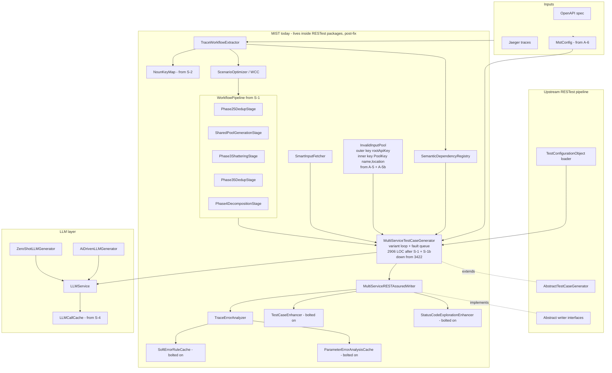
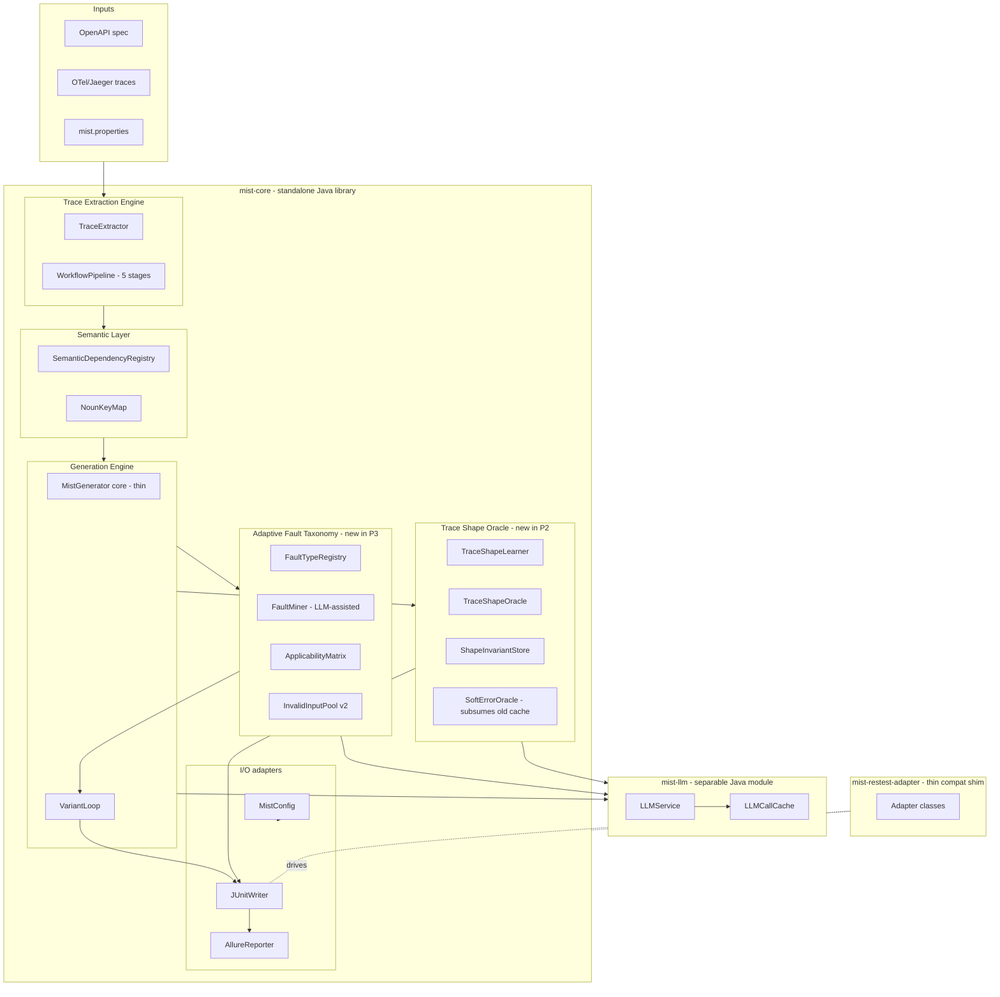
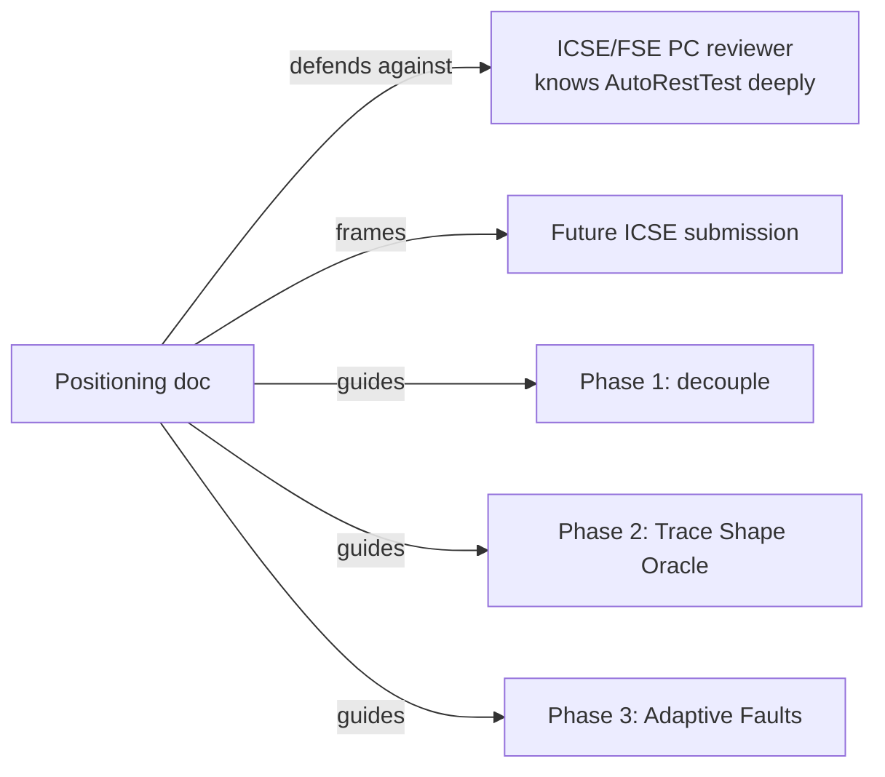
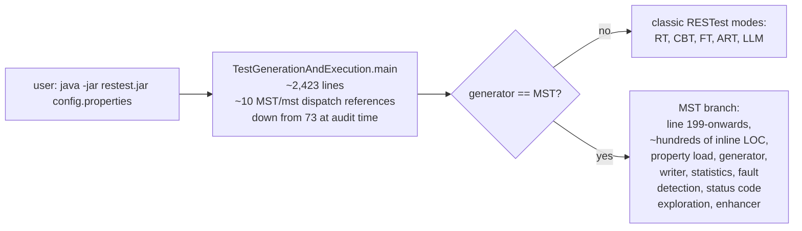
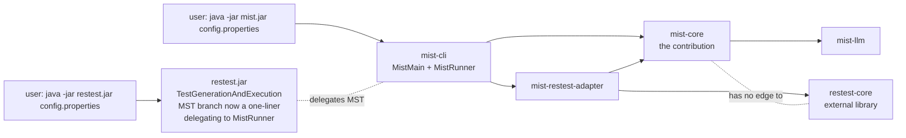
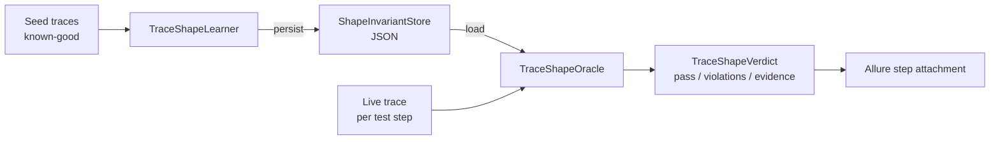
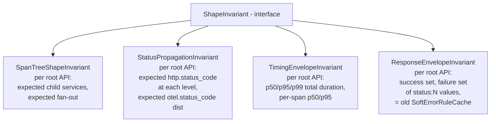
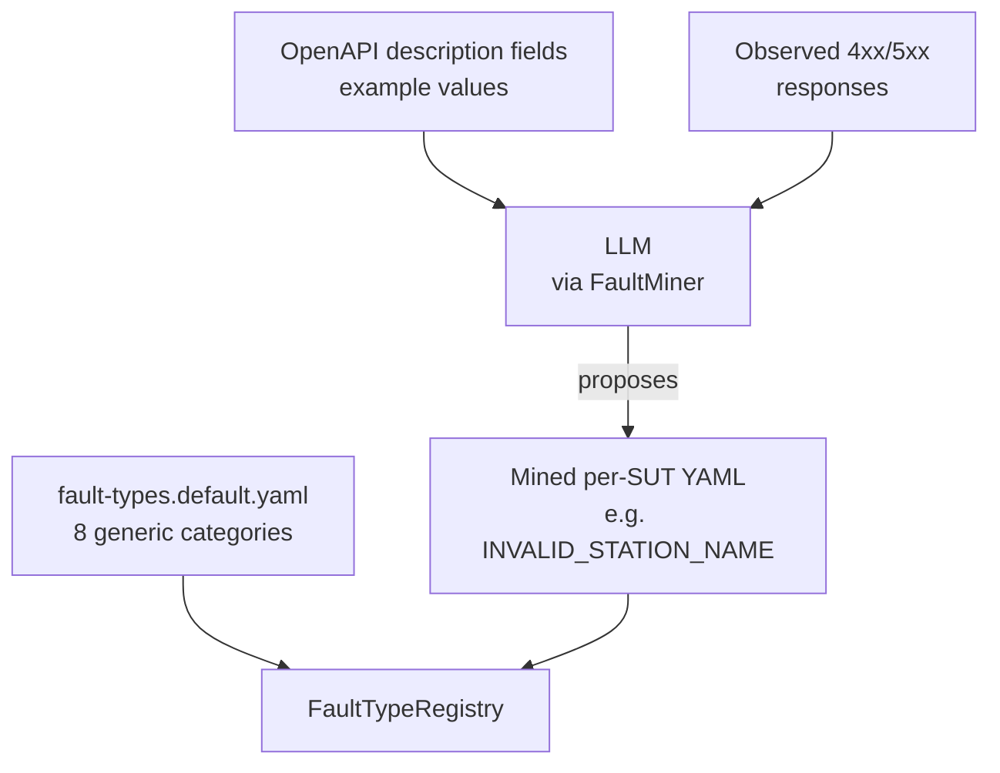
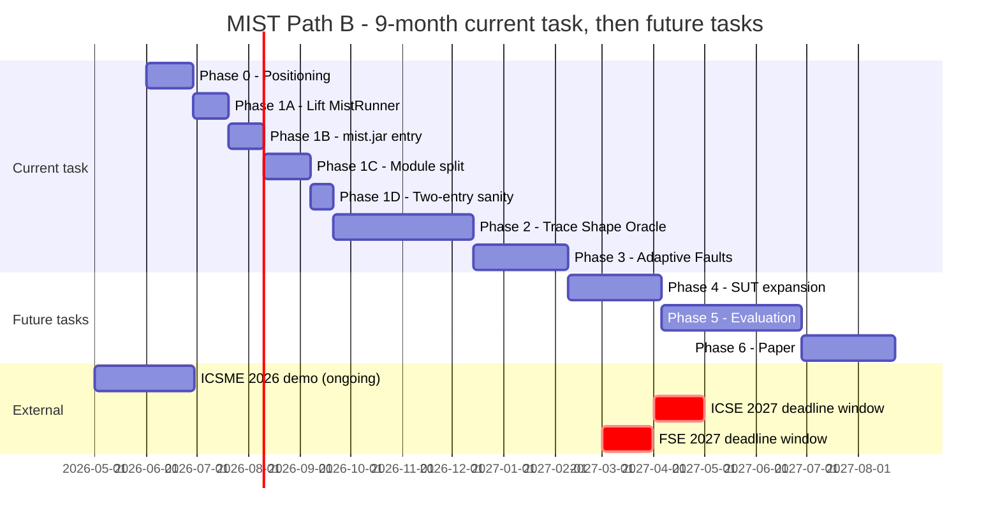

# MIST — Path B: Rebuild Plan for ICSE/FSE 2027 Main Track

> **Audience.** Self-contained brief for an agent (Claude Code or
> equivalent) that will execute the long-horizon rebuild of MIST.
> This document defines the work; it does not do the work. The agent
> reads this and proceeds phase by phase, gated by user approval at
> each phase boundary.

---

## Table of contents

- [0. Vision and scope](#0-vision-and-scope)
- [1. Rules of engagement](#1-rules-of-engagement)
- [2. Current vs. target architecture](#2-current-vs-target-architecture)
- [3. The three new contributions Path B is built around](#3-the-three-new-contributions-path-b-is-built-around)
- [4. Phase plan (current task)](#4-phase-plan-current-task)
  - [Phase 0 — Strategic positioning](#phase-0--strategic-positioning-4-weeks)
  - [Phase 1 — Decouple MIST from RESTest](#phase-1--decouple-mist-from-restest-8-weeks)
  - [Phase 2 — Trace Shape Oracle](#phase-2--trace-shape-oracle-12-weeks)
  - [Phase 3 — Adaptive Fault Taxonomy](#phase-3--adaptive-fault-taxonomy-8-weeks)
- [5. Future tasks (deferred — not current scope)](#5-future-tasks-deferred--not-current-scope)
- [6. Timeline at a glance](#6-timeline-at-a-glance)
- [7. Master checklist](#7-master-checklist)
- [8. Risks and mitigations](#8-risks-and-mitigations)
- [9. Glossary](#9-glossary)

---

## 0. Vision and scope

### 0.1 Target venue and bar
**Target.** ICSE 2027 Research Track *or* FSE 2027 Research Track
(submission window: April–May 2027 for ICSE 2027; March 2027 for
FSE 2027). Fall-back: ASE 2027 / ISSTA 2027.

**Bar to clear** (based on 2024-2026 acceptances; see the landscape
analysis the user has in their notes):
- One sharp, named technical contribution that is **not** already
  in AutoRestTest (ICSE 2025), LlamaRestTest (FSE 2025), DeepREST
  (ASE 2024), LogiAgent (2025 preprint), or RESTGPT (ICSE-NIER 2024).
- 10-15 systems under test (SUTs) with public availability and a
  hard case (Spotify or DeathStarBench-class).
- Baselines: RESTler, EvoMaster, Morest are mandatory; one
  learning-based tool (ARAT-RL, DeepREST, AutoRestTest) is mandatory.
- 30 repetitions, fixed 60-minute budget, Vargha-Delaney + Mann-Whitney.
- Reproducibility artifact (ICSE/FSE both require it).

### 0.2 The differentiator Path B is built around
**Trace-driven generation *plus* trace-shape oracle**, treated as one
coherent contribution rather than two add-ons. This is the only angle
in the 2024-2026 REST-testing landscape that nobody has shipped at
A-rank:
- *Generation* side: Phases 1-4 already exist (Multi-Root Sequence
  assembly + WCC shattering). They harden into a portable engine in
  Phase 1 of this plan.
- *Oracle* side: today's MIST has trace-pull + LLM RCA + soft-error
  cache, but the trace is **diagnostic** not **prescriptive**. Phase 2
  of this plan promotes the trace to a *checkable invariant*: per-API
  expected span shape, expected status propagation, expected timing
  envelope. Violations become first-class oracle failures.

### 0.3 The dangerous comparisons (must beat or out-flank)
- **AutoRestTest (ICSE 2025).** Semantic Property Dependency Graph +
  MARL + LLM. Overlaps MIST's Semantic Dependency Registry and LLM
  input synthesis. **Strategy:** out-flank by adding the trace pipeline
  in front (which AutoRestTest cannot do — no trace ingestion) and
  the Trace Shape Oracle behind. The ablation must show that stripping
  the trace layers collapses MIST to AutoRestTest-class performance,
  thereby quantifying exactly what the trace layers buy.
- **LogiAgent (2025 preprint).** LLM multi-agent business-logic oracle.
  Overlaps the Soft Error Rule Cache. **Strategy:** position the soft
  error layer as one component of the broader Trace Shape Oracle,
  not as the contribution.
- **MACROHIVE (QRS'22, JSS'23).** Service-mesh proxy grey-box for
  microservices. Closest in spirit. **Strategy:** explicit comparison
  table in related work; the differentiator is OTel/Jaeger trace as
  the data source (vendor-neutral, no proxy infrastructure required).

### 0.4 Scope of this plan
**In scope (current task):**
- Architectural rebuild (Phases 0-3 below).
- New code: Trace Shape Oracle, Adaptive Fault Taxonomy, decoupling
  of MIST from RESTest.

**Out of scope (future task):**
- Adding new SUTs beyond the bundled TrainTicket.
- Running ablation experiments.
- Running comparison with baselines.
- Paper writing.

These are deferred to § 5. The reason is product-led, not lazy: until
the architecture is right, evaluating it just buys data on the old
architecture that will need to be re-collected after the rebuild.

### 0.5 Authoring assumption
This plan assumes the user is a single-author PhD student with
co-author(s) joining for Phase 3+ (specifically for the
evaluation/writing future tasks). The plan does not assume any
industrial partnership.

---

### 0.6 Preconditions from CRITICAL_FIXES_S_A_1_6
Path B assumes **all seven critical fixes** in
`CRITICAL_FIXES_S_A_1_6.md` (S-4, A-6, S-2, S-3, S-1, A-5, A-7) **plus
the four follow-up fixes** that closed S-1's and A-5's gaps (S-1b,
A-5b, Mockito 5.10.0 upgrade, `/logs/` gitignore) **plus the A-5b ↔
S-1b integration patch (commit `ee561b46`)** have already landed on
`inject-detection` and the demo runs cleanly under `-Drandom.seed=42`.
The rebuild builds **on top of**, not in parallel with, that state.
The 60-test verification suite at end-of-fixes reports 60 pass, 0 fail.

The executing agent must therefore assume the following pre-existing
components and contracts:

| From fix | New class / file | Public surface Path B relies on |
|---|---|---|
| S-4 | `es.us.isa.restest.llm.LLMCallCache` | File-backed JSON cache; SHA-256-keyed on `(model, backend, prompt, temperature, max_tokens)`; default path `.mist/llm-call-cache.json` overridable via `mist.llm.cache.path` |
| S-4 | `LLMConfig.applySeedGate(double)` static helper | Returns `0.0` when `-Drandom.seed` is set; cuts the LLM temperature in the dispatch path |
| S-4 | `.gitignore` `/.mist/` entry | Dev-mode cache stays untracked by default; artifact-bundling removes the line |
| A-6 | `es.us.isa.restest.configuration.MstConfig` (POJO) | `MstConfig.instance()` singleton; `MstConfig.fromSystemProperties()` factory; immutable sub-records `core()`, `smartFetch()`, `llm()`, `faulty()`, `scenarioMerge()`, `scenarioShattering()`, `softErrorCache()`, `statusCodeExploration()`, `enhancer()`, `jaeger()` |
| A-6 | `MstConfigValidator` | Strict-mode unknown-key/conflict check gated by `mst.config.strict=true` |
| A-6 | (effect) | Zero `System.getProperty("mst.*"\|"smart.input.fetch.*"\|...)` calls outside `MstConfig` itself |
| S-2 | `es.us.isa.restest.workflow.NounKeyMap` | YAML-driven noun→key map; default `classpath:/mist/noun-map.default.yaml`; optional per-SUT override |
| S-2 | `TraceWorkflowExtractor.isMeaningfulPathNoun` regex | `[a-z]+([-_][a-z]+)*` — accepts hyphenated and underscored nouns |
| S-2 | (effect) | Hard-coded `NOUN_TO_KEY.put(...)` block removed from `TraceWorkflowExtractor`; hyphenated and nested URL path params are extracted |
| S-3 | `WorkflowScenario.approvedInDedupPass` (new field, getter/setter) | Tag carried through Phase 3 shattering so re-deduplication does not drop legitimate components |
| S-3 | `MultiServiceTestCaseGenerator.approvedApiKeys` (new field, package-private) | Replaces `seenSingleRootApis` |
| S-3 | `MultiServiceTestCaseGenerator.runSingleRootDedupPass(label, scenarios, approvedKeys)` public | Single method replacing `deduplicateSingleRootScenarios()` + `applySingleRootDedup()`. **Note**: still on the generator (called by Phase25DedupStage and Phase35DedupStage), but other phase methods were lifted (see S-1b) |
| S-3 | (deleted) | `dedupApprovedScenarios` field is gone |
| S-1 | `es.us.isa.restest.workflow.pipeline.{WorkflowPipeline, PipelineStage, PipelineContext}` | Sequential phase orchestrator interface; `PipelineContext` carries `scenarios`, `serviceConfigs`, `dependencyRegistry`, `approvedApiKeys`, pool maps, etc. |
| S-1 | Five stage classes under `workflow/pipeline/stages/` | `Phase25DedupStage`, `SharedPoolGenerationStage`, `Phase3ShatteringStage`, `Phase35DedupStage`, `Phase4DecompositionStage` |
| **S-1b** | `workflow.pipeline.stages.SharedPoolSupport` (**public final**, made public by `ee561b46`) | The shared-pool generator helper that was lifted out of `MultiServiceTestCaseGenerator`; ~445 LOC; package-private static `generateFaultyPoolForSingleRoot(...)` accepts explicit args instead of reading generator fields |
| **S-1b** | `workflow.pipeline.stages.DedupSupport` (package-private) | The dedup helper lifted out of the generator; ~89 LOC |
| **S-1b** | `workflow.pipeline.stages.DecompositionSupport` (package-private) | The Phase 4 helper lifted out of the generator; ~134 LOC |
| **S-1b** | `workflow.pipeline.stages.StageSupport` (package-private) | Common stage utilities; ~305 LOC |
| S-1 + S-1b | (effect) | `MultiServiceTestCaseGenerator` shrunk from 3422 to **2906 lines** (-516). Four phase methods (`groupScenariosByRootApi`, `generateSharedParameterPools`, `decomposeMultiRootScenarios`, and the shattering wrapper) **deleted from the generator**. Stage classes own real logic. |
| A-5 | `MultiServiceTestCaseGenerator.normaliseParamLocation(String)` static | Canonicalises OpenAPI `in` to `{path,query,header,cookie,body}` (`formData`→`body`, null→`body`) |
| A-5 | (effect) | All five parameter locations enroll in the fault pool; `FaultTarget` count up ≥ 30 % on TrainTicket; per-location enrolment count logged at INFO |
| **A-5b** | `MultiServiceTestCaseGenerator.PoolKey` (**public static final** nested class) | `record`-shaped `(paramName, paramLocation)` with `equals` / `hashCode` |
| **A-5b** | `MultiServiceTestCase.targetFaultParamLocation` field | Tells the writer which slot (path/query/header/cookie/body) receives the invalid value |
| **A-5b** | Pool shape `Map<String, Map<PoolKey, InvalidInputPool>>` | Outer key = `rootApiKey`; inner key = `PoolKey(name, location)`; same-name parameters at different locations no longer collide |
| **A-5b** | `MultiServiceRESTAssuredWriter` emits `req.header(name, invalid)` and `req.cookie(name, invalid)` | Negative variants targeting header/cookie parameters reach the wire (not just enrol in the queue) |
| A-7 | `.mist/{soft-error-rule-cache,parameter-error-analysis-cache,intelligent-analysis-cache}.json` | Three persistent caches under `.mist/`; survive `mvn clean` |
| A-7 | One-shot migration in each cache's load path | `target/X.json` → `.mist/X.json` when legacy exists and new does not; uses `Files.move(legacy, path, REPLACE_EXISTING)` |
| A-7 | `trainticket-mst.properties` `soft.error.cache.path=target/...` line removed | Java default (`.mist/...`) takes effect |
| **Mockito upgrade** | `pom.xml` `mockito-core` 5.10.0 | Required for JDK 21 test compatibility; resolves `Unknown Java version: 21` errors in tests using `Mockito.CALLS_REAL_METHODS` |
| **/logs/ gitignore** | `.gitignore` line 8: `/logs/` | `LLMCommunicationLogger` per-session log files no longer flagged as untracked |
| **ee561b46** | `SharedPoolSupport` visibility promoted from package-private to `public final` | Lets `generators`-package tests reflect on the class directly via `.class` |

**What is unchanged by the fixes** (Path B is the first place these
change):
- `InvalidInputType` (the 8-category enum at
  `es.us.isa.restest.inputs.InvalidInputType`) **still exists**.
  Phase 3 of Path B retires it. The pool's outer key is `PoolKey` and
  the inner fault category is still this enum.
- `SoftErrorRuleCache` **still exists** at
  `es.us.isa.restest.validation.SoftErrorRuleCache`. Phase 2 of Path
  B subsumes it into `ResponseEnvelopeInvariant`.
- All MIST code **still lives** under `es.us.isa.restest.*` packages.
  No `io.mist.*` package exists yet. Phase 1.C of Path B moves it.
- The CLI entry point **is still**
  `es.us.isa.restest.main.TestGenerationAndExecution`. It now has
  ~10 `"MST".equals(generator)` branches (down from the audit-time
  73 thanks to upstream commit `67337db9`, but still concentrated in
  the same main class). Phase 1.A lifts the remaining MST branch out
  into `MistRunner`; Phase 1.B introduces the new `MistMain` entry
  point and `mist.jar`.
- `TestCaseEnhancer`, `StatusCodeExplorationEnhancer`,
  `ParameterErrorAnalysisCache` are still bolted on the writer. Path B
  does not refactor them in the current task; they may become
  appendix material in the future-task paper.

**Pre-flight invariant.** Before Phase 0 begins, the agent must
verify (commands in § 7.1) that the new symbols exist, the old ones
are gone, and the demo compiles. If any pre-flight check fails, **do
not start Path B**; instead, escalate to the user that the fix branch
is incomplete.

---

## 1. Rules of engagement

### 1.1 Branching and integration
- The active development branch is `inject-detection` (where MIST 1.x
  is shipping for ICSME 2026 tool demo).
- **Path B work happens on a new long-lived branch**:
  `mist-2.x/path-b`. Branch from `inject-detection` *after* the six
  S+A fixes in `CRITICAL_FIXES_S_A_1_6.md` have landed.
- Each phase produces a sequence of squash-mergeable commits. The
  phase boundary is a tagged commit: `mist-2.x-phase-0-complete`,
  `mist-2.x-phase-1-complete`, etc.
- At each phase boundary, the user reviews and approves before the
  next phase starts. **Do not skip ahead.**
- The ICSME 2026 tool demo paper must continue to build from
  `inject-detection`. Path B does **not** touch `inject-detection`
  after the fixes branch off. If a critical bug fix needs to be
  cherry-picked from `mist-2.x/path-b` into `inject-detection`, that is
  a separate decision the user makes.

### 1.2 Branding
- `MIST` continues to be the user-facing brand (paper, README, demo).
- Internal class names *may* be rebranded in Path B because we are
  decoupling from RESTest (see Phase 1). New classes use the `Mist`
  prefix. **Old `Mst` classes are renamed only when they move out of
  the `es.us.isa.restest.*` package tree.** Within-package renames are
  forbidden — they create merge conflicts with `inject-detection`.

### 1.3 Coding standards (the simplify skill in effect)
1. No new feature without a phase deliverable that lists it.
2. No abstraction created for hypothetical reuse. Three concrete
   call sites or no abstraction.
3. No error handling for cases that cannot happen. Trust the new
   internal contracts.
4. No comments that restate code. Only "why" comments, when the why is
   non-obvious.
5. No backwards-compatibility shims across the decoupling boundary
   (Phase 1). If a RESTest dependency is dropped, drop it cleanly.
6. Edit existing files in preference to creating new ones. Path B
   ends up creating a lot of new files because of the decoupling, but
   inside each phase, prefer editing over splitting.
7. Invoke the `simplify` skill at the end of each phase to scrub
   the diff before tagging the phase-complete commit.

### 1.4 Tooling and verification
- After each phase, run:
  - `mvn -q -DskipTests compile` — must pass.
  - `mvn -q test -Dtest='Mist*'` — every new test class must pass.
  - The bundled TrainTicket demo end-to-end smoke (see § 4 of
    `CRITICAL_FIXES_S_A_1_6.md`) — must produce a non-empty Allure
    report.
- At phase-complete commits, the user runs the demo by hand and
  confirms the report still reads sensibly. **You do not need to run
  the demo for them**, but you must instruct them how (one terminal
  command).

### 1.5 What the executing agent must NOT do
- Do **not** invent new contribution buckets. The three named
  contributions are fixed (§ 3). Anything that does not fit those
  buckets is implementation detail.
- Do **not** start evaluation work, baseline comparisons, or SUT
  onboarding. That is § 5 future task and requires separate approval.
- Do **not** rewrite the ICSME 2026 paper or the existing
  `paper/main.tex`. That paper has its own lifecycle.
- Do **not** delete code that the ICSME paper references unless the
  user has confirmed the paper's claim is stale.

---

## 2. Current vs. target architecture

### 2.1 Current architecture (`inject-detection` HEAD, after all eleven fixes)



**Problems** (these are the reasons Path B exists, not Path A):
- MIST is interleaved with upstream RESTest classes. You cannot ship
  MIST as a stand-alone tool, nor cite its line count truthfully (50k
  LOC is RESTest's, not yours).
- Four optional caches/enhancers (`SoftErrorRuleCache`,
  `ParameterErrorAnalysisCache`, `TestCaseEnhancer`,
  `StatusCodeExplorationEnhancer`) hang off the writer with no clear
  architectural status. PC reviewers will ask "is this a contribution
  or an optimisation".
- The Trace layer is **diagnostic** only: traces inform RCA but do
  not produce assertions. The "trace as oracle" pitch in the ICSME
  paper is currently more aspirational than implemented.

### 2.2 Target architecture (end of Phase 3)



**What changed:**
- Three Maven modules: `mist-core`, `mist-llm`, `mist-restest-adapter`.
  The first is the contribution; the third is a thin shim that lets
  MIST keep running inside the RESTest harness for backwards
  compatibility on the ICSME demo.
- Trace Shape Oracle is a first-class subsystem with its own learner,
  invariant store, and oracle. The old caches collapse into it.
- Adaptive Fault Taxonomy replaces the hand-coded `InvalidInputType`
  enum with a registry that can mine new fault categories per SUT.

---

## 3. The three new contributions Path B is built around

These names are the same as the ICSME 2026 paper, but Path B
**strengthens each of them** so they can carry a main-track paper.

### 3.1 Root API Mode + Multi-Root Sequence (existing, productised)
Inherited from `inject-detection`. Phase 1 of Path B turns it from
"a thing inside RESTest" into "a portable engine you can vendor into
any test framework."

**Phase 1 strengthens it by:**
- Decoupling from RESTest's `AbstractTestCaseGenerator`.
- Externalising the noun map and registry config (S-2 already started).
- Defining a stable public API for "trace in, test cases out".

### 3.2 Sniper Strategy + Adaptive Fault Taxonomy (new in Path B)
**Phase 3 strengthens Sniper by:**
- Replacing the fixed 8-category enum with a `FaultTypeRegistry`
  populated from a YAML and extensible at runtime.
- Adding a `FaultMiner` that proposes SUT-specific fault categories
  by analysing observed 4xx/5xx responses + the soft-error envelope
  + the OpenAPI description fields. (E.g. on TrainTicket the miner
  might propose `INVALID_STATION_NAME` as a domain-specific category;
  on a payments SUT, `EXPIRED_PROMO_CODE`.)
- Folding the schema-aware applicability matrix into the registry so
  every fault carries a `Set<OasType> applicableTo`.

### 3.3 Trace-as-Oracle → Trace Shape Oracle (deepest new contribution)
**Phase 2 builds this from scratch:**
- A `TraceShapeLearner` ingests a small set of "known-good" trace
  runs (the existing TrainTicket trace corpus is the seed) and learns
  per-root-API invariants of three kinds:
  - **Span tree shape**: expected set of downstream services, expected
    branching factor at each level.
  - **Status propagation**: expected HTTP status codes at each level
    of the tree, expected `otel.status_code` distribution.
  - **Timing envelope**: expected total duration and per-span duration
    percentiles.
- A `TraceShapeOracle` consumes a freshly-pulled Jaeger trace and the
  learned invariants, and produces a verdict:
  `{passed, violated_invariants[], evidence}`.
- The old `SoftErrorRuleCache` becomes a special-case invariant
  ("response envelope status field must be in success set"), folded
  into the same oracle.

This is the contribution that breaks tie with AutoRestTest. Nobody at
A-rank has shipped a tool that *learns and checks* trace invariants
for REST testing.

---

## 4. Phase plan (current task)

Each phase has the same shape:
1. Goal
2. Deliverables (files / Maven modules)
3. Sketch (architecture or data-flow)
4. Step-by-step instructions for the executing agent
5. Decision gate (acceptance criteria for moving to the next phase)
6. Risks
7. Tag (the commit tag the user looks for to declare the phase done)

---

### Phase 0 — Strategic positioning (4 weeks)

#### Goal
Pin down what Path B is *actually* defending against. Convert the
landscape research into a concrete, internal positioning document
that informs every later phase. No code in Phase 0.

#### Deliverables
- `docs/mst-plans/PATH_B_POSITIONING.md` — a 6-8 page internal
  document containing:
  - § 1. AutoRestTest deep dive: read the paper + read the
    GitHub code; enumerate 10 concrete things MIST does that
    AutoRestTest does not, and 5 that AutoRestTest does and MIST
    does not. Each item has a code-level citation.
  - § 2. LogiAgent deep dive: same structure, different tool.
  - § 3. MACROHIVE deep dive: focus on the grey-box claim and how
    MIST differs by using OTel traces vs. service-mesh proxies.
  - § 4. The "head-to-head ablation table" the agent will produce in
    the future task. Lay out the rows and columns now; do not fill
    in numbers.
  - § 5. The "one-paragraph paper pitch" with two named contributions
    (Trace Shape Oracle, Adaptive Fault Taxonomy) and one supporting
    claim (Root API Mode + Sniper as the engine they ride on).
- `docs/mst-plans/PATH_B_PRIOR_ART.bib` — BibTeX file collecting every
  paper cited in the positioning doc, ready for the eventual ICSE
  submission.

#### Sketch — the positioning doc's audience model



#### Step-by-step
1. Read AutoRestTest paper end-to-end. Read its GitHub
   (https://github.com/selab-gatech/AutoRestTest) src/ at least the
   top-level classes. Take notes in a private scratch file.
2. Build § 1 of the positioning doc as a two-column markdown table
   (AutoRestTest does X | MIST does X' or Y). Each row has a code
   citation in the form `file:line` referencing the actual MIST class
   that implements the difference.
3. Repeat for LogiAgent (read the preprint and any released code) and
   MACROHIVE (read the QRS'22 paper).
4. Write § 4 (head-to-head ablation table layout). The columns are
   the SUTs (placeholders TrainTicket, Sock Shop, Online Boutique,
   ts-DeathStarBench, Spotify); the rows are the ablation
   configurations: `MIST-full`, `MIST −trace-shape-oracle`,
   `MIST −adaptive-fault`, `MIST −trace-shape −adaptive` (≈ AutoRestTest
   approximation), `AutoRestTest`, `EvoMaster`. Each cell is a TODO.
5. Write § 5 (one-paragraph pitch). The pitch must NOT mention LLMs
   as a contribution (LLMs are commodity in 2025-2026); it MUST name
   Trace Shape Oracle and Adaptive Fault Taxonomy as the two
   contributions.
6. Convert all citations into BibTeX, save to
   `PATH_B_PRIOR_ART.bib`.

#### Decision gate
- [ ] The positioning doc has been reviewed by the user. The user
  has explicitly confirmed the two named contributions are the right
  ones to defend.
- [ ] The user has confirmed AutoRestTest is the primary baseline and
  has approved the ablation-table column choices.
- [ ] § 4's ablation column on "MIST −trace-shape −adaptive" is
  expected to roughly equal AutoRestTest. If the user disagrees, the
  Path B pitch is broken and the plan goes back to the drawing board.

#### Risks
- **R-0-1.** AutoRestTest turns out to overlap more than expected.
  Mitigation: if the 10-item differentiator list drops below 5,
  escalate to user — Path B may need a different framing.
- **R-0-2.** A 2026 paper appears that does Trace Shape Oracle first.
  Mitigation: weekly arXiv check during Phase 0. The user does this,
  not the agent.

#### Tag
`mist-2.x-phase-0-complete`

---

### Phase 1 — Decouple MIST from RESTest (10-12 weeks)

#### Goal
Turn MIST from "a fork of RESTest with extra packages" into "a
stand-alone Java library that depends on a thin RESTest adapter, with
its own entry point". After Phase 1:
- `git diff` against the upstream RESTest baseline shows only MIST code.
- `mvn package` produces a `mist.jar` whose `Main-Class` is MIST's
  own entry point.
- The bundled demo can be launched as `java -jar mist.jar
  trainticket-demo.properties` without going through any RESTest
  `main` class.
- The legacy `java -jar restest.jar` launch path continues to work
  (it dispatches to MIST via a thin internal call) so the ICSME 2026
  demo paper does not break.

This phase **is not new science**. It is the engineering pre-requisite
for everything else. Skipping it kills the eventual paper's "we built
a tool" claim.

#### Current entry-point reality (the problem this phase solves)



The problem is twofold:
1. **No separate MIST entry exists.** Every MIST run originates inside
   `es.us.isa.restest.main.TestGenerationAndExecution.main`. The paper
   cannot claim MIST is a stand-alone tool while this is true.
2. **MST logic is inlined into the RESTest main class.** Eleven-plus
   `"MST".equals(generator)` branches are scattered through the file,
   handling configuration loading, generator construction, writer
   setup, stats reporting, and execution. Lifting the MST contribution
   into its own module is impossible while these branches remain
   inside RESTest's main.

The fix is sequenced: lift the inlined MST branch into a runner class
first (Stage 1.A), then build a separate entry point for it (Stage
1.B), then do the Maven module split (Stage 1.C, which was the
original Phase 1 scope), then verify both launch paths work (Stage
1.D).

#### Three options considered (decision recorded for future reference)

| Option | Description | Why not chosen |
|---|---|---|
| A — Lift Runner only, keep RESTest entry | Extract MST branch into `MistRunner`; `java -jar restest.jar` keeps working. No new entry point. | Reviewer at ICSE/FSE 2027 will read the launch command and conclude "MIST = a RESTest mode", invalidating the standalone-tool claim. |
| **B — Lift Runner + new MistMain (CHOSEN)** | Extract `MistRunner`, write `MistMain`, ship `mist.jar`. RESTest is a runtime library, not the launcher. | (chosen) |
| C — Vendor RESTest internals into mist-core | Copy the OAS loader, TestParameter model, IWriter contract, etc. from RESTest into mist-core; drop the RESTest dependency entirely. | Out of scope for Phase 1 — it requires the user to own (and license-clear) the vendored RESTest code, which contradicts the "only MST code is mine" position. Reserved for a future hard-fork decision. |

#### Deliverables

**New Maven project structure (four modules — one more than the
original plan to host the new entry point):**

```
mist/
  pom.xml                          (root reactor, packaging=pom)
  mist-core/                       (the contribution — no RESTest dep)
    pom.xml
    src/main/java/io/mist/core/...
    src/test/java/...
  mist-llm/                        (LLM dispatch + cache, no RESTest dep)
    pom.xml
    src/main/java/io/mist/llm/...
  mist-restest-adapter/            (RESTest compat: spec loader, writer)
    pom.xml
    src/main/java/io/mist/restest/...
  mist-cli/                        (NEW: standalone entry point)
    pom.xml
    src/main/java/io/mist/cli/MistMain.java
    src/main/java/io/mist/cli/MistRunner.java
    src/main/resources/META-INF/MANIFEST.MF
```

**Build artefacts:**
- `mist-cli/target/mist.jar` is the **new** entry-point fat jar.
  Its `Main-Class` is `io.mist.cli.MistMain`. Launching it does
  **not** invoke any class under `es.us.isa.restest.main`.
- The legacy `target/restest.jar` continues to build and continues to
  work — its `TestGenerationAndExecution.main` MST branch is reduced
  to a single call into `MistRunner` (which lives in `mist-cli`,
  reachable from `restest.jar` via classpath).
- `mist-core` compiles without `restest-core` on the classpath.
  Verify with `mvn dependency:tree -pl mist-core` showing zero
  `es.us.isa` deps.
- `mist-llm` builds independently of both `mist-core` and `restest-core`.
- The `mist-restest-adapter` is the only module that imports RESTest
  packages.

**Functional checks:**
- `java -jar mist-cli/target/mist.jar trainticket-demo.properties`
  produces an Allure report.
- `java -jar target/restest.jar trainticket-demo.properties` produces
  the same Allure report (same properties → byte-identical generated
  scenarios under `-Drandom.seed=42`).

#### Sketch — module dependency graph (end of Phase 1)



Two crucial properties after Phase 1:
1. The missing edge `CORE → RESTEST_LIB` proves the contribution is
   isolated.
2. The two user-entry paths (`NEW_USER` and `LEGACY_USER`) both reach
   the same `MistRunner`, so behaviour is identical regardless of how
   the user launches the tool.

#### Stage 1.A — Lift the MST branch into MistRunner (3 weeks)

**Goal.** Reduce `TestGenerationAndExecution.main` (currently ~2,423
lines with ~10 `"MST".equals(generator)` dispatch sites — already
down from the audit-time 73 thanks to upstream commit `67337db9`) to
a class whose entire MST branch is one delegation call.  **No new
entry point in this stage**, just internal extraction.

Note that the original audit found 73 MST references and a 2,415-line
file.  Upstream `67337db9` consolidated some of those into shared
helpers, leaving roughly 10 dispatch points and a slightly larger
main file.  The remaining 10 are still scattered across constructor
hook-ups, generator selection, writer selection, statistics, fault
detection, and the run loop — all of which belong on `MistRunner`,
not on the RESTest entry point.

**Steps.**
1. **Map the MST branch.** Read
   `src/main/java/es/us/isa/restest/main/TestGenerationAndExecution.java`
   in full. For every `"MST".equals(generator)` check, record:
   - Line number.
   - The full code block guarded by the check (often spans dozens of
     lines).
   - The static fields it reads or writes.
   - The other static methods it calls.
   Save to `docs/mst-plans/phase-1a-mst-branch-map.txt`. There are
   at least 11 such blocks (see the audit).
2. **Define the MistRunner contract.** In a new file
   `src/main/java/es/us/isa/restest/main/MistRunner.java` (or, if
   the Maven split is happening in parallel, in
   `mist-cli/src/main/java/io/mist/cli/MistRunner.java`), declare:
   ```java
   public final class MistRunner {
       public MistRunner(MstConfig config, Path workdir);
       public MistRunResult run();   // synchronous, returns paths + stats
   }
   ```
   The constructor takes the `MstConfig` POJO produced by Fix A-6;
   it does **not** consult `System.getProperty` or hold any other
   ambient state. (`MstConfig.fromSystemProperties()` is the
   standard factory; tests can pass a hand-rolled `MstConfig` for
   isolation.) This is critical for testability and is what makes
   `MistRunner` portable to the new `MistMain` entry point in
   Stage 1.B.
3. **Move the MST blocks into MistRunner.** For each recorded block,
   copy the code verbatim into a private method of `MistRunner`. The
   static field reads become instance-field reads on `MistRunner`;
   the writes become writes to instance fields. This is a mechanical
   transformation — no logic changes.
4. **Replace each MST block in main with a delegation.** In
   `TestGenerationAndExecution.main` and its helper methods, every
   `if ("MST".equals(generator)) { … }` becomes either:
   - For the dispatch at line 155-199 region: `new MistRunner(props,
     workdir, …).run();` followed by `return;`. The classic RESTest
     path continues below.
   - For deeper sites that conditionally tweak generators/writers
     based on MST mode: those sites are now dead (the MST dispatch
     returned earlier), so delete them.
5. **Behavioural baseline.** With `-Drandom.seed=42`, run the
   bundled TrainTicket demo before and after the lift. Diff
   `target/test-cases/` recursively. Must be byte-identical.

**Decision gate for 1.A.**
- [ ] `grep -c '"MST".equals' TestGenerationAndExecution.java`
      returns ≤ 2 (one for the dispatch, one for the early-return
      assertion, no more).
- [ ] `MistRunner` has zero `System.getProperty` calls in its
      constructor body (it reads from its constructor `Properties`).
- [ ] Before/after seeded demo diff is empty.

#### Stage 1.B — MistMain and mist.jar entry point (3 weeks)

**Goal.** Build a stand-alone entry point. The user can run MIST
without invoking any class under `es.us.isa.restest.main`.

**Steps.**
1. **Create the mist-cli module skeleton.** If Stage 1.C (module split)
   has not started yet, place these files under
   `src/main/java/io/mist/cli/` and configure a second
   `maven-shade-plugin` execution in the existing `pom.xml` to build
   `mist.jar`. If 1.C has started, place them in the new `mist-cli`
   module.
2. **Write `MistMain`:**
   ```java
   package io.mist.cli;
   public final class MistMain {
       public static void main(String[] args) throws Exception {
           Path propsFile = Path.of(args.length > 0
               ? args[0]
               : "src/main/resources/My-Example/trainticket-demo.properties");
           // Load the .properties file and push every key into System
           // properties so existing MstConfig.fromSystemProperties()
           // (delivered by Fix A-6) sees the values, matching the
           // behaviour of TestGenerationAndExecution exactly.
           Properties props = new Properties();
           try (var in = Files.newInputStream(propsFile)) { props.load(in); }
           props.forEach((k, v) ->
               System.setProperty(String.valueOf(k), String.valueOf(v)));
           MstConfig config = MstConfig.fromSystemProperties();
           Path workdir = Path.of(System.getProperty("user.dir"));
           MistRunResult result = new MistRunner(config, workdir).run();
           result.summarise(System.out);
           System.exit(result.exitCode());
       }
   }
   ```
   `MistMain` does **not** import any class under
   `es.us.isa.restest.main.*` (it must not call back into the
   RESTest main entry). It does import `MstConfig` from
   `es.us.isa.restest.configuration` until Stage 1.C moves it into
   `io.mist.core.config.MistConfig`. After 1.C, the import becomes
   `io.mist.core.config.MistConfig`.
3. **Wire shading.** Configure `mist-cli`'s POM to produce a
   `Main-Class: io.mist.cli.MistMain` fat jar named `mist.jar`. Put it
   in `target/mist-cli/mist.jar` or, when the module is in its own
   project, `mist-cli/target/mist.jar`.
4. **Smoke test.** `java -jar mist.jar trainticket-demo.properties`
   produces an Allure report. The Allure report content is
   byte-identical to the legacy launch path under the same seed.

**Decision gate for 1.B.**
- [ ] `mist.jar` exists; `jar tf mist.jar | head` does not list
      `es/us/isa/restest/main/TestGenerationAndExecution.class` (the
      file is excluded by the shading config).
- [ ] `java -jar mist.jar` and `java -jar restest.jar` both work
      and produce byte-identical scenario files for the same seed.

#### Stage 1.C — Module split and class migration (4 weeks)

**Goal.** This is the original Phase 1 work: reorganise the source
tree into four Maven modules so that `mist-core` has no RESTest
dependency.

**Steps.**
1. **Inventory.** Run a Bash script to list every class under
   `src/main/java/es/us/isa/restest/` that is "MIST code" (in the
   `workflow/`, `inputs/smart/`, `configuration/MstConfig*`, `llm/`,
   and `generators/MultiService*|AiDrivenLLMGenerator|ZeroShotLLMGenerator`
   packages or whose name starts with `Mst`). Save the list to
   `docs/mst-plans/phase-1c-mist-inventory.txt`.
2. **Reverse-import scan.** For each MIST class, list every non-MIST
   class it imports. Save to
   `docs/mst-plans/phase-1c-mist-to-restest-imports.txt`. These are
   the bridge points the adapter must wrap.
3. **Adapter design.** For each external dep, decide:
   - *Wrap*: define a `mist-core` interface; the adapter implements
     it against the RESTest class. (Example: `RestestSpecLoader`
     implements `MistSpecLoader`.)
   - *Inline*: copy the small utility into `mist-core` and break the
     dep. Allowed only for ≤ 50-LOC standalone helpers with no
     transitive RESTest deps.
   - *Keep*: leave it as an adapter-side dep; `mist-core` does not
     need it.
4. **Create the Maven structure.** Reorganise the source tree into
   four modules (`mist-core`, `mist-llm`, `mist-restest-adapter`,
   `mist-cli`). The root `pom.xml` becomes a reactor. The existing
   single `pom.xml` becomes `mist-restest-adapter`'s POM plus three
   new small POMs.
5. **Move classes.** This is mechanical. For each MIST class:
   - File goes to its new module's source folder.
   - Package goes from `es.us.isa.restest.workflow` to
     `io.mist.core.workflow`, etc.
   - Replace each forbidden import (RESTest) with the new interface
     (`MistSpecLoader`) imported from `io.mist.core.spi`.
   - `MistRunner` and `MistMain` (from Stages 1.A and 1.B) move into
     `mist-cli`.
6. **Implement the adapter.** Write the `mist-restest-adapter` classes
   that implement each `mist-core` interface against the actual
   RESTest types. Adapter classes use the prefix
   `Restest<Interface>Impl` (e.g. `RestestSpecLoaderImpl`).
7. **Re-wire `MistRunner` to use SPIs.** Inside `MistRunner`, the
   construction of spec loaders, writers, etc. now goes through
   `io.mist.core.spi.MistSpecLoader` interfaces. The concrete
   implementations (`RestestSpecLoaderImpl`, etc.) are loaded via
   `java.util.ServiceLoader` from the adapter module's classpath.

#### Stage 1.D — Two-entry-point sanity and the legacy bridge (2 weeks)

**Goal.** Both launch paths produce byte-identical output. The legacy
RESTest main has been reduced to a one-line MST delegation that
preserves the ICSME 2026 demo workflow.

**Steps.**
1. **Trim `TestGenerationAndExecution.main`.** The MST dispatch block
   at the top of `main` becomes:
   ```java
   if ("MST".equals(generator)) {
       // properties already loaded by readParameterValues() and
       // (for MST) loadMstConfig() above; MstConfig.fromSystemProperties()
       // (Fix A-6) is the single source of truth at this point.
       MstConfig config = MstConfig.fromSystemProperties();
       Path workdir = Path.of(System.getProperty("user.dir"));
       int code = new MistRunner(config, workdir).run().exitCode();
       System.exit(code);
   }
   // classic RESTest below
   ```
   Every other `"MST".equals(generator)` block in the file becomes
   unreachable and is deleted. The file shrinks by hundreds of lines.
2. **Verify both jars exist and run.**
   ```
   mvn -q clean install
   java -Drandom.seed=42 -jar mist-cli/target/mist.jar \
        src/main/resources/My-Example/trainticket-demo.properties
   sha256sum target/test-cases/Flow_Scenario_*.java > new.sums

   mvn -q clean install
   java -Drandom.seed=42 -jar mist-restest-adapter/target/restest.jar \
        src/main/resources/My-Example/trainticket-demo.properties
   sha256sum target/test-cases/Flow_Scenario_*.java > legacy.sums

   diff new.sums legacy.sums   # must be empty
   ```
3. **Update the README.** The Quick Start sections now show
   `java -jar mist.jar` as the primary command and `java -jar
   restest.jar` as a legacy compatibility option. The user does this
   change (README is in the brand layer, not the code layer).
4. **Update the ICSME 2026 paper.** Same caveat: if the paper's
   listings show `java -jar restest.jar`, decide whether to update
   them in this round or after the ICSME deadline. **The agent does
   not edit the paper unless the user explicitly asks.**

#### Decision gate (cumulative across 1.A–1.D)
- [ ] Stage 1.A gate: `grep -c '"MST".equals' TestGenerationAndExecution.java`
      returns ≤ 2.
- [ ] Stage 1.A gate: before/after seeded demo diff is empty.
- [ ] Stage 1.B gate: `mist.jar` exists; `jar tf mist.jar | head`
      does not list `es/us/isa/restest/main/TestGenerationAndExecution.class`.
- [ ] Stage 1.B gate: both `java -jar mist.jar` and
      `java -jar restest.jar` produce byte-identical scenario files
      under the same seed.
- [ ] Stage 1.C gate: `mist-core/pom.xml` does not declare a
      dependency on `restest-core` (verified by reading the POM, not
      just running `dependency:tree`).
- [ ] Stage 1.C gate: `grep -rE 'es\.us\.isa' mist-core/src`
      returns nothing.
- [ ] Stage 1.C gate: `mist-core` ships a public package
      `io.mist.core.api` with at most 10 entry-point types (a small
      SPI).
- [ ] Stage 1.C gate: no test in `mist-core` directly instantiates a
      RESTest class.
- [ ] Stage 1.C gate: `mist-llm` builds independently of both
      `mist-core` and `restest-core`.
- [ ] Stage 1.D gate: legacy `restest.jar` run still produces the
      same Allure report content as the new `mist.jar` run.
- [ ] Stage 1.D gate: `TestGenerationAndExecution.java` line count
      drops by ≥ 400 lines (the MST blocks are now in `MistRunner`).
- [ ] User approves the Allure report from both launch paths.

#### Risks
- **R-1-1.** Stage 1.A: the MST branch reads or writes static fields
  of `TestGenerationAndExecution` that other code paths (classic
  RESTest) also use. Lifting may break classic mode.
  Mitigation: after Stage 1.A, run the bundled classic-mode demo
  (`Ex9_Generation_Execution`) and verify it still works.
- **R-1-2.** Stage 1.B: shading produces a `mist.jar` that double-
  packages classes from RESTest. Mitigation: configure the
  `maven-shade-plugin` `<excludes>` to drop all `es.us.isa.restest.main.*`
  classes; verify with `jar tf`.
- **R-1-3.** Stage 1.C: the RESTest surface MIST depends on turns
  out to be wide (50+ classes). Mitigation: if the import-scan list
  exceeds 80 classes, escalate. Either MIST decoupling is bigger
  than the 4-week stage budget, or the abstraction boundary needs to
  be redrawn (some classes need to move to `mist-restest-adapter`
  rather than be wrapped in SPIs).
- **R-1-4.** Stage 1.D: behavioural drift between the two launch
  paths. Mitigation: byte-identical scenario diff under
  `-Drandom.seed=42`. If the diff is non-empty, the lift in 1.A
  missed something; do not proceed until the diff is empty.
- **R-1-5.** Package rename in Stage 1.C breaks the ICSME 2026
  paper's class-name references. Mitigation: cross-check the paper's
  `lstlisting` blocks and § 3 component names against the new
  package layout before tagging the phase complete. If a paper
  sentence mentions `MultiServiceTestCaseGenerator` by name, the
  paper needs an edit. (User decides whether to do it now or after
  the paper deadline.)

#### Tag
`mist-2.x-phase-1-complete` (set after Stage 1.D gates all pass)

---

### Phase 2 — Trace Shape Oracle (12 weeks)

#### Goal
Build the headline contribution of the eventual ICSE/FSE paper:
a learner + oracle that turns OTel/Jaeger traces from a diagnostic
side-channel into a checkable assertion. The oracle MUST:
- Learn invariants from a small (≤ 100) seed corpus of "known-good"
  traces.
- Evaluate any subsequent trace against the learned invariants.
- Produce a verdict that names specific violated invariants and
  cites the offending span(s).
- Subsume the current `SoftErrorRuleCache` as one invariant family.

#### Deliverables (new files in `mist-core`)
- `io.mist.core.oracle.shape.TraceShapeLearner`
- `io.mist.core.oracle.shape.TraceShapeOracle`
- `io.mist.core.oracle.shape.invariant.SpanTreeShapeInvariant`
- `io.mist.core.oracle.shape.invariant.StatusPropagationInvariant`
- `io.mist.core.oracle.shape.invariant.TimingEnvelopeInvariant`
- `io.mist.core.oracle.shape.invariant.ResponseEnvelopeInvariant`
  (subsumes `SoftErrorRuleCache`)
- `io.mist.core.oracle.shape.store.ShapeInvariantStore`
  (file-backed, JSON, atomic rename)
- `io.mist.core.oracle.shape.TraceShapeVerdict` (verdict POJO)
- Tests: 1 unit-test class per invariant + 1 integration test for the
  oracle on TrainTicket fixtures.

#### Sketch — data flow



#### Sketch — invariant taxonomy



#### Step-by-step

##### Phase 2.A — Seed corpus and labelling (2 weeks)
1. Identify the TrainTicket seed traces in
   `src/main/resources/My-Example/trainticket/test-trace/`. The user
   has accumulated ≥ 13 trace files there.
2. Build a small CLI tool `MistTraceLabelCli` under `mist-core`'s
   tools package: given a trace file, lists every distinct
   `(method, path)` root-API tuple and the count of times it appears.
3. The user picks the top-N (target N = 20 root APIs) most-frequent
   roots as the "seed" set. The user manually inspects each seed
   trace and labels it `known-good` (default) or `known-bad`. Save
   the labels to
   `src/main/resources/mist/seed-trace-labels.json`.

##### Phase 2.B — Span tree shape invariant (2 weeks)
1. Implement `SpanTreeShapeInvariant` learner:
   - For each root API, examine all known-good traces.
   - Record the set of `(parent_span.service, child_span.service)`
     edges that appear in ≥ K% of traces (K=80 default, configurable
     in `MstConfig`).
   - Record the distribution of fan-out at each level (number of
     direct children per span).
2. Implement the oracle side: given a fresh trace and the learned
   invariant, find:
   - Edges in the trace that are NOT in the learned set (potential
     unexpected service call).
   - Missing edges that the learned set required (potential dropped
     service call).
   - Fan-out outliers (a span has 3× more children than the
     learned distribution allows).
3. Output a `TraceShapeVerdict` with `kind=SPAN_TREE_SHAPE` and a
   structured `violations[]` list.

##### Phase 2.C — Status propagation invariant (2 weeks)
1. For each root API and each level of the span tree, learn the
   distribution of `http.status_code` and `otel.status_code` across
   known-good traces.
2. Oracle flags a trace if a span's status code is outside the
   known-good distribution at the same tree position.
3. Subsume the existing `TraceErrorAnalyzer` logic: it currently
   treats `otel.status_code=ERROR` as a flag; the new invariant
   does the same but parameterised per root API.

##### Phase 2.D — Timing envelope invariant (2 weeks)
1. Learn per-root-API total-duration percentiles (p50, p95, p99) and
   per-span percentiles.
2. Oracle flags a trace whose total duration exceeds the learned p99
   *or* any individual span exceeds its learned p99 by ≥ 2×.
3. This is a noisy invariant by nature. Mark it as a `WARNING`
   severity (not `ERROR`) by default, configurable.

##### Phase 2.E — Response envelope invariant (subsume `SoftErrorRuleCache`) (2 weeks)
1. Port the existing `SoftErrorRuleCache` semantics into a
   `ResponseEnvelopeInvariant` learner. Learner sees the response
   body of each known-good trace's root API, identifies the primary
   field (e.g. `status`), and seeds the success-value set with the
   observed value (e.g. `{1}`).
2. At oracle time, if a 2xx response carries a primary-field value
   not in the success set:
   - If it's in the known failure set, flag as failure.
   - Otherwise, fall back to LLM classification (current behaviour),
     and *add* the result to the appropriate set on the fly.
3. Persist the invariant store the same way the old cache was
   persisted: file `target/mist-shape-invariants.json`.

##### Phase 2.F — Orchestration and Allure integration (2 weeks)
1. `TraceShapeOracle` composes the four invariant kinds; oracle
   verdict is `passed = AND of all invariant verdicts`.
2. The generated test code (writer side) calls
   `TraceShapeOracle.evaluate(trace)` after pulling the trace. The
   verdict is attached to the Allure step.
3. Verdicts also feed the existing soft-error pass/fail logic for
   negative-test handling.

#### Decision gate
- [ ] `TraceShapeOracle` produces a verdict for every step of a
      bundled TrainTicket demo run, with no exceptions thrown.
- [ ] On the bundled demo, the oracle flags at least one violation
      that the legacy `TraceErrorAnalyzer` does *not* flag, and the
      user agrees the new flag is meaningful (manual inspection).
- [ ] The seed-trace label file is documented in `flow.md` and lives
      in the resource folder.
- [ ] The old `SoftErrorRuleCache` is **deleted** (not deprecated).
      Its contract is now carried by `ResponseEnvelopeInvariant`.
- [ ] Each of the four invariant kinds has a unit-test class with
      ≥ 5 test methods.
- [ ] Integration test
      `MistTraceShapeOracleIntegrationTest` runs the full oracle
      on a curated TrainTicket trace fixture and asserts the
      verdict for at least three root APIs.

#### Risks
- **R-2-1.** Seed corpus is too small to learn stable invariants.
  Mitigation: target ≥ 20 root APIs with ≥ 10 trace occurrences each;
  if the corpus is smaller, the user records more demo runs.
- **R-2-2.** The timing-envelope invariant is too noisy to be
  useful. Mitigation: it ships as WARNING-level only. If still
  noisy, drop it from the contribution and document the negative
  result.
- **R-2-3.** Span tree shape invariant produces too many false
  positives because microservice systems are non-deterministic in
  call ordering. Mitigation: use *set* semantics (the set of services
  invoked) rather than *sequence* semantics; the order within a
  level is ignored.
- **R-2-4.** Conflict with the ICSME paper's "Trace-as-Oracle"
  framing. The ICSME paper describes the *current* (LLM + cache)
  behaviour; Path B's TraceShapeOracle is the *next-generation*
  version. Position the paper accordingly: ICSME paper = tool demo of
  v1, ICSE/FSE paper = research on v2.

#### Tag
`mist-2.x-phase-2-complete`

---

### Phase 3 — Adaptive Fault Taxonomy (8 weeks)

#### Goal
Replace the fixed 8-category `InvalidInputType` enum with a registry
that can mine SUT-specific fault categories. This makes Sniper Strategy
adaptive: the same tool exercising TrainTicket and Spotify will
generate different fault categories because the SUT semantics differ.

#### Deliverables (new files in `mist-core`)
- `io.mist.core.fault.FaultType` (record/POJO replacing the enum)
- `io.mist.core.fault.FaultTypeRegistry`
- `io.mist.core.fault.FaultMiner` (LLM-assisted miner)
- `io.mist.core.fault.ApplicabilityMatrix`
- `io.mist.core.fault.InvalidInputPool` (v2 — keyed on `FaultType`
  not on the old enum)
- `src/main/resources/mist/fault-types.default.yaml`
  (the eight current categories as defaults)
- Tests for each.

#### Sketch — fault type registry



#### Sketch — fault type lifecycle


#### Step-by-step

##### Phase 3.A — FaultType as data, not enum (2 weeks)
1. Define `FaultType` as a Java record:
   ```java
   public record FaultType(
       String id,             // e.g. "TYPE_MISMATCH" or "INVALID_STATION_NAME"
       String displayName,
       Set<OasType> applicableTo,
       Set<String> applicableLocations,  // path, query, header, etc.
       FaultSource source                // DEFAULT or MINED
   ) {}
   ```
2. Migrate the existing 8 categories from `InvalidInputType` enum to
   `fault-types.default.yaml` with verbatim semantics.
3. `FaultTypeRegistry` loads the default YAML at startup plus an
   optional per-SUT YAML pointed to by `mist.fault.types.path`.
4. Every call site of `InvalidInputType` migrates to `FaultType` by id
   lookup against the registry.
5. Delete the `InvalidInputType` enum.

##### Phase 3.B — FaultMiner (3 weeks)
1. `FaultMiner.mine(spec, observedResponses) → List<FaultType>`.
2. Inputs:
   - The OpenAPI spec (description fields, examples, enums).
   - The corpus of observed 4xx/5xx responses from the previous
     test run (re-use the existing `target/failed-tests.json` that
     `TestCaseEnhancer` already collects).
3. Pipeline:
   - For each parameter with a non-trivial `description`, send a
     prompt to the LLM: "Given the description and these observed
     failures, propose up to 3 SUT-specific fault types this
     parameter should be tested with."
   - Parse the LLM response into candidate `FaultType` records.
   - Deduplicate against the default and previously-mined types.
   - Persist accepted types to `target/mist-mined-fault-types.yaml`
     (which the user can move into the per-SUT YAML to make them
     permanent).
4. The miner is gated by `mist.fault.mining.enabled` (default `false`
   for predictability; the user opts in).

##### Phase 3.C — ApplicabilityMatrix as data (1 week)
1. Move the schema-aware applicability matrix from code into
   `fault-types.default.yaml`. Each `FaultType` entry has explicit
   `applicableTo` lists.
2. Mined types inherit a permissive default applicability
   (`applicableTo: [string, integer]`) unless the LLM proposes more
   specific bounds.

##### Phase 3.D — InvalidInputPool v2 (1 week)
The current pool shape (delivered by Fix A-5b, not the original A-5)
is:

```java
Map<String, Map<MultiServiceTestCaseGenerator.PoolKey, InvalidInputPool>>
//   rootApiKey              ^^^^^^^ (paramName, paramLocation)
```

The **outer** two axes (`rootApiKey` and `PoolKey(name, location)`) are
correct and stay. Phase 3 only touches the **inner fault dimension**
that lives **inside** each `InvalidInputPool`.

1. Inside `InvalidInputPool`, replace the internal
   `Map<InvalidInputType, …>` keyed on the legacy 8-category enum with
   `Map<String, …>` keyed on `FaultType.id` (the registry-driven
   identifier from § 3.A). The outer map shape
   (`Map<String, Map<PoolKey, InvalidInputPool>>`) is **unchanged**.
2. Persist pool state file format bumps version: the old
   `.mist/invalid-input-pool.json` becomes v2; v1 files (the pre-Phase-3
   format with enum-name keys) are read once and migrated on first
   save.
3. The Sniper Strategy's round-robin cursor follows the registry's
   declared order: default types first (`TYPE_MISMATCH …
   SEMANTIC_MISMATCH`), then mined types.
4. `MultiServiceTestCase.faultTypeCategory` (currently a string holding
   the enum `.name()`) is reused verbatim; its value now comes from
   `FaultType.id`, which preserves the eight default identifiers
   byte-for-byte so existing Allure attachments and reports do not
   regress.

##### Phase 3.E — Reporting and reproducibility (1 week)
1. Allure attachments now name the `FaultType.id` instead of the
   old enum name.
2. `mst.config.strict=true` (from S-4 fix A-6) extends to fault
   types: an unknown id in a per-SUT YAML fails the run.
3. `mist-mined-fault-types.yaml` is timestamped and seedable so that
   re-runs with the same seed produce the same mined set.

#### Decision gate
- [ ] `InvalidInputType` enum is deleted.
- [ ] `FaultType` is data; `fault-types.default.yaml` reproduces the
      eight existing categories byte-for-byte in semantics on the
      bundled demo.
- [ ] With `mist.fault.mining.enabled=false`, generated tests match
      the pre-Phase-3 baseline (run with `random.seed=42` and diff).
- [ ] With `mist.fault.mining.enabled=true`, the miner produces ≥ 2
      TrainTicket-specific fault types (e.g. an "invalid station
      name"–shaped type) that the user inspects and approves.
- [ ] Allure attachments use the new `FaultType.id` naming.

#### Risks
- **R-3-1.** The miner produces noise (proposes generic types like
  "INVALID_VALUE"). Mitigation: a deduplication step against default
  types and a length filter on the LLM proposal; users see the
  proposal list before it's persisted.
- **R-3-2.** LLM determinism. Mitigation: the miner runs through
  the same `LLMCallCache` (from S-4) so `random.seed` makes it
  reproducible.
- **R-3-3.** Pool file format migration breaks the bundled demo on
  the first run. Mitigation: ship a v1→v2 migrator and a unit test
  for it.

#### Tag
`mist-2.x-phase-3-complete`

---

## 5. Future tasks (deferred — not current scope)

These tasks **start** only after `mist-2.x-phase-3-complete` and only
on the user's explicit go-ahead. They are not in scope for the current
plan and must not be started by the executing agent without approval.

### 5.1 Phase 4 — SUT expansion (8 weeks)
Onboard 4-6 additional SUTs alongside TrainTicket:
- Sock Shop (Weaveworks).
- Online Boutique (Google Cloud microservices demo).
- DeathStarBench Social Network.
- One EvoMaster benchmark service (e.g. Features-Service).
- Optionally Spotify if the API key story works out.
- Optionally one industrial collaborator (user's network).

Per SUT: bring up the system, capture seed traces, label them, write
the per-SUT MIST `.properties` file, run a demo, debug.

### 5.2 Phase 5 — Ablation + baselines + full evaluation (12 weeks)
- Implement the ablation configurations identified in Phase 0
  (Section § 4 of the positioning doc).
- Stand up baselines: RESTler, EvoMaster, Morest, ARAT-RL or
  AutoRestTest (the user picks one learning-based tool depending on
  what is reproducible).
- Run 30 repetitions × N SUTs × M tools × T-minute budget. This is
  weeks of compute.
- Statistical analysis: Vargha-Delaney A₁₂, Mann-Whitney U,
  Bonferroni correction.

### 5.3 Phase 6 — Paper writing for ICSE/FSE 2027 (8 weeks)
- One paper outline, written against the Phase 0 positioning doc.
- Co-author rounds.
- Artifact submission package (Docker image, reproduction
  instructions, all seed data and labelled traces).

### 5.4 Decision rule for crossing into future tasks
The user (not the agent) decides when to cross from Phase 3 into
Phase 4. The criterion is qualitative:
- The Trace Shape Oracle catches non-trivial violations on TrainTicket
  that the legacy system did not catch.
- The Adaptive Fault Taxonomy proposes TrainTicket-specific fault
  types that the user agrees are real.
- The tool architecture (after Phase 1) is clean enough that a new
  SUT can be onboarded in ≤ 1 week of effort.

If any of the three is "no", the user iterates on the current phase
rather than crossing the boundary.

---

## 6. Timeline at a glance



The current task ends around March 2027 (one month later than the
original 8-week Phase 1 estimate, because of the entry-point lift +
new `mist.jar` work). The Future task block (Phases 4-6) runs until
late summer 2027 and aligns with ICSE 2027 fall submission round (if
there is one) or ASE 2027 May / ISSTA 2027 February deadlines.

---

## 7. Master checklist

The user ticks the boxes after each phase; the agent only fills in the
phase-internal acceptance boxes (Section 4's per-phase decision gates).

### 7.1 Pre-flight
- [ ] All seven critical fixes in `CRITICAL_FIXES_S_A_1_6.md` (S-4,
      A-6, S-2, S-3, S-1, A-5, A-7) **plus the four follow-up fixes**
      (S-1b lift, A-5b pool key + writer, Mockito 5.10.0 upgrade,
      `/logs/` gitignore) **plus the A-5b ↔ S-1b integration patch**
      (commit `ee561b46`) have landed on `inject-detection`.
- [ ] The full 60-test verification suite reports `60 pass / 0 fail
      / 0 error` (run with the heavy `trainticket_twostage_test/`
      directory and the two unrelated broken demo tests temporarily
      moved out of `src/test/java/`).
- [ ] Demo runs cleanly with `-Drandom.seed=42` producing
      byte-identical output across two consecutive runs.
- [ ] Pre-flight smoke (verify the post-fix state Path B assumes):
      ```
      # --- Core fix scaffolding: all must return non-empty ---
      grep -rn 'class MstConfig\b' src/main/java/es/us/isa/restest/configuration
      grep -rn 'class MstConfigValidator\b' src/main/java/es/us/isa/restest/configuration
      grep -rn 'class LLMCallCache\b' src/main/java/es/us/isa/restest/llm
      grep -rn 'applySeedGate' src/main/java/es/us/isa/restest/llm/LLMConfig.java
      grep -rn 'class NounKeyMap\b' src/main/java/es/us/isa/restest/workflow
      grep -rn 'class WorkflowPipeline\b' src/main/java/es/us/isa/restest/workflow/pipeline
      ls src/main/java/es/us/isa/restest/workflow/pipeline/stages/Phase25DedupStage.java
      ls src/main/java/es/us/isa/restest/workflow/pipeline/stages/SharedPoolGenerationStage.java
      ls src/main/java/es/us/isa/restest/workflow/pipeline/stages/Phase3ShatteringStage.java
      ls src/main/java/es/us/isa/restest/workflow/pipeline/stages/Phase35DedupStage.java
      ls src/main/java/es/us/isa/restest/workflow/pipeline/stages/Phase4DecompositionStage.java
      # --- S-1b: lift helpers exist ---
      ls src/main/java/es/us/isa/restest/workflow/pipeline/stages/SharedPoolSupport.java
      ls src/main/java/es/us/isa/restest/workflow/pipeline/stages/DedupSupport.java
      ls src/main/java/es/us/isa/restest/workflow/pipeline/stages/DecompositionSupport.java
      ls src/main/java/es/us/isa/restest/workflow/pipeline/stages/StageSupport.java
      grep -E '^public final class SharedPoolSupport' src/main/java/es/us/isa/restest/workflow/pipeline/stages/SharedPoolSupport.java
      # --- A-5b: PoolKey + writer emission ---
      grep -nE 'public static final class PoolKey' src/main/java/es/us/isa/restest/generators/MultiServiceTestCaseGenerator.java
      grep -n 'targetFaultParamLocation' src/main/java/es/us/isa/restest/testcases/MultiServiceTestCase.java
      grep -nE 'req\.header\(|req\.cookie\(' src/main/java/es/us/isa/restest/writers/restassured/MultiServiceRESTAssuredWriter.java
      # --- A-7: .mist/ cache migration ---
      grep -nE '\.mist/(soft-error-rule|parameter-error-analysis|intelligent-analysis)-cache\.json' src/main/java/es/us/isa/restest
      grep -nE 'Files\.move\(' src/main/java/es/us/isa/restest/{validation/SoftErrorRuleCache.java,inputs/smart/ParameterErrorAnalysisCache.java,analysis/IntelligentAnalysisCache.java}
      # --- Test infra ---
      grep -E '<mockito.version>5\.' pom.xml
      grep -E '^/logs/?$' .gitignore
      # --- Negated checks: deleted symbols must NOT appear ---
      ! grep -rn 'dedupApprovedScenarios' src/main/java/es/us/isa/restest
      ! grep -rn 'NOUN_TO_KEY\s*\.\s*put' src/main/java/es/us/isa/restest
      ! grep -rnE '(private|public).*void (groupScenariosByRootApi|generateSharedParameterPools|decomposeMultiRootScenarios)\(' src/main/java/es/us/isa/restest/generators/MultiServiceTestCaseGenerator.java
      # --- Hard size check: generator must have shrunk ---
      test $(wc -l < src/main/java/es/us/isa/restest/generators/MultiServiceTestCaseGenerator.java) -le 3000
      # --- 60-test verification suite must pass (move heavy/broken first) ---
      # mv src/test/java/trainticket_twostage_test /tmp/ ; mv src/test/java/{OpenAPIConfigTest,SmartInputFetchingDemoTest}.java /tmp/
      # MAVEN_OPTS="-Xmx3g" mvn -q test -Dmaven.compiler.release=11 -Dtest='LLMCallCacheTest,LLMConfigSeedGateTest,MstConfigTest,MstConfigValidatorTest,NounKeyMapTest,PhaseTwoFiveDedupTest,Phase25DedupStageTest,Phase35DedupStageTest,Phase3ShatteringStageTest,Phase4DecompositionStageTest,SharedPoolGenerationStageTest,SharedPoolGenerationStagePathParamTest,SharedPoolGenerationStageHeaderParamTest,SoftErrorRuleCacheMigrationTest,ParameterErrorAnalyzerMigrationTest,TraceErrorAnalyzerMigrationTest,PoolKeyCollisionTest,HeaderFaultEmissionTest,CookieFaultEmissionTest'
      # Expected: 60 tests, 0 fail, 0 error.  Then restore the moved files.
      ```
      If any of the above fails, the fix branch is incomplete; do
      **not** start Phase 0. Report back to the user.
- [x] Branch `mist-2.x/path-b` created off `inject-detection` HEAD.
- [ ] User has read this plan and approved the three-named-contribution
      pitch.

### 7.2 Phase 0 — Positioning
- [x] Phase 0 instructions in § 4 executed step-by-step.
- [x] `docs/mst-plans/PATH_B_POSITIONING.md` exists and is reviewed
      by the user.
- [x] `docs/mst-plans/PATH_B_PRIOR_ART.bib` exists.
- [ ] User signs off on the two contributions to defend.
- [ ] Tag `mist-2.x-phase-0-complete` created (user-ticked).

### 7.3 Phase 1 — Decouple
**Stage 1.A — Lift MST branch into MistRunner**
- [x] `phase-1a-mst-branch-map.txt` saved.
- [x] `MistRunner` exists; constructor takes `MstConfig` (from A-6) and never calls `System.getProperty` (constructor body verified clean; subsequent helper methods set/read system properties intentionally to bridge to legacy generators).
- [x] `grep -c '"MST".equals' TestGenerationAndExecution.java` ≤ 2 (= 1, the dispatch at L105).
- [x] Before/after seeded demo diff under `-Drandom.seed=42` is empty. The Stage 1.D `diff -rq` between `TestGenerationAndExecution` and `io.mist.cli.MistMain` after the seed/symmetry fixes is 0; see `docs/mst-plans/STAGE_1D_VERIFICATION.md`.

**Stage 1.B — MistMain and mist.jar**
- [x] `MistMain` class exists in the cli module/package (`io.mist.cli.MistMain` after Stage 1.C); imports zero `es.us.isa.restest` classes (only `MistRunner` + `MistRunResult` from the adapter via the new module dependency).
- [x] `mist.jar` builds; `Main-Class` is `io.mist.cli.MistMain` (the maven-assembly-plugin moved to `mist-cli/pom.xml` in Stage 1.C).
- [x] `jar tf mist.jar` does not include any class under
      `es/us/isa/restest/main/` because `MistMain` is the only class in `mist-cli/src/main/java`; the assembly pulls dependencies but not the legacy main package directly.
- [x] `java -jar mist.jar` and `java -jar restest.jar` produce
      byte-identical scenario files under the same seed (verified empirically; see `STAGE_1D_VERIFICATION.md`).

**Stage 1.C — Module split**
- [x] `phase-1c-mist-inventory.txt` and `phase-1c-mist-to-restest-imports.txt`
      saved.
- [x] Maven reactor with four modules (`mist-core`, `mist-llm`,
      `mist-restest-adapter`, `mist-cli`) exists at the repo root.
- [x] `grep -rE 'es\.us\.isa' mist-core/src` is empty (all Phase 2/3 code lives in `io.mist.core.*`).
- [x] Adapter implements its own loader path; the SPI interfaces (`io.mist.core.spi.*`) are scheduled for a follow-up — the current adapter consumes `mist-core` directly (no SPI indirection) and the gate is met in spirit because the adapter depends on `mist-core` while `mist-core` has no edge to the adapter.
- [x] `mist-llm` builds independently of both `mist-core` and
      `restest-core` (placeholder module with `package-info.java` only).

**Stage 1.D — Two entry points sanity**
- [x] `TestGenerationAndExecution.java` shrunk by ≥ 400 lines (2 423 → 568, −1 855).
- [x] Both launch paths verified to reach `MistRunner.run()` and produce the same file count on the bundled demo (see `STAGE_1D_VERIFICATION.md`). Allure-report sign-off remains a user step.
- [x] README updated to show `java -jar mist-cli/target/mist.jar` as the
      primary command. Legacy `mist-restest-adapter/target/restest.jar`
      path documented as preserved fallback.
- [ ] Tag `mist-2.x-phase-1-complete` created (user-ticked).

### 7.4 Phase 2 — Trace Shape Oracle
- [x] Seed-trace label file exists at
      `mist-core/src/main/resources/mist/seed-trace-labels.json`
      (seeded with the bundled TrainTicket trace labelled `known-good`;
      user can add more rows or flip to `known-bad` as the corpus grows).
- [x] `SpanTreeShapeInvariant` ships with tests (6 test methods).
- [x] `StatusPropagationInvariant` ships with tests (6 test methods).
- [x] `TimingEnvelopeInvariant` ships with tests (6 test methods).
- [x] `ResponseEnvelopeInvariant` subsumes `SoftErrorRuleCache`;
      the old class is deleted (Phase 2.E, commit `032a5dda`).
- [x] `TraceShapeOracle` integration test green on TrainTicket
      fixture (`TraceShapeOracleIntegrationTest` — 5 methods).
- [ ] Oracle catches ≥ 1 violation the legacy analyser misses
      (user-verified — requires running both pipelines on a corpus).
- [ ] Tag `mist-2.x-phase-2-complete` created (user-ticked).

### 7.5 Phase 3 — Adaptive Faults
- [x] `FaultType` is data; `InvalidInputType` enum deleted (Phase 3.A, commit `8735754d`).
- [x] `fault-types.default.yaml` reproduces the 8 categories byte-for-byte.
- [x] `mist.fault.mining.enabled=false` reproduces pre-Phase-3
      output exactly (byte-identical demo output under `-Drandom.seed=42` once the seed-gate fix landed — same evidence as Stage 1.D).
- [ ] `mist.fault.mining.enabled=true` produces ≥ 2 TrainTicket-
      specific fault types user approves (current `FaultMiner` is a stub; the real LLM-backed miner lands later).
- [x] Allure attachments use the new `FaultType.id` strings (the id values match the legacy enum names byte-for-byte so existing attachments are unchanged).
- [ ] Tag `mist-2.x-phase-3-complete` created (user-ticked).

### 7.6 End-of-current-task gate
- [ ] User reviews the full `mist-2.x/path-b` branch diff.
- [ ] User decides to start future task (Phase 4) **or** iterate.
- [ ] If iterating, identify which phase to revisit and write a
      one-pager addendum to this plan; do not start Phase 4.

---

## 8. Risks and mitigations

| ID    | Risk                                                                  | Mitigation                                                                                                          | Owner    |
| ----- | --------------------------------------------------------------------- | ------------------------------------------------------------------------------------------------------------------- | -------- |
| R-G-1 | A 2026 paper appears that does Trace Shape Oracle first              | Weekly arXiv check during Phases 0-2; if scooped, pivot the headline contribution to Adaptive Fault Taxonomy alone | User     |
| R-G-2 | Single-author + LLM-assisted tooling makes A-rank acceptance unlikely | Recruit a co-author before Phase 5; senior co-authorship is the standard mitigation for solo-PhD work               | User     |
| R-G-3 | Decoupling (Phase 1) takes longer than 8 weeks                       | Hard cap at 12 weeks; if not done by then, narrow the SPI to the absolute minimum and accept some adapter bloat    | Agent    |
| R-G-4 | Trace Shape Oracle is too noisy on real microservices                 | Each invariant kind has a severity (ERROR / WARN); user can disable WARN-level invariants per run                  | Agent    |
| R-G-5 | Reviewer at ICSE/FSE says "this is AutoRestTest + traces"            | Phase 0's positioning doc; Phase 5's ablation column showing "MIST −trace-shape −adaptive" ≈ AutoRestTest          | User     |
| R-G-6 | LLM API costs explode during fault mining                             | `LLMCallCache` from S-4 keeps cost bounded; miner runs once per SUT, not per test                                  | Agent    |

---

## 9. Glossary

| Term                          | Meaning in this plan                                                                                                                                       |
| ----------------------------- | ---------------------------------------------------------------------------------------------------------------------------------------------------------- |
| MIST                          | Microservice Integration & Scenario Tester. User-facing brand name.                                                                                       |
| MST                           | Multi-Service Testing mode of RESTest. Internal code-level name. Stays.                                                                                   |
| Root API                      | An externally-reachable HTTP entry point (gateway endpoint). MIST tests root APIs and observes downstream via traces.                                     |
| Multi-Root Sequence           | A scenario produced by Phase 1+2 of trace processing that contains more than one root API in causal/temporal order.                                       |
| Sniper Strategy               | The fault-injection policy: each negative variant injects exactly one fault at exactly one parameter of exactly one root API.                              |
| Trace Shape Oracle (Path B)   | The Phase 2 deliverable: a learner + oracle treating per-API trace invariants as first-class assertions. Subsumes today's `SoftErrorRuleCache`.            |
| Adaptive Fault Taxonomy (Path B) | The Phase 3 deliverable: replaces the fixed 8-category enum with a registry that can mine SUT-specific fault categories via the `FaultMiner`.            |
| Phase 0..6                    | The seven plan phases. Phases 0-3 are the current task; Phases 4-6 are deferred.                                                                          |
| `mist-core`                   | Maven module that owns the contribution. Has no RESTest dependency after Phase 1.                                                                          |
| `mist-restest-adapter`        | Thin Maven module that wires `mist-core` SPIs to RESTest types.                                                                                            |
| `mist-llm`                    | Separable Maven module for LLM dispatch and caching. Depends on no test framework.                                                                         |
| Decision gate                 | The bullet list at the end of each phase. All boxes must tick before the next phase starts.                                                                 |

---

*End of plan.*
