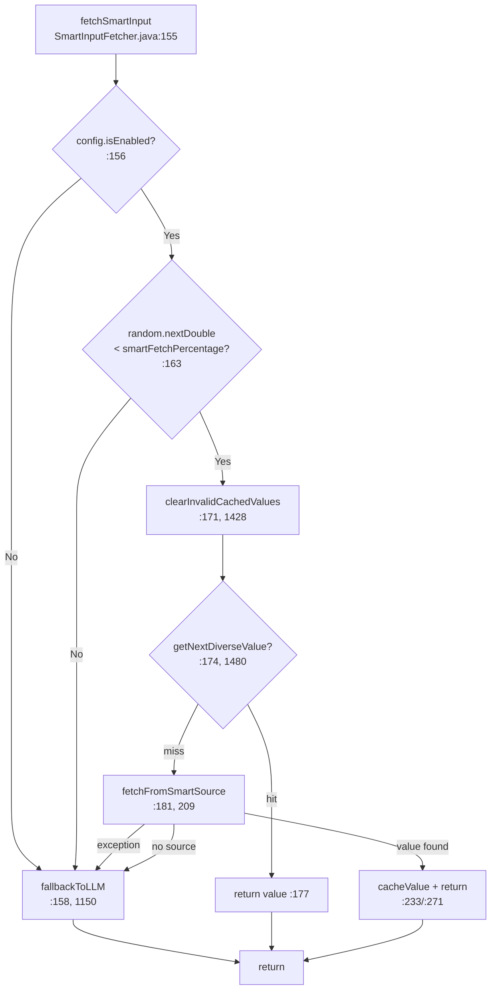
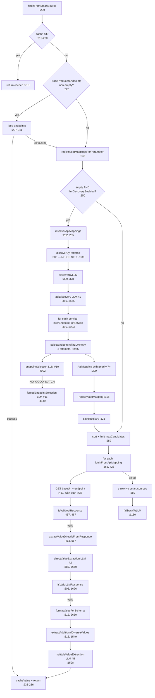
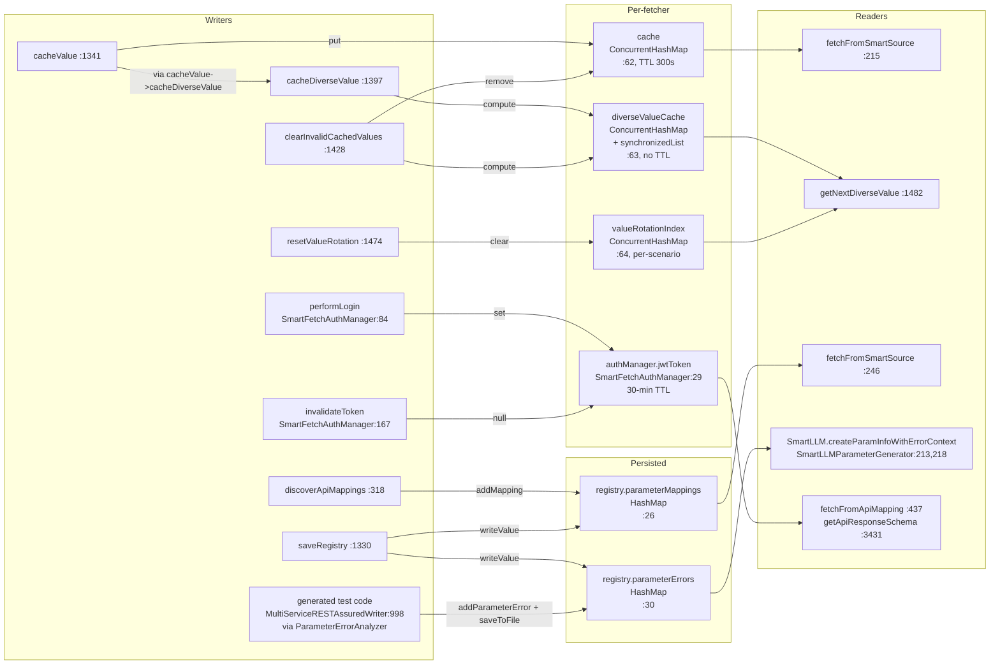

# Smart Input Fetch — Implementation-Reality Dataflow Map

Date: 2026-05-05
Branch: inject-detection

This document is the **implementation-reality companion** to the design-intent diagrams in `src/main/resources/My-Example/trainticket/flow.md` (sections at line 785, 1029, 1198). Every box, branch, and table cell carries a `file:line` citation. When the code disagrees with `flow.md`, the discrepancy is recorded in section 7.

Subsystem under audit: `src/main/java/es/us/isa/restest/inputs/smart/` — eleven files totalling roughly 305 KB, dominated by `SmartInputFetcher.java` (4383 lines) and `InputFetchRegistry.java` (710 lines).

Working set:

| File | Size | Role |
|---|---|---|
| `SmartInputFetcher.java` | 4383 lines | Cache, priority chain, all LLM prompt builders, value formatters |
| `InputFetchRegistry.java` | 710 lines | YAML registry I/O, error semantic dedup, registry data classes |
| `SmartLLMParameterGenerator.java` | 347 lines | `LLMParameterGenerator` subclass that bridges `nextValue()` to the fetcher |
| `SmartFetchAuthManager.java` | 220 lines | JWT login + 30-minute cached token |
| `SmartInputFetchConfig.java` | 217 lines | Properties → config bean |
| `OpenAPIEndpointDiscovery.java` | 270 lines | OAS-driven service/endpoint enumeration |
| `ParameterErrorAnalyzer.java` | 530 lines | Trace → `ParameterError` analyzer (writer-emitted, not used inside fetcher) |
| `ApiMapping.java`, `CacheConfig.java`, `ParameterError.java`, `ServicePattern.java` | small DTOs | YAML-bound model classes |
| `input-fetch-registry.yaml` | 51232 lines | Persisted registry (TrainTicket profile) — 2745 lines of mappings, ~48 000 lines of error history |

---

## 1. Caller Graph

### 1.1 The single entry point

`SmartInputFetcher.fetchSmartInput(ParameterInfo)` at `SmartInputFetcher.java:155-201` is the **only** public input-producing method on the fetcher. Every external caller invokes it.

The fetcher is constructed once per generator at `MultiServiceTestCaseGenerator.java:223` and held in the field `smartFetcher` declared at `MultiServiceTestCaseGenerator.java:50`. A second construction site exists at `SmartLLMParameterGenerator.java:50` (used when the smart fetcher is wired through the standalone `LLMParameterGenerator` SPI).

### 1.2 Call sites in `MultiServiceTestCaseGenerator`

| # | Line | Context | Caller path |
|---|---|---|---|
| 1 | `:333` | Per-scenario rotation reset (no `fetchSmartInput`) | `generateScenarioVariants` calls `smartFetcher.resetValueRotation()` at the start of every variant batch |
| 2 | `:811` | First-step pool miss (positive) | `generateScenarioVariants` → `traverse` (step 1 branch) → `Pool miss for ... falling back to smart fetch` |
| 3 | `:948` | Independent-parameter path (subsequent steps) | `generateScenarioVariants` → `traverse` → step 2+ → INDEPENDENT branch, AFTER `traceProducerEndpoints` enrichment at `:943` |
| 4 | `:2340` | Shared-pool population | `generateSharedParameterPools` Phase 1 — calls `fetchSmartInput` up to `targetPoolSize` times to seed the shared pool |
| 5 | `:2986` | Array element top-up | `generateAdditionalArrayValues` per-element loop |

### 1.3 Producer-endpoint enrichment

The Generator computes a list of HTTP paths observed upstream in the workflow (`collectProducerEndpoints` at `MultiServiceTestCaseGenerator.java:1699`) and passes them on `ParameterInfo` via `info.setTraceProducerEndpoints(...)` at `MultiServiceTestCaseGenerator.java:943`. The fetcher consumes these via `parameterInfo.getTraceProducerEndpoints()` at `SmartInputFetcher.java:223` (Priority 0 below).

This wiring is unique to call site #3 (independent-parameter path). The other four call sites (`:811`, `:2340`, `:2986`, plus call site #2 for first-step pool miss) **do not** enrich the `ParameterInfo` with trace endpoints, so Priority 0 is silently inactive in those callers — the fetcher proceeds straight to Priority 1.

### 1.4 Call from `SmartLLMParameterGenerator`

`SmartLLMParameterGenerator.nextValue()` at `SmartLLMParameterGenerator.java:66-92` calls `smartFetcher.fetchSmartInput(parameterInfo)` at line 77. This is the integration point used by RESTest's standalone `LLMParameterGenerator` SPI (i.e., when the smart fetcher is not driven from `MultiServiceTestCaseGenerator`). It does not set `traceProducerEndpoints`.

### 1.5 Full call chain into `fetchSmartInput`

```
TestGenerationAndExecution.main()
  RESTestRunner.run()
    MultiServiceTestCaseGenerator.generate()
      .generateSharedParameterPools()  ───────────────► fetchSmartInput  [#4 :2340]
      .generateScenarioVariants(sc, baseCounter)
        .smartFetcher.resetValueRotation()                                [#1 :333]
        .traverse(...)                                                    
          ├─ first-step branch  (pool miss)            ──► fetchSmartInput  [#2 :811]
          ├─ subsequent-step independent branch        ──► fetchSmartInput  [#3 :948]
          │   (info.setTraceProducerEndpoints first  :943)
          └─ generateAdditionalArrayValues             ──► fetchSmartInput  [#5 :2986]

— or, when the LLM-generator SPI is used directly —

SmartLLMParameterGenerator.nextValue()                  [SmartLLMParameterGenerator.java:77]
  └─► fetchSmartInput
```

---

## 2. Priority Chain inside `fetchFromSmartSource`

Source: `SmartInputFetcher.java:209-290`. Every branch is numbered below; line ranges quote the exact implementation slice.

### 2.1 Pre-priority cache lookup (`:212-220`)

Before any priority is consulted, the single-value cache is checked under `buildCacheKey(parameterInfo)` (`SmartInputFetcher.java:3244`). Hit ⇒ return immediately. Miss ⇒ fall through.

```java
if (config.isCacheEnabled()) {
    String cacheKey = buildCacheKey(parameterInfo);
    CachedValue cached = cache.get(cacheKey);
    if (cached != null && !cached.isExpired(config.getCacheTtlSeconds())) {
        return cached.value;
    }
}
```

### 2.2 Pre-priority diverse-cache rotation

Note: this is one level higher than `fetchFromSmartSource`. `fetchSmartInput` (`SmartInputFetcher.java:174-178`) calls `getNextDiverseValue(parameterInfo)` BEFORE entering `fetchFromSmartSource`, so a populated diverse cache short-circuits the entire priority chain.

### 2.3 Priority 0 — trace-observed producer endpoints (`:222-243`)

```java
List<String> traceEndpoints = parameterInfo.getTraceProducerEndpoints();
if (traceEndpoints != null && !traceEndpoints.isEmpty()) {
    for (String endpoint : traceEndpoints) {
        ApiMapping traceMapping = new ApiMapping(endpoint, "trace-observed", "DIRECT_EXTRACTION");
        traceMapping.setPriority(10);
        ... fetchFromApiMapping(traceMapping, parameterInfo) ...
    }
}
```

- **Cached on success:** yes — `cacheValue(parameterInfo, value)` at `:233`.
- **Persisted:** **no** — the synthetic `ApiMapping` is never `registry.addMapping()`-ed and never reaches `saveRegistry()`.
- **Loop semantics:** every endpoint is tried in order; the first valid value wins. If all fail, falls through to Priority 1.

### 2.4 Priority 1 — registry mappings (`:245-247, 258-286`)

```java
List<ApiMapping> mappings = registry.getMappingsForParameter(paramName);   // :246
...
for (ApiMapping mapping : mappings.stream()
        .sorted((a, b) -> Double.compare(b.calculateScore(), a.calculateScore()))
        .limit(config.getMaxCandidates())                                  // default 5
        .collect(Collectors.toList())) {
    String value = fetchFromApiMapping(mapping, parameterInfo);
    if (value != null && !value.trim().isEmpty()) {
        if (isValidValueForParameter(value, parameterInfo)) {
            mapping.updateSuccessRate(true);                               // :270
            cacheValue(parameterInfo, value);                              // :271
            return value;
        } else {
            mapping.updateSuccessRate(false);                              // :279
        }
    }
}
```

- **Score function:** `ApiMapping.calculateScore()` at `ApiMapping.java:69-76`: `0.5*(priority/10) + 0.3*successRate + 0.2*recentnessScore`.
- **Side effects:** `ApiMapping.successRate` updates with EMA learning rate `α=0.1` (`ApiMapping.java:59-64`); `lastUsed` is bumped to `now()`.
- **Persistence:** the `successRate` and `lastUsed` mutations are **NOT** written back to disk — `saveRegistry()` is only called from the discovery branch (Priority 2), so success/failure learning is lost between runs unless discovery happens.

### 2.5 Priority 2 — LLM discovery (`:249-256, then 295-334`)

```java
if (mappings.isEmpty() && config.isLlmDiscoveryEnabled()) {
    mappings = discoverApiMappings(parameterInfo);                         // :252
}
```

`discoverApiMappings(parameterInfo)` (`:295-334`) does:

1. `discoverByPatterns(parameterInfo)` (`:339-356`) — **disabled stub**: returns empty list, logs `❌ DEPRECATED: Pattern discovery creates JSONPath mappings`.
2. `discoverByLLM(parameterInfo)` (`:378-418`) — Section 5.1 (LLM call graph).
3. For every newly discovered mapping: `registry.addMapping(parameterInfo.getName(), mapping)` (`:318`).
4. After discovery: `saveRegistry()` (`:323`) writes the entire YAML file.

After discovery returns, control falls through to the same scoring loop at `:259-286` — meaning the freshly added mappings are **immediately tried** alongside any pre-existing ones.

### 2.6 Priority 3 — fallback to LLM (`:288-289, then 1150-1221`)

```java
throw new Exception("No smart sources available for parameter: " + paramName);   // :288
```

Caught by `fetchSmartInput` (`:189-192`) which then invokes `fallbackToLLM(parameterInfo)`. Note the priority-2 caller path. The throw-and-catch here is the documented exit; it does NOT cache, does NOT persist mappings.

`fallbackToLLM` (`:1150-1221`) calls `llmGenerator.generateParameterValues(parameterInfo)` (the underlying `AiDrivenLLMGenerator`), validates each returned value via `isValidValueForParameter` (`:2479`), caches valid ones into the diverse cache via `cacheDiverseValue` (`:1190`), and rotates through them with `getNextDiverseValue`.

### 2.7 Side effects per priority

| Priority | Single-value cache write | Diverse cache write | Registry mutation | Registry persist |
|---|---|---|---|---|
| Pre-priority lookup | — | — | — | — |
| 0 (trace) | `:233` | `:1350` (via `cacheValue`) + `:1411-1422` from `extractAdditionalDiverseValues` | none | none |
| 1 (registry) | `:271` | same as P0 | `mapping.updateSuccessRate` (in-memory only, `:270` / `:279`) | **no** |
| 2 (discovery) | `:271` after fall-through | same as P0 | `addMapping` (`:318`) | `saveRegistry` (`:323`) |
| 3 (LLM fallback) | none in the single-value cache | `cacheDiverseValue` (`:1190`) | none | none |

---

## 3. Cache Subsystems

The fetcher exposes **six** distinct caches plus a JWT cache. Their scopes, eviction rules, and mutation/reset points:

### 3.1 `cache : Map<String, CachedValue>` — single-value TTL cache

| Attribute | Value |
|---|---|
| Declared | `SmartInputFetcher.java:62` |
| Initialised | `:93` — `new ConcurrentHashMap<>()` |
| Concurrency | `ConcurrentHashMap` (thread-safe) |
| Scope | Per-fetcher instance (lifetime ≈ generator instance) |
| TTL | `config.getCacheTtlSeconds()` (default 300s, `SmartInputFetchConfig.java:49`) |
| Eviction | Lazy: `CachedValue.isExpired(ttl)` check at read time (`:78`); no proactive sweep |
| Capacity | **Not enforced** — `CacheConfig.maxEntries=1000` (`CacheConfig.java:15`) is **dead config**: never read by `SmartInputFetcher`. `grep maxEntries SmartInputFetcher.java` returns zero hits. |
| Read | `:215` (pre-priority lookup) |
| Mutated | `cacheValue(...)` at `:1341-1352` (writes formatted value); `clearInvalidCachedValues(...)` removes invalid entries at `:1431-1437` |
| Reset | None except natural TTL expiry. No `clearAll` API. |

`CachedValue` inner class at `:68-80`: `final String value`, `final LocalDateTime timestamp`. No equality / hashing — pure record.

### 3.2 `diverseValueCache : Map<String, List<String>>` — multi-value pool

| Attribute | Value |
|---|---|
| Declared | `SmartInputFetcher.java:63` |
| Initialised | `:94` — `new ConcurrentHashMap<>()` |
| Concurrency | `ConcurrentHashMap` outer; `Collections.synchronizedList(new ArrayList<>())` inner (`:1413`); writes are atomic via `compute` (`:1411-1422`); iterations under `synchronized(list)` (`:1414`, `:1446`) |
| TTL | **None** — entries live for the lifetime of the fetcher |
| Eviction | Manual via `clearInvalidCachedValues` (`:1441-1462`); also internal compute-replace removes invalid items but keeps key |
| Read | `getNextDiverseValue` (`:1480-1509`) |
| Mutated | `cacheDiverseValue(...)` at `:1397-1423`, called from `cacheValue` (`:1350`), `extractAdditionalDiverseValues` (`:1560`), `extractAllValuesWithLLM` flow (`:1606-1608` via call chain), `fallbackToLLM` (`:1190`), `generateAdditionalValuesWithSemanticSimilarity` (`:2020`) |
| Reset | None — only invalidated entries removed (`:1456`) |

Note the diversity of write sites: any LLM call path that yields a usable value seeds this cache.

### 3.3 `valueRotationIndex : Map<String, Integer>` — round-robin cursor

| Attribute | Value |
|---|---|
| Declared | `SmartInputFetcher.java:64` |
| Initialised | `:95` — `new ConcurrentHashMap<>()` |
| Concurrency | `ConcurrentHashMap` (atomic put/get) |
| Scope | Per-scenario via the public reset method (see below) |
| Read | `:1489` — `valueRotationIndex.getOrDefault(cacheKey, 0)` |
| Mutated | `:1495` — `valueRotationIndex.put(cacheKey, (currentIndex + 1) % values.size())` |
| Reset | `resetValueRotation()` at `:1474-1478` — clears the entire map. Called from `MultiServiceTestCaseGenerator.java:333` once per scenario. |

The two-step read-then-put on `:1489-1495` is **not atomic** under concurrent access; if two threads happened to call `getNextDiverseValue` for the same cache key simultaneously the cursor could skip an entry. In practice the generator runs sequentially per scenario, so this is unobserved.

### 3.4 `registry.parameterMappings : Map<String, List<ApiMapping>>` — persisted mapping cache (YAML)

| Attribute | Value |
|---|---|
| Declared | `InputFetchRegistry.java:26` |
| Initialised | `:39` (empty) plus `initializeDefaults()` at `:198-262` (default servicePatterns + 3 default `llmPrompts`) |
| Concurrency | Plain `HashMap` — not thread-safe; the fetcher accesses it from a single thread |
| Persisted to | YAML at `config.getRegistryPath()` (default `input-fetch-registry.yaml`) |
| Loaded at | `loadRegistry` (`SmartInputFetcher.java:1288-1302`) — runs once in the fetcher constructor (`:105`); also re-loaded from disk **per parameter** by `SmartLLMParameterGenerator.createParameterInfoWithErrorContext` (`SmartLLMParameterGenerator.java:213`) |
| Saved at | `saveRegistry()` (`SmartInputFetcher.java:1330-1339`) — only called from `discoverApiMappings` (`:323`) |
| Read | `getMappingsForParameter` (`InputFetchRegistry.java:79`) — used by fetcher at `:246`; `getServicePatterns` at `:343`; `getAllServices` at `:365`; `getLlmPrompts` (5 sites: `:635, :997, :3451, :3514, :4271`) |
| Mutated | `addMapping(...)` (`InputFetchRegistry.java:86-89`) — used by fetcher at `:318` |
| Reset | None during normal operation. Manual: delete the YAML file. |

### 3.5 `registry.parameterErrors : Map<String, Map<String, List<ParameterError>>>` — persisted error context (YAML)

| Attribute | Value |
|---|---|
| Declared | `InputFetchRegistry.java:30` |
| Schema | `apiEndpoint → parameterName → [ParameterError]` |
| Concurrency | Plain `HashMap`; semantic dedup logic at `:493-543` |
| Persisted to | Same YAML as `parameterMappings` |
| Mutated | `addParameterError(...)` (`InputFetchRegistry.java:109-133`) — **not called from the fetcher**. Only the writer-emitted `ParameterErrorAnalyzer` (used by `MultiServiceRESTAssuredWriter.java:998`) feeds this map at runtime, then test code calls `registry.saveToFile(...)`. |
| Read | `getErrorContextForParameter(...)` (`:153-172`) — read by `SmartLLMParameterGenerator.createParameterInfoWithErrorContext` at `:218` |
| Eviction | Semantic dedup ONLY — no expiry. Errors accumulate indefinitely (the live YAML has ~50 000 lines of error entries, including ~49 KB of repeated `Lorem ipsum` payload from a single OVERFLOW probe at line 51100+). |

### 3.6 `authManager.jwtToken` — JWT cache with manual invalidation

| Attribute | Value |
|---|---|
| Declared | `SmartFetchAuthManager.java:29` (token), `:31` (`tokenExpiry`) |
| Initialised | `null` — fetched lazily on first `getValidToken()` call (`:45-53`) |
| Concurrency | Not thread-safe — fields are non-volatile and `performLogin()` mutates without locking. In practice the fetcher's HTTP calls are sequential. |
| TTL | Fixed `TOKEN_VALIDITY_MINUTES = 30` (`:32`) — set at login (`:119`) regardless of actual JWT `exp` claim. The 5-minute pre-expiry buffer is enforced at `:76`. |
| Mutated | `performLogin()` (`:84-140`); `invalidateToken()` (`:167-171`) sets both fields to null |
| Read | `addAuthHeaders(conn)` (`:145-153`); `getAuthorizationHeader()` (`:58-64`) |
| Reset | Only via `invalidateToken()` — no caller in the codebase invokes this (verified by grep). The token therefore lives until the 30-minute window elapses, even if the underlying SUT issues a shorter-lived JWT. |

### 3.7 Cache key derivation — `buildCacheKey` (`:3244-3259`)

The cache key is the colon-joined concatenation of:

```
name : type : location : format : enums : minimum..maximum : minLength..maxLength : regex
```

It does NOT include `traceProducerEndpoints` (so trace-aware draws share the cache with non-trace draws — see Discrepancy 7.3). It also does NOT include the `parameterInfo` description.

---

## 4. Shared Mutable State Table

Every field on `SmartInputFetcher` and `InputFetchRegistry` that mutates during a run.

### 4.1 `SmartInputFetcher`

| # | Field | Type | Decl | Scope | Mutation site | Read site | Concurrency |
|---|---|---|---|---|---|---|---|
| 1 | `registry` | `InputFetchRegistry` | `:61` | per-fetcher | `loadRegistry` `:1292/:1295/:1300`; `saveRegistry` does not reassign | `:246, :318, :323, :343, :365, :635, :997, :3451, :3514, :4271` | reference is final-by-construction; fields inside are mutated below |
| 2 | `cache` | `Map<String, CachedValue>` | `:62` | per-fetcher | `:1347` (`cacheValue.put`), `:1435` (`cache.remove`) | `:215, :1432` | `ConcurrentHashMap` |
| 3 | `diverseValueCache` | `Map<String, List<String>>` | `:63` | per-fetcher | `:1411-1422` (`compute`), `:1443-1461` (`compute`) | `:1175, :1196, :1482` | `ConcurrentHashMap` outer; `Collections.synchronizedList` inner |
| 4 | `valueRotationIndex` | `Map<String, Integer>` | `:64` | per-scenario (cleared at scenario start) | `:1495`, `:1476` (`clear`) | `:1489` | `ConcurrentHashMap`; non-atomic compound read-modify-write |
| 5 | `baseUrl` | `String` | `:65` | per-fetcher | `:84` (constructor) only | `:424, :3423` | effectively final |
| 6 | `random` | `Random` | `:56` | per-fetcher | seeded once at `:92` (`SeededRandom.create("SmartInputFetcher")`); mutated implicitly by every `nextDouble()` call | `:162` | not synchronised — `Random` is internally thread-safe but state advances are non-deterministic if shared |
| 7 | `config` | `SmartInputFetchConfig` | `:52` | per-fetcher | constructor only | many | effectively final |
| 8 | `llmGenerator` | `AiDrivenLLMGenerator` | `:53` | per-fetcher | constructor only | `:1152` | effectively final |
| 9 | `llmService` | `LLMService` | `:54` | process singleton | constructor only | many | singleton lookup via `LLMService.getInstance` |
| 10 | `objectMapper` | `ObjectMapper` | `:55` | per-fetcher | constructor only | many | Jackson `ObjectMapper` is thread-safe after configuration |
| 11 | `openAPIDiscovery` | `OpenAPIEndpointDiscovery` | `:57` | per-fetcher | constructor only; internal state populated in `loadOpenAPISpec` (`:1314`) | `:368, :3905, :3906` | not thread-safe internally, but populated once before any `fetchSmartInput` |
| 12 | `authManager` | `SmartFetchAuthManager` | `:58` | per-fetcher | constructor only; internal token state mutates | `:436, :3431` | see 4.3 |

### 4.2 `InputFetchRegistry`

| # | Field | Type | Decl | Scope | Mutation site | Read site | Concurrency |
|---|---|---|---|---|---|---|---|
| 13 | `version` | `String` | `:24` | per-registry | constructor `:37`, deserializer `:345` | n/a internal; `getVersion` getter | n/a |
| 14 | `lastUpdated` | `LocalDateTime` | `:25` | per-registry | `saveToFile` `:66`; constructor `:38`; deserializer `:346` | getter | n/a |
| 15 | `parameterMappings` | `Map<String, List<ApiMapping>>` | `:26` | per-registry, persisted | `addMapping` (`:87`), `removeMapping` (`:97-99`), deserializer `:351-358` | `:80, :180-185` | plain `HashMap` — not thread-safe |
| 16 | `servicePatterns` | `List<ServicePattern>` | `:27` | per-registry | `initializeDefaults` `:200-218`, deserializer `:362-364` | `getServicePatterns`, `getAllServices` | plain `ArrayList` |
| 17 | `llmPrompts` | `Map<String, String>` | `:28` | per-registry | `initializeDefaults` `:221-261` (3 keys: apiDiscovery, directValueExtraction, valueSelection), deserializer `:347` | 5 read sites in fetcher | plain `HashMap` |
| 18 | `cacheConfig` | `CacheConfig` | `:29` | per-registry | constructor `:42`, deserializer `:369` | only read via `getCacheConfig`; **never read by the fetcher** (the fetcher reads its own `config.getCacheTtlSeconds()` instead — config drift) | n/a |
| 19 | `parameterErrors` | `Map<String, Map<String, List<ParameterError>>>` | `:30` | per-registry, persisted | `addParameterError` (`:110-118`), `mergeErrorInformation` (`:684-698`), deserializer `:373-385` | `:139, :147, :154` | plain `HashMap`; semantic dedup at `:493-543` |

### 4.3 `SmartFetchAuthManager`

| # | Field | Type | Decl | Scope | Mutation site | Read site | Concurrency |
|---|---|---|---|---|---|---|---|
| 20 | `jwtToken` | `String` | `SmartFetchAuthManager.java:29` | per-fetcher | `:118` (login), `:137, :169` (invalidate/clear) | `:48, :60, :70` | non-volatile; not thread-safe |
| 21 | `tokenExpiry` | `LocalDateTime` | `:31` | per-fetcher | `:119, :138, :170` | `:70, :77` | non-volatile |

### 4.4 `ApiMapping` runtime fields (mutated during scoring)

| # | Field | Type | Mutation site | Read site |
|---|---|---|---|---|
| 22 | `successRate` | `double` | `ApiMapping.java:62` (`updateSuccessRate`); fetcher calls at `:270` and `:279` | `:75` (in `calculateScore`) |
| 23 | `lastUsed` | `LocalDateTime` | `:63` (`updateSuccessRate`) | `:73` (`calculateScore`) |
| 24 | `priority` | `int` | `:229` (set on synthetic trace mapping); `:404` (set after LLM discovery) | `:71` (`calculateScore`) |

**Total: 24 mutable fields** across the four classes.

### 4.5 Concurrency notes

- The `SmartInputFetcher` is constructed once per `MultiServiceTestCaseGenerator` and used from the single test-case generator thread. The `ConcurrentHashMap` choices for caches 1-4 are defensive but not strictly required.
- The `InputFetchRegistry` map fields are plain `HashMap`/`ArrayList`. If the fetcher were ever called from multiple threads (e.g., a parallel scenario generator) `addMapping` and `addParameterError` would race; the `ConcurrentHashMap` outer wrapper of `parameterErrors` is provided in the YAML loader (`:373`) as `new HashMap<>()` so that protection is also absent.
- Race condition observed in `valueRotationIndex` (`:1489` → `:1495`): non-atomic increment under concurrent reads would cause two callers to see the same index. Current sequential generation avoids this.

---

## 5. LLM Call Graph

The fetcher issues **fourteen** distinct LLM prompts, all routed through `LLMService.generateText(systemContent, userPrompt, maxTokens, temperature)` defined at `LLMService.java:132`. Three of them reuse YAML-stored templates from `InputFetchRegistry.llmPrompts`; the remaining eleven build their prompts inline.

| # | Logical name | Built at | Invoked at | maxTokens | temperature | System prompt origin | Output format expected | Cleaning / parsing |
|---|---|---|---|---|---|---|---|---|
| 1 | **apiDiscovery** | `buildLLMDiscoveryPrompt` `:3513-3553` | `callLLMForServiceDiscovery` `:3609-3634` (called by `askLLMForServices` `:3555`) | 200 | 0.7 | inline at `:3610-3614`: "API testing assistant ... return JSON array of service names" | JSON array of 1-5 service names, or `NO_GOOD_MATCH` | `cleanJsonFromMarkdown` `:3563`; `objectMapper.readTree`; truncate to 3 if >5 (`:3588`) |
| 2 | **directValueExtraction** | `buildDirectExtractionPrompt` `:634-651` (template from registry key `directValueExtraction`) | `callLLMForDirectValueExtractionFromResponse` `:3680-3713` (called by `askLLMForDirectValueExtraction` `:656`) | 100 | 0.3 | inline at `:3681-3693` (10-line CRITICAL RULES list) | Plain text value, or `NO_GOOD_MATCH` | `cleanJsonFromMarkdown` `:662`; quote stripping (`:670`); JSONPath rejection (`:594`); `isValidLLMResponse` (`:1626`); `formatValueForSchema` (`:612`) |
| 3 | **valueSelection** | `buildValueSelectionPrompt` `:996-1007` (template from registry key `valueSelection`) | `callLLMForValueSelection` `:1124-1145` | 100 | 0.1 | inline at `:1125`: "selects the most appropriate value from given data" | Plain text value or `NO_GOOD_MATCH` | `cleanJsonFromMarkdown`; quote stripping. Note: **only reachable via dead code path** through `extractValueFromResponse` (`:885`) which has zero call sites. |
| 4 | **semanticFieldMatching** | inline at `:818-862` | direct `llmService.generateText` at `:867` | 10 | 0.2 | inline at `:864-865`: "semantic field matching expert" | A single field name, or `NO_MATCH` | trim + null/empty check; case-insensitive lookup `:798-803` |
| 5 | **multipleValueExtraction** | `buildMultipleValueExtractionPrompt` `:1912-1945` | `askLLMForMultipleValueExtraction` `:1950-1970` | 200 | 0.3 | inline at `:1952-1954`: "data extraction expert ... return actual values" | One value per line, or `NO_VALUES_FOUND` | split on `[,\n\r]+`; strip surrounding quotes; `isValidValueForParameter` per item |
| 6 | **semanticSimilarity** | `buildSemanticSimilarityPrompt` `:2169-2238` (with type-specific guard rails for boolean / numeric / station / id / distance) | `askLLMForSemanticSimilarValues` `:2243-2264` | 150 | 0.7 | inline at `:2245-2248`: "semantic similarity and test data generation" | One value per line, or `NO_VALUES_GENERATED` | split on `[,\n\r]+`; strip quotes; reject existing values; `isValidValueForParameter`. Closed-domain short-circuit (`:2046-2057`) and ID-typed short-circuit (`:2070-2075`) skip this prompt entirely. |
| 7 | **fieldRelevance** | `buildFieldRelevancePrompt` `:2436-2453` | `askLLMForFieldRelevanceDecision` `:2458-2474` | 10 | 0.1 | inline at `:2460`: "data extraction expert" | `YES`/`NO`/`relevant` | trim, lowercase, equals comparison |
| 8 | **schemaTypeInference** | `buildSchemaTypeInferencePrompt` `:2947-2974` | `askLLMForSchemaTypeInference` `:2916-2942` | 10 | 0.1 | inline at `:2925-2927`: "OpenAPI schema expert ... respond with exactly one word" | One of `integer`/`number`/`string`/`boolean`/`array` | trim + lowercase; whitelist check (`:2896`) |
| 9 | **arrayTypeDecision** | `buildArrayTypePrompt` `:3098-3117` | `askLLMForArrayTypeDecisionCall` `:3122-3138` | 10 | 0.1 | inline at `:3124`: "OpenAPI schema expert" | `YES`/`NO`/`array` | trim, lowercase, equals. Note: **only reachable via dead code** (`shouldBeArrayType` at `:3054` does NOT call this; `askLLMForArrayTypeDecision` at `:3068` is unreferenced). |
| 10 | **endpointSelection** | `buildEndpointSelectionPrompt` `:4198-4228` | `callLLMForEndpointDiscovery` `:3639-3664` (via `askLLMForEndpointSelection` `:4353`) | 100 | 0.3 | inline at `:3640-3644`: "REST API endpoints" | Plain endpoint path | `cleanJsonFromMarkdown`; quote stripping; `validateAndNormalizeEndpoint` (`:4052-4119`) — exact / case-insensitive / partial / suffix / reverse / fuzzy match |
| 11 | **forcedEndpointSelection** | `buildForcedEndpointSelectionPrompt` `:4238-4265` | reuses `callLLMForEndpointDiscovery` (`:3639`) via `askLLMForEndpointSelection` (`:4160`) | 100 | 0.3 | inline at `:3640-3644` (same as #10) | Plain endpoint path (no `NO_GOOD_MATCH` accepted) | same as #10 |
| 12 | **valueGeneration** | `buildValueGenerationPrompt` `:3780-3834` | `askLLMForValueGeneration` `:3839-3859` | 50 | 0.7 | inline at `:3842-3843`: "test data generator" | Plain text value or JSON array (for array params) or `NO_GOOD_MATCH` | trim; quote stripping; JSONPath rejection (`:3757`); array bracket validation for array params |
| 13 | **minimalFallback (named)** | inline at `:1699-1746` (`generateMinimalFallbackValue`) | direct `llmService.generateText` at `:1749` | 20 | 0.3 | inline at `:1747`: "test data generator" | Plain value | `cleanLLMGeneratedValue` (`:1357`); `isValidValueForParameter` |
| 14 | **minimalFallbackLLM (raw)** | inline at `:1791-1825` (`generateLLMBasedMinimalValue`) | direct `llmService.generateText` at `:1826` | 30 | 0.1 | inline at `:1824`: "minimal test data generator" | Plain value | trim; quote stripping for non-array; throws `RuntimeException` on null |
| 15 | **valueVariation** (LLM-fallback variation) | inline at `:2320-2336` | direct `llmService.generateText` at `:2340` | 10 | 0.7 | inline at `:2338`: "value generation expert" | Plain text value | trim only |

**Distinct prompts: 15.**

Several **registered** template keys never resolve at runtime:

- Key `dataExtraction` is read at `:3451` but **does not exist in the registry** — `initializeDefaults` (`InputFetchRegistry.java:198-262`) installs only `apiDiscovery`, `directValueExtraction`, `valueSelection`. The yaml file confirms this (the only three `llmPrompts` keys present). At runtime `template` is `null` and `template.replace(...)` throws `NullPointerException` — but the function only runs from `guessExtractPath` (`:3279`) which is itself unreachable (Discrepancy 7.4). So this NPE is latent.
- Key `endpointDiscovery` is read at `:4271` from `buildEndpointDiscoveryPrompt`. Same issue: not present in the registry. Caller `askLLMForEndpoint` (`:4304`) is itself only invoked from `parseEndpointFromLLMResponse` paths that have no live caller chain (verify by grep: `buildEndpointDiscoveryPrompt` is unreferenced). Another latent NPE.

### 5.1 Service discovery sub-flow (Priority 2 detail)

Source: `SmartInputFetcher.java:378-418`.

```
discoverByLLM(parameterInfo)
  ├─ getAllAvailableServices() :361                — registry + OpenAPI services
  ├─ buildLLMDiscoveryPrompt :3513                 — apiDiscovery template (#1)
  ├─ askLLMForServices :3555                       — JSON-array parsing
  ├─ for each suggested service: inferEndpointForService :3903
  │    ├─ openAPIDiscovery.getEndpointsForService :3906
  │    ├─ filter to GET only :3909-3911
  │    ├─ selectEndpointWithLLMRetry :3918 / :3965  (3 attempts)
  │    │    ├─ selectEndpointWithLLM :4002            — endpointSelection prompt (#10)
  │    │    └─ on NO_GOOD_MATCH: forceEndpointSelectionWithLLM :4149  — forcedEndpointSelection prompt (#11)
  │    └─ on full failure: pickFirstReasonableEndpoint :3948
  └─ create ApiMapping with priority = config.getLlmDiscoveryPriority() + i (default base=7)
```

### 5.2 Direct extraction sub-flow

Source: `:567-629` and `:1546-1582`.

```
extractValueDirectlyFromResponse(responseBody, parameterInfo)
  ├─ buildDirectExtractionPrompt :634             — directValueExtraction template (#2)
  ├─ length-cap check :574 (>2044 → fallback to extractValueWithSimpleFallback)
  ├─ askLLMForDirectValueExtraction :582
  │    └─ callLLMForDirectValueExtractionFromResponse :3680
  ├─ JSONPath sanity check :594
  ├─ isValidLLMResponse :603 (rejects explanations, generics, ID-format violations)
  ├─ formatValueForSchema :612 (per OpenAPI schema type)
  └─ extractAdditionalDiverseValues :616
       ├─ extractAllValuesWithLLM :1587            — multipleValueExtraction prompt (#5)
       └─ generateAdditionalValuesWithSemanticSimilarity :1575 if extracted < required
            └─ generateSemanticallySimilarValues :2038
                 ├─ closedDomain short-circuit :2046
                 ├─ ID-typed short-circuit :2070
                 └─ askLLMForSemanticSimilarValues :2085 — semanticSimilarity prompt (#6)
```

---

## 6. Registry Lifecycle

### 6.1 Loading

- The fetcher constructor at `:105` calls `loadRegistry()` (`:1288-1302`), which reads `config.getRegistryPath()` (default `input-fetch-registry.yaml`).
- If the file exists: `InputFetchRegistry.loadFromFile(file)` (`InputFetchRegistry.java:51-59`) deserializes via `RegistryData.toRegistry()` (`:343-388`). Defaults are NOT layered on — the deserializer fully replaces every map.
- If the file is missing or unreadable: a fresh `InputFetchRegistry` is constructed (`:1295/:1300`), invoking `initializeDefaults()` (`InputFetchRegistry.java:198-262`) to install 5 service patterns and 3 LLM prompts.
- A second, separate load happens in `SmartLLMParameterGenerator.createParameterInfoWithErrorContext` at `SmartLLMParameterGenerator.java:213` — **per parameter**, on every `nextValue()` call. This re-reads the YAML from disk to retrieve `getErrorContextForParameter(...)`. With ~50 000 lines / 1.6 MB of YAML this is a non-trivial I/O cost on every parameter generation.

### 6.2 Saving

- `saveRegistry()` (`SmartInputFetcher.java:1330-1339`) is called only from `discoverApiMappings` (`:323`) when at least one new mapping was discovered.
- The save writes the **entire** registry — including all `parameterErrors` accumulated since last load — via `InputFetchRegistry.saveToFile` (`:64-74`).
- `lastUpdated` is bumped at `:66`.
- `successRate` and `lastUsed` mutations on `ApiMapping` (Section 2.4) live only in memory until a discovery save happens.

### 6.3 Mutation surface

| Mutator | Site | Persisted by |
|---|---|---|
| `addMapping` | `:318` (in fetcher), via `InputFetchRegistry.java:86` | `saveRegistry` at `:323` |
| `addParameterError` | `InputFetchRegistry.java:109` (called externally by `MultiServiceRESTAssuredWriter.java:998` from generated test code) | The writer-emitted code calls `saveToFile` directly |
| `removeMapping` | `:97` | not called by fetcher |
| `setLastUpdated` | `:269` and `:66` (auto on save) | `saveToFile` |
| `mergeErrorInformation` | `:684-698` | next save |

### 6.4 YAML schema

```yaml
# top-level keys (InputFetchRegistry.java:295-303)
version: "1.0"
lastUpdated: [year, month, day, hour, minute, second, nanos]   # LocalDateTime as 7-element array
parameterMappings:
  <paramName>:
    - endpoint: "/api/v1/..."
      method: "GET"
      service: "ts-..."
      extractPath: "DIRECT_EXTRACTION"   # or legacy JSONPath
      priority: 7
      lastUsed: [...7 ints...]
      successRate: 0.19
      description: null
servicePatterns:
  - pattern: ".*[Ss]tation.*"
    services: [ts-station-service]
    endpoints: [/api/v1/stationservice/stations]
llmPrompts:
  apiDiscovery: "..."
  directValueExtraction: "..."
  valueSelection: "..."
cache:
  enabled: true
  maxEntries: 1000
  ttlSeconds: 300
parameterErrors:
  <apiEndpoint>:
    <paramName>:
      - errorType: "FORMAT_ERROR"
        errorReason: "..."
        apiEndpoint: "..."
        parameterName: "..."
        timestamp: [...7 ints...]
        additionalInfo: null
```

Sample top entry from the live `input-fetch-registry.yaml` (lines 11-57):

```yaml
parameterMappings:
  boughtDateStart:
  - endpoint: "/api/v1/orderservice/order"
    method: "GET"
    service: "ts-order-service"
    extractPath: "DIRECT_EXTRACTION"
    priority: 7
    successRate: 0.0
  - endpoint: "/api/v1/adminorderservice/adminorder"
    service: "ts-admin-order-service"
    extractPath: "DIRECT_EXTRACTION"
    priority: 8
    successRate: 0.0
  - endpoint: "/api/v1/travelservice/trips"
    service: "ts-travel-service"
    extractPath: "DIRECT_EXTRACTION"
    priority: 9
    successRate: 0.19              # <-- the only mapping with non-zero learning
```

Sample mid-file entry (around line 200):

```yaml
  confortClass:
  - endpoint: "/api/v1/priceservice/prices"
    service: "ts-price-service"
    extractPath: "DIRECT_EXTRACTION"
    priority: 7
    successRate: 0.0
  - endpoint: "/api/v1/travelservice/trips"
    service: "ts-travel-service"
    extractPath: "DIRECT_EXTRACTION"
    priority: 8
    successRate: 0.1
```

### 6.5 Anomalies in the live registry

- The mapping section ends at line 2745 (parameterErrors begin). Of ~330 mapping entries, only a handful have non-zero `successRate` — most learning was lost because successful registry hits do not call `saveRegistry()` (Section 2.4).
- The error section (lines 2745-51232) is dominated by a single OVERFLOW probe entry around line 51100 that captures the entire 49 KB Lorem-ipsum URL the test injected. That single entry inflates the registry by ≈25%.
- Some endpoint keys are URL-encoded multiple times (`%2521%2540%2523...`) reflecting encoded special-character probes. They should never recur as unique entries but they do because endpoint normalization is absent at `addParameterError` ingestion.

---

## 7. Discrepancies between flow.md and the code

### 7.1 JSONPath is not "fully retired" — it is dormant dead code

flow.md line 824 claims:

> JSONPath is fully retired: `fetchFromApiMapping` always calls `extractValueDirectlyFromResponse` regardless of `ApiMapping.extractPath`. The legacy `extractValueFromResponse` (JSONPath) method has zero call sites and is dead code.

**Code reality:**

- `fetchFromApiMapping` does call `extractValueDirectlyFromResponse` (`:463`) — this part is correct.
- However, `extractValueFromResponse` (`:885-907`) is still **defined** and uses `JsonPath.read(...)`. Verified by grep: zero call sites in the entire codebase.
- More dead code along the same path: `guessExtractPath` (`:3272-3320`), `guessPathByParameterName` (`:3325-3384`) — only `guessPathByParameterName` is called from `guessExtractPath`; `guessExtractPath` itself has zero call sites.
- `askLLMForExtractionPath` (`:3506`) and `callLLMForExtractionPathDiscovery` (`:3670`) are stubs that log `❌ DEPRECATED` and return null. Neither has any active caller.
- The `dataExtraction` and `endpointDiscovery` registry keys (referenced at `:3451` and `:4271`) do not exist in the YAML, which would cause NPEs if the dead methods were ever invoked.

**Net impact:** flow.md is technically accurate that JSONPath is unused, but the codebase is full of JSONPath-era dead methods and a registry key contract (`dataExtraction`, `endpointDiscovery`) that has no producer. It is misleading to call this "retired" — it is dormant.

### 7.2 Trace endpoints ARE session-scoped — flow.md is correct

flow.md line 825:

> Trace endpoints are session-scoped: Trace-observed `ApiMapping` objects are never added to `registry.addMapping()` and are never persisted to YAML. Only LLM-discovered mappings are saved.

**Verified.** The Priority-0 path at `:228-229` constructs an `ApiMapping` with priority 10 and consumes it directly. There is no `registry.addMapping(...)` call within the Priority-0 block. The synthetic mapping is short-lived. This finding agrees with the code.

### 7.3 Cache key DOES include constraints — flow.md is correct, with one caveat

flow.md line 826:

> `buildCacheKey` now hashes name + type + location + format + enum + minimum/maximum + minLength/maxLength + regex.

**Verified at `SmartInputFetcher.java:3244-3259`.** The key string is the colon-joined concatenation of all eight fields.

**Caveat not stated in flow.md:** the key does NOT include `traceProducerEndpoints`. Two parameters with identical schema constraints but different upstream producer paths share the same cache slot. In practice this means a cached value extracted from one workflow's producer can satisfy a different workflow's parameter draw. Whether this is desirable or a leak is a design call — but it is not what flow.md's wording implies.

### 7.4 `isValidApiResponse` — structured detection is real but incompletely described

flow.md line 828:

> `isValidApiResponse` uses structured detection: instead of a substring scan for the word "error" anywhere in the body, the validator now parses JSON and inspects only the top-level envelope (status, success, error, hasError).

**Code reality at `:487-537`:**

- The structured-JSON inspection is accurate (`isExplicitFailureEnvelope` at `:543-562` checks all four envelope fields).
- However, the implementation has **three** undocumented preconditions that flow.md omits:
  1. **Empty document rejection** at `:493`: `{}` and `[]` are considered invalid before any envelope check.
  2. **Hard length floor of 20 chars** at `:497`: bodies below 20 characters are rejected as "too short". This is the rule the prompt referenced. It will reject very small but legitimate responses (e.g., a single-string ID echo of length 12).
  3. **Empty `data` array/object rejection** at `:512-520`: an envelope with `status: 1` but `data: []` is rejected as a "soft miss". flow.md describes only failure-flag detection, not empty-data rejection.
- For non-JSON bodies, a substring scan IS retained at `:528-534` (looking for `error`, `exception`, `internal server error`, `not found`, `unauthorized`, `forbidden` at the start of the body). flow.md says the substring scan was eliminated; in fact it survives as a fallback for unparseable bodies.

### 7.5 flow.md priority 1198 — Smart Fetch is priority 6, but the per-call-site reality differs

flow.md priority table (line 1198-1209) lists Smart Fetch at priority 6 for "INDEPENDENT path" parameters. The relevant call site is `MultiServiceTestCaseGenerator.java:948`.

**Code reality:**

- Five distinct call sites exist (Section 1.2). Only call site #3 (line 948) follows the documented priority chain (provenance → context → trace → smart fetch → LLM).
- Call site #2 (line 811) — first-step pool miss — invokes Smart Fetch as a **Step-1 fallback after pool miss**. This is the path where pool exhaustion drops the parameter into Smart Fetch. flow.md does mention this branch obliquely at line 1217 ("First business step: positive parameters prefer `sharedParameterPools` first, then Smart Fetch, then LLM") but does not include it in the numbered priority table.
- Call site #4 (line 2340) calls Smart Fetch repeatedly in a loop *before* any LLM, to seed the shared pool. This is a build-time concern — flow.md does not document the pool-seeding flow.
- Call site #5 (line 2986) calls Smart Fetch from the array-element generator. Not in the priority table.

So the priority table at line 1198 describes only one of five live call sites.

### 7.6 Pattern discovery — flow.md describes it as a priority, but the implementation is a no-op stub

flow.md line 798-806 mermaid diagram has nodes labelled `J{Empty and discovery enabled}` → `K[LLM-based discovery - DIRECT_EXTRACTION only]`. The text section "Priority Chain inside `fetchFromSmartSource`" (line 814-821) lists Priority 2 as **LLM-discovered mappings**. Pattern discovery is not mentioned as a priority in the table — but it IS named in the code at `:303` (`discoverByPatterns`) and runs for every discovery cycle.

**Code reality at `:339-356`:**

```java
private List<ApiMapping> discoverByPatterns(ParameterInfo parameterInfo) {
    List<ApiMapping> mappings = new ArrayList<>();
    log.warn("❌ DEPRECATED: Pattern discovery creates JSONPath mappings - we want direct extraction only");
    log.warn("❌ Skipping pattern discovery to avoid JSONPath expressions like '$.data[*].route.endStation'");
    return mappings;   // always empty
}
```

The method body produces only log messages and returns an empty list — yet the caller `discoverApiMappings` at `:303` always invokes it before `discoverByLLM`. flow.md's priority table omits this because it is a no-op, but the mermaid diagram does not even hint that pattern discovery exists. The deprecation warnings are emitted on every discovery cycle, polluting the logs.

### 7.7 Per-scenario rotation reset — wired but caller-fragile

flow.md line 827:

> Per-scenario rotation reset: `SmartInputFetcher.resetValueRotation()` is invoked at the start of every scenario from `MultiServiceTestCaseGenerator.generateScenarioVariants`.

**Verified at `MultiServiceTestCaseGenerator.java:332-334` and `SmartInputFetcher.java:1474-1478`.** Note however that `resetValueRotation` clears only `valueRotationIndex` — it does NOT clear `cache` or `diverseValueCache`. In practice this means the cache persists across scenarios; only the rotation cursor restarts.

Furthermore, `SmartLLMParameterGenerator` (the alternate caller path) does NOT invoke `resetValueRotation` anywhere. If the standalone SPI is used end-to-end, scenario boundaries become invisible to rotation.

### 7.8 Discovery learning is partially persisted

flow.md does not explicitly state when `successRate` is persisted, but readers of the priority chain table (line 1208) reasonably expect that `successRate` updates from `:270/:279` are saved.

**Code reality:** They are not. The only `saveRegistry()` call site is `:323` inside `discoverApiMappings`. If the YAML has all the mappings the parameter needs, the discovery branch never runs, so the learning side-effects of every Priority-1 invocation are lost on JVM exit.

### 7.9 Cache `maxEntries` is dead config

flow.md does not assert it, but `CacheConfig.maxEntries=1000` is exported in the YAML and read by `CacheConfig.toCacheConfig` (`InputFetchRegistry.java:461`). Verified by grep: zero reads of `getMaxEntries()` from `SmartInputFetcher`. The single-value cache grows without bound for the lifetime of the fetcher (mitigated by per-fetcher scope).

### 7.10 30-minute JWT cache vs. real expiry

flow.md does not document JWT lifetime. The code hard-codes `TOKEN_VALIDITY_MINUTES = 30` (`SmartFetchAuthManager.java:32`) regardless of the actual JWT `exp` claim from the SUT. If the SUT issues shorter tokens, the cache will hand out a still-valid (in our terms) but already-expired (server-side) JWT and the API call will fail with 401. There is no caller of `invalidateToken()` in production — the only way to flush a stale token is to recreate the fetcher.

**Total discrepancies catalogued: 10.**

---

## 8. Mermaid Diagrams (Implementation Reality)

### 8.1 `fetchSmartInput` top-level flow



### 8.2 Priority chain inside `fetchFromSmartSource`



### 8.3 Cache & state interactions



---

## 9. Quick-reference index

| Topic | File:line |
|---|---|
| Public entry | `SmartInputFetcher.java:155` |
| Priority 0 trace | `SmartInputFetcher.java:222-243` |
| Priority 1 registry | `SmartInputFetcher.java:245-286` |
| Priority 2 discovery | `SmartInputFetcher.java:295-334` |
| Priority 3 LLM fallback | `SmartInputFetcher.java:1150-1221` |
| Cache key | `SmartInputFetcher.java:3244-3259` |
| Diverse cache write | `SmartInputFetcher.java:1397-1423` |
| Rotation reset | `SmartInputFetcher.java:1474-1478` |
| `isValidApiResponse` 20-char floor | `SmartInputFetcher.java:497` |
| Pattern discovery stub | `SmartInputFetcher.java:339-356` |
| JWT 30-min cache | `SmartFetchAuthManager.java:32, 119` |
| Registry mappings YAML | `input-fetch-registry.yaml:11-2745` |
| Registry errors YAML | `input-fetch-registry.yaml:2745-51232` |
| Per-parameter YAML re-read | `SmartLLMParameterGenerator.java:213` |
| Generator call site #2 (step 1 pool miss) | `MultiServiceTestCaseGenerator.java:811` |
| Generator call site #3 (independent) | `MultiServiceTestCaseGenerator.java:948` |
| Trace endpoint enrichment | `MultiServiceTestCaseGenerator.java:943, 1699` |
| Per-scenario rotation reset | `MultiServiceTestCaseGenerator.java:333` |
| Pool seed call site | `MultiServiceTestCaseGenerator.java:2340` |
| Array top-up call site | `MultiServiceTestCaseGenerator.java:2986` |
