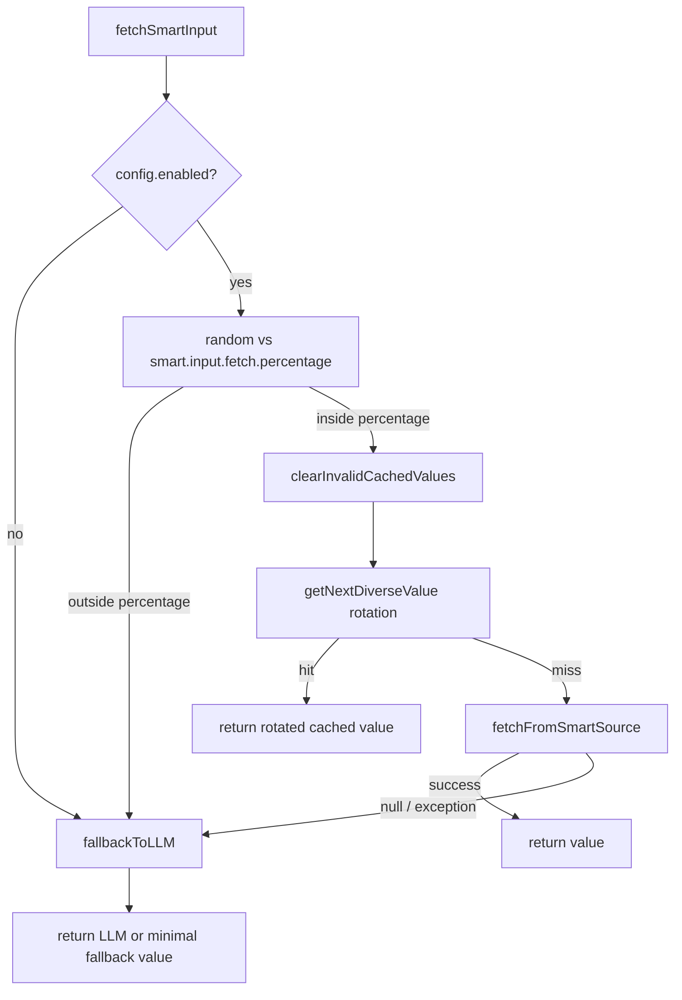

# Smart Fetch (Smart Input Fetching) — Full Process Documentation

This document describes **Smart Fetch** as implemented in this RESTest fork: what it does, how it runs end-to-end, how it interacts with LLMs, HTTP, the registry, and MST (multi-service) test generation.

---

## 1. What Smart Fetch Is

**Smart Fetch** is a subsystem that tries to populate API test parameters with **realistic values obtained from the live system** (via GET calls to existing microservice endpoints) instead of relying only on **LLM-generated** or random values.

Goals:

- Use **data that actually exists** in the deployed system (IDs, station names, order references, etc.).
- **Learn** parameter-to-endpoint mappings over time and **persist** them in a YAML registry.
- When live fetch is not possible, **fall back** to the same LLM path the rest of the tool already uses (`AiDrivenLLMGenerator` via `fallbackToLLM`).

The main implementation class is `es.us.isa.restest.inputs.smart.SmartInputFetcher`.

---

## 2. Configuration

Configuration is loaded into `SmartInputFetchConfig` from properties (typically set as **system properties** in MST mode). Key properties:

| Property | Role |
|----------|------|
| `smart.input.fetch.enabled` | Master switch (`true`/`false`). |
| `smart.input.fetch.percentage` | Probability (0.0–1.0) that **each** `fetchSmartInput` call attempts the smart path vs immediate LLM. Example: `0.3` → ~30% smart attempts. |
| `smart.input.fetch.registry.path` | YAML file for `parameterMappings`, prompts, etc. |
| `smart.input.fetch.openapi.spec.path` | Merged OpenAPI YAML used for **service → GET endpoint** discovery (`x-service-name` on operations). |
| `smart.input.fetch.llm.discovery.enabled` | When no mapping exists, run LLM-based **service** discovery and create mappings. |
| `smart.input.fetch.max.candidates` | Max ranked `ApiMapping` candidates to try per parameter. |
| `smart.input.fetch.discovery.timeout.ms` | HTTP connect/read timeout for discovery GETs. |
| `smart.input.fetch.cache.enabled` / `smart.input.fetch.cache.ttl.seconds` | Single-value cache TTL. |
| `auth.admin.username` / `auth.admin.password` | Used by `SmartFetchAuthManager` for JWT login to the SUT. |
| `base.url` | Gateway/base URL prepended to mapping endpoints. |

Example (from `src/main/resources/My-Example/trainticket-demo.properties`): `smart.input.fetch.enabled=true`, `smart.input.fetch.percentage=0.3`, registry and OpenAPI paths pointing at TrainTicket artifacts.

`TestGenerationAndExecution.passSmartInputFetchingProperties()` copies these (and LLM/auth-related keys) from the experiment `.properties` file into `System.setProperty(...)` **before** `MultiServiceTestCaseGenerator` is constructed, so the generator can read them at startup.

---

## 3. Major Components

### 3.1 `SmartInputFetcher`

- **Entry point:** `fetchSmartInput(ParameterInfo parameterInfo)`.
- Holds:
  - `SmartInputFetchConfig`
  - `InputFetchRegistry` (loaded/saved YAML)
  - `OpenAPIEndpointDiscovery` (parsed OpenAPI for `inferEndpointForService`)
  - `SmartFetchAuthManager` (JWT for authenticated GETs)
  - `LLMService` + `AiDrivenLLMGenerator` (discovery prompts + fallback generation)
  - Caches: single-value cache, **diverse** multi-value cache with **rotation** index

### 3.2 `SmartFetchAuthManager`

- POSTs to `{baseUrl}/api/v1/users/login` with admin credentials.
- Parses `data.token` from JSON, caches JWT with a **30-minute** validity window (with a 5-minute safety buffer).
- Adds `Authorization: Bearer <token>` on smart-fetch HTTP GETs when configured.

### 3.3 `InputFetchRegistry` (YAML)

- **`parameterMappings`:** map from **parameter name** → list of `ApiMapping` (endpoint path, service name, `extractPath`, priority, success rate, etc.).
- **Default LLM prompt templates** for `apiDiscovery`, `directValueExtraction`, `valueSelection` (can be overridden by file content).
- **Service patterns** (regex → services/endpoints) exist for defaults; **pattern-based discovery is disabled** in code (`discoverByPatterns` returns empty by design).
- Optional **parameter error** tracking for feeding context into other generators (`getErrorContextForParameter`).

### 3.4 `ApiMapping`

- Describes **which URL** to call (`endpoint`), **which service** label to log, and `extractPath`.
- Current smart-fetch path uses **`DIRECT_EXTRACTION`** as the extract path marker: values are **not** taken via JSONPath in the primary path; the response is passed to **direct LLM extraction** or structured fallbacks.
- `calculateScore()` ranks mappings; success/failure updates `successRate` (exponential moving average).

### 3.5 `OpenAPIEndpointDiscovery`

- Reads OpenAPI YAML, walks `paths`, and for each operation with **`x-service-name`**, records `EndpointInfo` (path, method, summary, description).
- `inferEndpointForService` uses **GET-only** endpoints for a service, then **LLM-based endpoint selection** (`selectEndpointWithLLM` / retries) or heuristics / emergency fallback.

### 3.6 `ParameterInfo`

- Standard LLM parameter descriptor (name, type, description, location, schema hints). Built in `MultiServiceTestCaseGenerator.createParameterInfoWithContext(...)` so Smart Fetch knows the **target parameter** and API context.

---

## 4. End-to-End Flow (`fetchSmartInput`)



### 4.1 Percentage gate

For each call, `random.nextDouble() < smartFetchPercentage`:

- **True:** try smart pipeline (after diverse-cache check).
- **False:** skip HTTP discovery and call **`fallbackToLLM`** immediately (same as “LLM decision” branch).

So “30% smart” means **30% of invocations** attempt live fetch, not “30% of parameters globally” as a hard quota.

### 4.2 Diverse value cache

If smart path is chosen, the code may return immediately from **`getNextDiverseValue`**: previously extracted values for the same parameter are **rotated** so repeated generations do not always reuse one ID.

### 4.3 `fetchFromSmartSource` (core)

1. **Optional single-value cache** (`cache` + TTL): if hit and valid, return.
2. **Load mappings** from registry: `registry.getMappingsForParameter(paramName)`.
3. **If empty and LLM discovery enabled:** `discoverApiMappings`:
   - Pattern discovery is **explicitly disabled** (empty list).
   - **LLM discovery:** `discoverByLLM` → `buildLLMDiscoveryPrompt` → `askLLMForServices` → for each suggested service, `inferEndpointForService` builds an `ApiMapping` with `DIRECT_EXTRACTION`, saves to registry, **`saveRegistry()`** persists YAML.
4. **Sort mappings** by `calculateScore()`, take up to **`maxCandidates`**.
5. For each mapping: **`fetchFromApiMapping`**:
   - `GET baseUrl + endpoint` with auth + timeouts.
   - Require HTTP **200** (configurable success code).
   - **`isValidApiResponse`:** reject obvious errors, empty `data`, very short bodies, etc.
   - **`extractValueDirectlyFromResponse`:** primary extraction via LLM + schema formatting; on failure, **`extractValueWithSimpleFallback`** (parse JSON, walk `data[0]`, field match / semantic match / `generateValueWithLLM`).
6. On success: **`isValidValueForParameter`**, **`mapping.updateSuccessRate(true)`**, **`cacheValue`** (and diverse cache via `extractAdditionalDiverseValues`).
7. On failure after all candidates: throw **`No smart sources available`** → caught at top level → **`fallbackToLLM`**.

### 4.4 `fallbackToLLM`

- Calls `llmGenerator.generateParameterValues(parameterInfo)` (`AiDrivenLLMGenerator`).
- Cleans values, validates with `isValidValueForParameter`, fills **diverse cache** for rotation, handles **array** parameters as JSON array strings, and finally may call **`generateMinimalFallbackValue`** if everything fails.

This is the **same style of LLM generation** used when Smart Fetch is disabled or loses the percentage roll.

---

## 5. How MST Uses Smart Fetch

### 5.1 Initialization (`MultiServiceTestCaseGenerator`)

In `initializeSmartInputFetching()`:

- Collects `smart.input.fetch*` and `base.url` from **system properties**.
- Builds `SmartInputFetchConfig.fromProperties(...)`.
- If enabled, constructs `new SmartInputFetcher(config, baseUrl)`.

### 5.2 Shared parameter pools (two-stage generation)

`generateSharedParameterPools` / `generateParameterPoolForRootApi`:

- For each parameter of the root operation, it calls **`smartFetcher.fetchSmartInput` up to 15 times** to build a pool (“Smart Fetch Pool” logs).
- If fewer than 15 values, it **supplements** with LLM seeds + **`SemanticParameterExpander`** (`expander.expandValues`).

This is where logs like `Smart Fetch Pool → parameter 'departureTime': 15 smart values generated` come from.

### 5.3 Per-step parameter filling

Smart Fetch is used when:

- **Step 1** parameters need a value and it is not a locked **faulty/negative** parameter.
- **Later steps** for **independent** parameters (no dependency from context/trace), again skipping **negative-test** target parameters.

Order of precedence (simplified):

1. Negative/faulty injection when applicable.
2. Smart Fetch (if enabled and conditions met).
3. LLM generation with rotation over returned lists.

### 5.4 Array body helper

`generateJsonArray` may call **`fetchSmartInput`** for extra elements when building JSON arrays.

### 5.5 Interaction with negative tests

For parameters selected as **invalid** in a negative variant, Smart Fetch is **skipped** so invalid values are not overwritten by real data. If invalid value injection fails, the code may still call Smart Fetch or LLM to get a **valid** value so the test case remains structurally usable (with logging).

---

## 6. Other Entry Points

### 6.1 `SmartLLMParameterGenerator`

- Extends `LLMParameterGenerator`.
- On `nextValue()`, calls **`smartFetcher.fetchSmartInput`** when initialized and enabled, else falls back to error-aware LLM (`generateWithErrorContext`).
- Used when test configuration selects the LLM parameter generator path and **`TestDataGeneratorFactory`** sees `smart.input.fetch.enabled=true`.

### 6.2 `TestDataGeneratorFactory.createLLMParameterGenerator`

- If `smart.input.fetch.enabled` is true, instantiates **`SmartLLMParameterGenerator`** by reflection; otherwise **`LLMParameterGenerator`**.

---

## 7. Usage samples

This section shows **how to turn Smart Fetch on** and **how to call it** in code, mirroring what the repo already ships (`trainticket-demo.properties`, `SmartInputFetchingDemoTest`, MST runs).

### 7.1 Enable Smart Fetch in a `.properties` file (MST / `TestGenerationAndExecution`)

Minimal pattern: set the master flag, percentage, paths, timeouts, cache, and point `base.url` at your gateway. The excerpt below matches the TrainTicket demo file (`src/main/resources/My-Example/trainticket-demo.properties`); adjust paths if your registry and merged OpenAPI live elsewhere.

```properties
# Master switch
smart.input.fetch.enabled=true

# Per-call probability of attempting live fetch (0.0 = always LLM path for "roll"; 1.0 = always try smart when enabled)
smart.input.fetch.percentage=0.3

smart.input.fetch.registry.path=src/main/resources/My-Example/trainticket/input-fetch-registry.yaml
smart.input.fetch.openapi.spec.path=src/main/resources/My-Example/trainticket/merged_openapi_spec 1.yaml

smart.input.fetch.llm.discovery.enabled=true
smart.input.fetch.max.candidates=5
smart.input.fetch.discovery.timeout.ms=5000
smart.input.fetch.cache.enabled=true
smart.input.fetch.cache.ttl.seconds=300

# Gateway / ingress (prepended to mapping endpoints)
base.url=http://your-host:port

# JWT login for protected GETs (TrainTicket-style /api/v1/users/login)
auth.admin.username=admin
auth.admin.password=yourPassword
```

Also ensure **LLM system properties** are set in the same file (or environment) so discovery and `fallbackToLLM` work—`passSmartInputFetchingProperties()` copies `llm.*` keys into `System` for MST.

**Run:** use your usual RESTest entry point with `generator=MST` and this properties file so `passSmartInputFetchingProperties()` runs before `MultiServiceTestCaseGenerator` is created. You should see initializer logs (`SmartInputFetcher initialized…`) and, during generation, `Smart Fetch →` / `Smart Fetch Pool →` lines when the percentage gate and mappings allow it.

### 7.2 Programmatic usage: `SmartInputFetcher` + `ParameterInfo`

The project includes `src/test/java/SmartInputFetchingDemoTest.java` (`es.us.isa.restest.test`). It shows the typical pattern: build `SmartInputFetchConfig`, point at the registry, set `baseUrl`, then call `fetchSmartInput` with a populated `ParameterInfo`.

**Configure in code (abbreviated from the demo):**

```java
SmartInputFetchConfig config = new SmartInputFetchConfig();
config.setEnabled(true);
config.setSmartFetchPercentage(0.7);
config.setRegistryPath("src/main/resources/My-Example/trainticket/input-fetch-registry.yaml");
config.setLlmDiscoveryEnabled(true);
config.setMaxCandidates(3);
config.setDiscoveryTimeoutMs(5000L);

String baseUrl = "http://localhost:8080";
SmartInputFetcher smartFetcher = new SmartInputFetcher(config, baseUrl);
```

**Fetch a value for one parameter:**

```java
ParameterInfo stationParam = new ParameterInfo();
stationParam.setName("stationName");
stationParam.setType("string");
stationParam.setDescription("Name of the railway station");
stationParam.setInLocation("body");
stationParam.setSchemaExample("Beijing");

String value = smartFetcher.fetchSmartInput(stationParam);
```

`fetchSmartInput` applies the **percentage gate** internally: some calls may return LLM-generated values without hitting HTTP, even when `enabled` is true.

**Load the same settings from a `Map` (matches property keys):**

```java
Map<String, String> testProperties = new HashMap<>();
testProperties.put("smart.input.fetch.enabled", "true");
testProperties.put("smart.input.fetch.percentage", "0.8");
testProperties.put("smart.input.fetch.registry.path", "test-registry.yaml");
testProperties.put("smart.input.fetch.llm.discovery.enabled", "true");
testProperties.put("smart.input.fetch.max.candidates", "5");

SmartInputFetchConfig cfg = SmartInputFetchConfig.fromProperties(testProperties);
```

For MST, you normally **do not** construct the fetcher yourself: `MultiServiceTestCaseGenerator` reads `System` properties and builds `SmartInputFetcher` if `smart.input.fetch.enabled=true`.

### 7.3 LLM parameter generator path (`TestDataGeneratorFactory`)

If your test configuration uses **`LLMParameterGenerator`** (classic RESTest test conf, not MST), set a JVM system property so the factory swaps in the smart wrapper:

```text
-Dsmart.input.fetch.enabled=true
-Dbase.url=http://localhost:8080
```

(plus the usual `smart.input.fetch.registry.path` etc., if not defaulted). The factory loads `SmartLLMParameterGenerator`, whose `nextValue()` delegates to `fetchSmartInput` when initialization succeeds.

### 7.4 Registry YAML snippet (learned mapping)

The registry persists **parameter name → list of GET sources**. Mappings discovered or saved at runtime use `extractPath: "DIRECT_EXTRACTION"` in current code paths. Example shape (from `input-fetch-registry.yaml`):

```yaml
parameterMappings:
  loginId:
    - endpoint: "/api/v1/user/query"
      method: "GET"
      service: "ts-User-service"
      extractPath: "DIRECT_EXTRACTION"
      priority: 7
```

Hand-editing is possible; ensure `endpoint` paths match what your gateway exposes.

### 7.5 What you might see in logs

When Smart Fetch runs against a live TrainTicket deployment, logs often include lines like:

```text
SmartInputFetcher initialized with config: SmartInputFetchConfig{enabled=true, smartFetchPercentage=0.30, ...}
SmartFetchAuthManager initialized for baseUrl: http://..., username: admin
🎯 Smart Fetch Decision → accountId (...)
✅ Smart Fetch Success: accountId = '98779e1f-8cce-4435-9ff4-81411a9d9bd5' (from ts-user-service)
Smart Fetch → accountId = 98779e1f-8cce-4435-9ff4-81411a9d9bd5 ✅
Smart Fetch Pool → parameter 'departureTime': 15 smart values generated
```

If no mapping exists and discovery is off or LLM returns no services, you may see fallbacks such as `Smart Fetch → differenceMoney = ERROR (No smart sources available for parameter: differenceMoney), falling back to LLM`.

### 7.6 MST-specific behavior (quick reference)

| What you do | What happens |
|-------------|----------------|
| Set `smart.input.fetch.enabled=true` and run MST | `MultiServiceTestCaseGenerator` creates `SmartInputFetcher` at startup. |
| Generate tests | Root-operation **shared pools** call `fetchSmartInput` up to **15× per parameter**; variants then reuse/rotate values. |
| Per-step params | Step 1 and **independent** later-step params may call `fetchSmartInput` before LLM; **negative-test** target params skip smart fetch. |

---

## 8. Concrete Example (TrainTicket-style)

**Scenario:** Parameter `accountId` (UUID) for a protected route.

1. MST enables smart fetch; `passSmartInputFetchingProperties` sets registry path and `base.url` to the cluster gateway.
2. `fetchSmartInput` wins the percentage roll → no diverse cache yet.
3. Registry may already list `accountId` → `GET .../api/v1/userservice/users` (example).
4. `SmartFetchAuthManager` logs in → JWT attached.
5. GET returns JSON with user list; **`extractValueDirectlyFromResponse`** asks the LLM to output **one actual value** from the body (not JSONPath). Result is formatted and cached.
6. Logs: `✅ Smart Fetch Success: accountId = '...' (from ts-user-service)` and `Smart Fetch → accountId = ... ✅`.

**If** no mapping exists:

- LLM suggests services (e.g. `ts-user-service`), `inferEndpointForService` picks a GET path from OpenAPI, mapping is saved to `input-fetch-registry.yaml` for the next run.

**If** extraction fails or HTTP is non-200:

- Mapping success rate decreases; next mapping may be tried; eventually **`fallbackToLLM`** produces a value.

---

## 9. Dependencies Between Components (Summary)

| Component | Depends on |
|-----------|------------|
| `SmartInputFetcher` | Config, registry file, optional OpenAPI file, `base.url`, LLM (`LLMService`), JWT auth |
| LLM discovery | Merged OpenAPI with `x-service-name`; LLM for service list + endpoint choice + direct value extraction |
| MST generator | System properties set by `TestGenerationAndExecution`; constructs `ParameterInfo` per parameter |
| Persisted learning | `input-fetch-registry.yaml` grows with new `parameterMappings` |

---

## 10. Design Notes and Limitations

- **Pattern discovery** is intentionally **off**; the design favors **LLM discovery + DIRECT_EXTRACTION** over JSONPath-heavy mappings.
- **Legacy JSONPath** helpers remain in the class but the documented happy path is **direct extraction**.
- **TrainTicket-specific** login URL and response shape are assumed in `SmartFetchAuthManager`; other systems need compatible auth or code changes.
- Log lines like `Smart Fetch Decision → ... (random: {:.3f} < {:.1f}%)` use **printf-style placeholders inside SLF4J `{}` messages**; some placeholders may not render as numbers in logs (cosmetic only).
- **`smart.input.fetch.dependency.resolution.enabled`** is present on `SmartInputFetchConfig`; dependency resolution for Smart Fetch itself is primarily handled in **MST** (context/trace), not reimplemented inside every `SmartInputFetcher` call—verify behavior if you rely on that flag for fetch-time semantics.

---

## 11. File Index (Implementation)

| File | Responsibility |
|------|------------------|
| `src/main/java/es/us/isa/restest/inputs/smart/SmartInputFetcher.java` | Main orchestration, HTTP GET, discovery, extraction, caches, fallbacks |
| `SmartInputFetchConfig.java` | Property defaults and parsing |
| `SmartFetchAuthManager.java` | Admin login + JWT |
| `InputFetchRegistry.java` | YAML load/save, prompts, optional error context |
| `ApiMapping.java` | Mapping model + scoring |
| `OpenAPIEndpointDiscovery.java` | Service/endpoint index from OpenAPI |
| `SmartLLMParameterGenerator.java` | LLM generator integration |
| `MultiServiceTestCaseGenerator.java` | MST pools + per-step smart fetch |
| `TestGenerationAndExecution.java` | `passSmartInputFetchingProperties()` |
| `TestDataGeneratorFactory.java` | Chooses `SmartLLMParameterGenerator` when enabled |

---

*Generated from source review of the Rest repository Smart Input Fetching implementation.*
