### MST Mode End-to-End Flow (MistMain → MistRunner)

> **Entry point.** The launch path is
> `java -jar mist-cli/target/mist.jar trainticket-demo.properties`,
> whose `Main-Class` is `io.mist.cli.MistMain`. `MistMain` loads the
> properties file, builds a `MstConfig` via
> `MstConfig.fromSystemProperties()`, and delegates to
> `MistRunner.run()` (lives at
> `mist-cli/src/main/java/io/mist/cli/MistRunner.java`). The legacy
> `restest.jar` / `TestGenerationAndExecution` main class was retired
> during the 1.6 RESTest sever; `mist.jar` is now the only supported
> entry point. The flowchart below describes the steps inside
> `MistRunner`. Before generation, `MistRunner.bootstrapTraceShapeOracle()`
> loads/learns the trace-shape invariants; the writer emits a per-step oracle
> evaluation into each generated `Flow_Scenario_*.java`.

> **SUT scope.** This doc uses TrainTicket for illustration, but MIST is
> multi-SUT (`evaluation/suts/bookinfo`, `evaluation/suts/sockshop`).
> TrainTicket-specific paths (`/api/v1/ts-*`), the TT noun-map, and the TT seed
> traces below are **examples**, not hardcoded universal behaviour — per-SUT
> service patterns, OpenAPI tags, and `*.properties` drive non-TT runs.

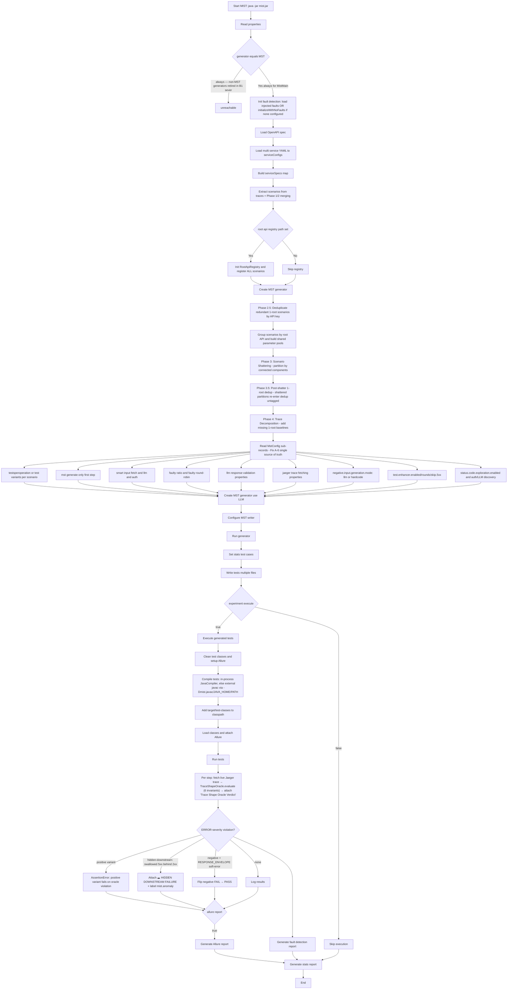

**Critical Design Decision: Registry Is Observational, Dedup Happens in the Generator**

The MST flow still registers **all extracted scenarios** in the Root API Registry before generator-side filtering, but the registry itself does **not** stop code generation:

1. **Extract scenarios from traces** → Get workflow patterns from Jaeger after Phase 1/2 merging
2. **Register ALL scenarios** → Root API Registry records every observed root API / tree pattern
   - Why? The registry is an architectural catalog of what was seen in traces
   - It can store multiple observed interaction trees per root API for auditing and analysis
3. **Create MST generator** → The actual generation pipeline starts
4. **Phase 2.5: Single-root scenario deduplication** → Remove redundant standalone 1-root scenarios with the same normalized API key
   - Why? Parameterless or stateless endpoints can otherwise explode into dozens of identical `Flow_Scenario_N.java` files
   - **Deduplication is applied only to standalone 1-root scenarios**
   - Multi-root workflows are preserved because they may differ in downstream chains
5. **Phase 3.5: post-shatter 1-root deduplication** → after Phase 3 shattering, partitions re-enter the same dedup pass UNtagged
   - A shattered 1-root partition whose API key was already approved (a standalone owner survives elsewhere) is dropped
   - A partition with a genuinely new key is approved and kept
   - Scenarios Phase 3 left untouched are the same tagged instances Phase 2.5 approved and pass through unchanged
6. **Phase 4 decomposition reuses the same seen-set** → if a standalone 1-root scenario already covers an API, `_RT` decomposed baselines for that API are skipped

**Example:**
- 10 traces all contain standalone `GET /api/v1/adminbasicservice/adminbasic/stations`
- All 10 may be recorded observationally in the registry layer
- But Phase 2.5 keeps only the first standalone 1-root scenario for generation
- If a multi-root flow later contains the same root API, decomposition skips emitting a duplicate `_RT` baseline
- Result: 1 generated baseline test class for that endpoint instead of 10+

### Workflow Scenario Extraction (TraceWorkflowExtractor)

**Purpose**: Convert raw OpenTelemetry / Jaeger trace files (JSON/JSONL) into `WorkflowScenario` objects that the Generator can traverse. This includes extracting business data from spans and linking independent traces that share data values.

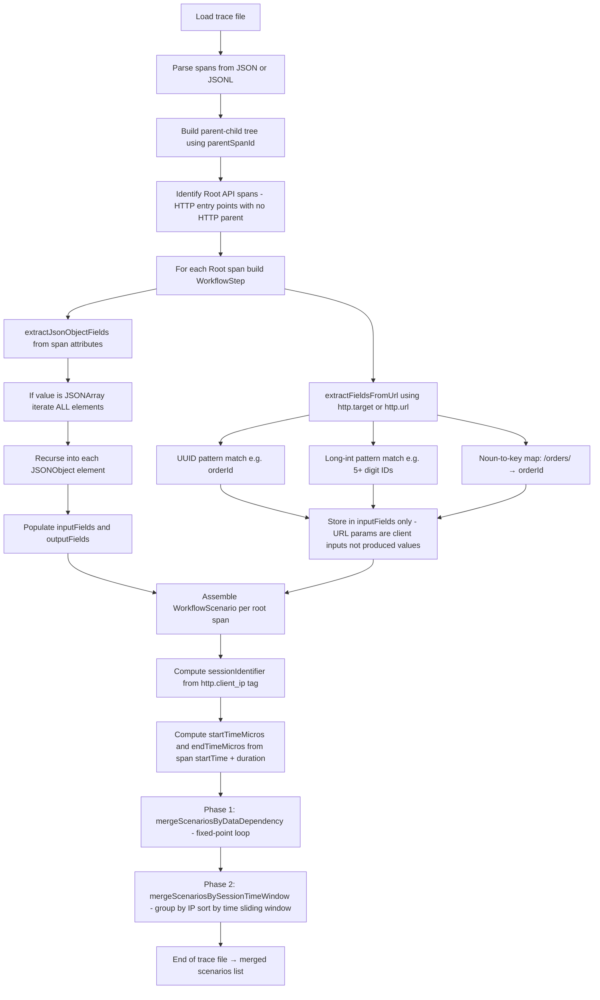

**Span Field Extraction (`extractJsonObjectFields`):**
- Iterates **all** elements in a `JSONArray` (previously only read index 0).
- Recursively calls itself on any `JSONObject` element found inside an array.
- **Dot-prefixed flattening + first-wins bare alias.** Each leaf is stored under both its dot-prefixed path (e.g., `data.orderId`) AND its bare key (`orderId`) using `putIfAbsent`. The bare alias keeps cross-trace merging semantics (which match on bare key + value) but is now deterministic: the shallowest occurrence wins instead of the previous last-wins clobber. Two unrelated nested fields with the same name no longer corrupt each other.
- Skips keys in `ignoreKeys`: `http.method`, `http.url`, `http.target`, `http.path`, `http.request.body`, `http.response.body` (these are structural, not business data).

**URL Path Parameter Extraction (`extractFieldsFromUrl`):**

| Pattern | Example URL | Key Assigned | Value |
|---------|-------------|--------------|-------|
| UUID after known noun | `/api/v1/orderservice/orders/47e2a130-...` | `orderId` | `47e2a130-...` |
| UUID after unknown but meaningful noun | `/api/v1/widgets/47e2a130-...` | `widgetId` | `47e2a130-...` |
| UUID after short / structural segment | `/api/v1/47e2a130-...` (prev = `v1`) | *skipped* | — |
| Long integer (≥5 digits) after known noun | `/api/v1/accountservice/accounts/10001` | `accountId` | `10001` |
| Long integer after unknown but meaningful noun | `/api/v1/widgets/10001` | `widgetId` | `10001` |

Noun-to-key mappings cover: `orders→orderId`, `accounts→accountId`, `trips→tripId`, `routes→routeId`, `users→userId`, `contacts→contactId`, `trains→trainNumber`, `stations→stationId`, `prices→priceId`, `seats→seatId`, `configs→configId`, `consigns→consignId`, `foods→foodId`, `assurances→assuranceId`, `vouchers→voucherId`, `payments→paymentId`.

**Meaningful-noun guard.** A previous segment now must be at least 3 lowercase letters and not in the path-noise set (`api`, `rest`, `service(s)`, `internal`, `external`, `public`, `private`, `v`, `version`). Short or structural prefixes used to produce keys like `v1Id`, `apiId`, `tId` that polluted `inputFields` and risked false cross-trace merges; they are now dropped entirely. The previous fallback `pathParam_<i>` orphan keys are also gone for the same reason.

> **Bug fix (Session Merging era):** URL path parameters are stored in **`inputFields` only** — NOT in `outputFields`. URL path segments are client-supplied inputs (they identify the resource to access); they are not values *produced* by the API call. Placing them in `outputFields` was causing false-positive cross-trace producer relationships in `mergeScenariosByDataDependency`, incorrectly linking unrelated traces. The line `extractFieldsFromUrl(urlForPathExtraction, outputFields)` was removed; only `extractFieldsFromUrl(urlForPathExtraction, inputFields)` remains.

---

### Phase 1: Cross-Trace Data Dependency Merging (`mergeScenariosByDataDependency`)

**Purpose**: Link independent `WorkflowScenario` objects from separate root API traces into a single unified scenario when they share a **matching business data value** (e.g., both traces reference the same `accountId` UUID). This implements Algorithm 1, Step 17: MERGESCENARIOS BY DATA DEPENDENCY.

> **When this works:** Effective when traces contain actual business IDs in span attributes (e.g., `orderId` in query params). **Limitation:** Production OTel traces that lack `http.response.body` prevent value matching on dynamically-generated IDs. Phase 2 (Session-Based Heuristic Merging) handles this case.

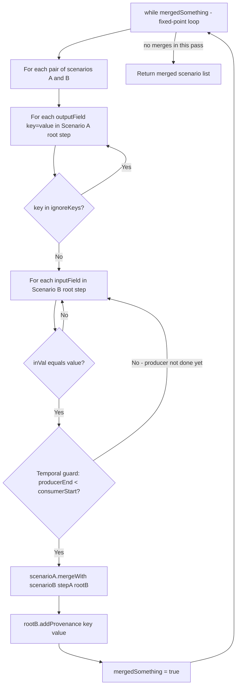

**Key guards and design decisions:**

| Guard | Reason |
|-------|--------|
| `ignoreKeys` set | Prevents merging on HTTP metadata (`http.url`, `http.method`, etc.) — these are structural, not business data |
| Temporal guard: `producerEnd < consumerStart` | Ensures causality — the producer trace must have **finished** before the consumer trace started. Prevents false merges for concurrent traces. |
| Fixed-point `while (mergedSomething)` loop | Handles **transitive chains**: if A→B and B→C share data, both merges are applied across multiple passes until no new merges are found. |
| `scenarioA.mergeWith(scenarioB, stepA, rootB)` | Encapsulated merge: adds `rootB` as a child of `stepA`, transfers traceIds, rebuilds root links. |
| `rootB.addProvenance(key, value)` | Records exactly **which field** caused the merge so the Generator can retrieve the exact value from `span.getDataProvenance()` without ambiguity. |

**Data Provenance (`WorkflowStep.dataProvenance`):**

A `Map<String, String>` added to `WorkflowStep` that records the key=value pair that caused a cross-trace merge for the consuming step (`rootB`). Example after merging on `accountId`:

```
rootB.dataProvenance = { "accountId" → "4d2a46c7-71cb-4cf1-b..." }
```

The Generator checks this map at **Priority 3-PROV** (before the flat context map) to ensure the consuming step uses the exact value from its proven producer, not an overwritten or rotated value from elsewhere.

**Observed merge triggers in TrainTicket traces (6 out of 10 multi-trace files):**

| File | Traces | Merges | Key |
|------|--------|--------|-----|
| `traces-1759192647565.json` | 99 | 67 | `routeId` |
| `traces-1772605059021.json` | 11 | 16 | `accountId` |
| `traces-1772605145922.json` | 31 | 28 | `routeId` |
| `traces-1772605177793.json` | 26 | 28 | `routeId` |
| `traces-1772605191379.json` | 19 | 28 | `routeId` |
| `traces-1772605095842.json` | 154 | 36 | `orderId`, `accountId` |
| `traces-1772605065914.json` | 2 | 1 | `accountId` (minimal test case) |

---

### Phase 2: Session-Based Heuristic Merging (`mergeScenariosBySessionTimeWindow`)

**Motivation**: Many production OpenTelemetry traces lack `http.response.body` and `http.request.body` because instrumentation frameworks omit payload capture for performance. Without matching output-to-input values, Phase 1 cannot link traces. Phase 2 uses *session identity* (client IP) and *temporal proximity* (timestamp overlap) as heuristic evidence that two API calls were issued by the same user in the same workflow.

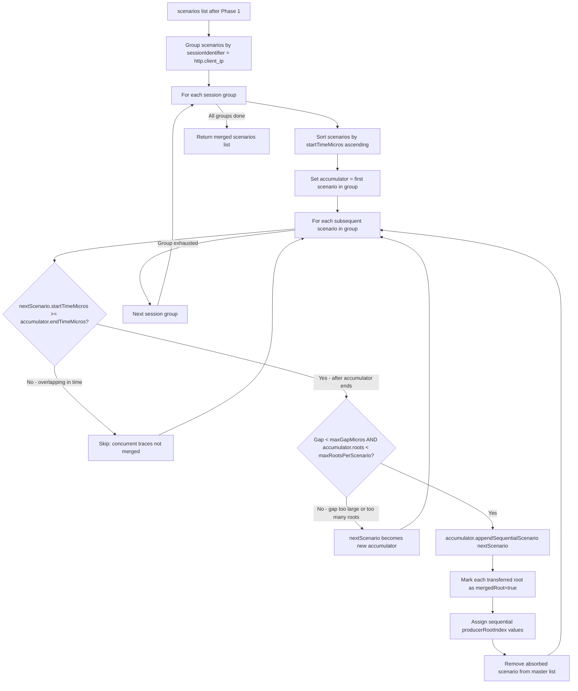

**`appendSequentialScenario(nextScenario)` logic:**
1. For each `rootStep` in `nextScenario.rootSteps`, set `rootStep.mergedRoot = true` and `rootStep.producerRootIndex = existingRootCount + i`
2. Transfer all root steps into `this.rootSteps`
3. Transfer all `traceIds` from `nextScenario` into `this.traceIds`
4. Set `this.endTimeMicros = max(this.endTimeMicros, nextScenario.endTimeMicros)`

**Session & Time Metadata fields added to `WorkflowScenario`:**

| Field | Type | Source | Purpose |
|-------|------|--------|---------|
| `sessionIdentifier` | String | `http.client_ip` span tag, fallback `"UNKNOWN_SESSION"` | Groups traces from the same client session |
| `startTimeMicros` | long | min span `startTime` in trace (microseconds) | Enables chronological sorting within a session group |
| `endTimeMicros` | long | max(`startTime + duration`) across all spans in trace | Defines the temporal boundary for gap calculation |

> **`endTime` computation fix**: Jaeger spans provide `duration` but not `endTime`. The extractor now computes `endTime = startTime + duration` for each span, then takes the maximum across all spans as `scenario.endTimeMicros`.

**Configuration:**

| Property | Default | Description |
|----------|---------|-------------|
| `trace.merge.max.session.gap.micros` | `60000000` (60 seconds) | Maximum time gap between end of one trace and start of the next to be considered the same session |
| `trace.merge.max.roots.per.scenario` | `10` | Maximum number of root APIs a merged scenario may contain (prevents unbounded merging) |
| *(implicit, UNKNOWN_SESSION fallback gap)* | `15000000` (15 seconds) | Hardcoded tighter gap applied when `sessionIdentifier == "UNKNOWN_SESSION"` |
| *(implicit, UNKNOWN_SESSION fallback roots)* | `3` | Hardcoded tighter root cap applied when `sessionIdentifier == "UNKNOWN_SESSION"` |

**"UNKNOWN_SESSION" handling**: Scenarios without a resolvable `http.client_ip` are assigned `sessionIdentifier = "UNKNOWN_SESSION"`. They participate in Phase 2 merging but with **conservative thresholds applied in code** (gap ≤ 15 s, root cap of 3), independent of the configured `trace.merge.max.session.gap.micros` / `trace.merge.max.roots.per.scenario` values. This preserves some multi-root assembly for legitimately related traces while preventing wild merges across unrelated requests that only share the absence of a client IP. Operators who want to disable UNKNOWN_SESSION merging entirely can strip that path in `TraceWorkflowExtractor.mergeScenariosBySessionTimeWindow`.

**Example (traces-1772605095842.json, 154 traces):**
- Before Phase 2: 154 individual single-root scenarios (Phase 1 produced some multi-root merges but many remained single)
- After Phase 2: ~15–20 Multi-Root Sequential Scenarios (each grouping 5–15 chronologically adjacent traces from the same client IP)
- Each merged scenario represents a user session: e.g., Login → Search → Select Trip → Create Order → Pay

---

### Phase 2.5: Global Single-Root Scenario Deduplication (`deduplicateSingleRootScenarios`)

**Motivation**: Even after Phase 1/2 merging, Jaeger can still leave many duplicate standalone 1-root scenarios for the exact same API. This happens when repeated clicks or page refreshes produce separate traces that are not merged into one session workflow.

**Purpose**: Keep only the **first** standalone 1-root scenario per normalized API key before shared-pool generation, shattering, decomposition, and variant generation begin.

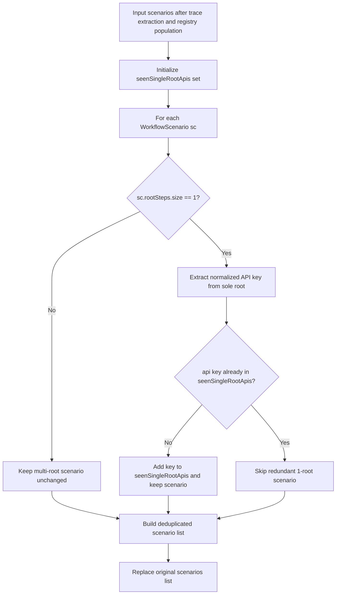

**Key properties:**
- Applies only to `sc.getRootSteps().size() == 1`
- Uses the same normalized API-key extraction logic already used for root grouping
- Preserves all multi-root scenarios because their downstream chains may be different
- Seeds a shared `seenSingleRootApis` set that Phase 4 decomposition also consults

**Effect on redundancy:**
- 30 identical standalone traces for `GET /api/v1/adminbasicservice/adminbasic/stations`
- Before Phase 2.5: up to 30 separate `Flow_Scenario_N.java` classes
- After Phase 2.5: exactly 1 standalone scenario survives into generation

---

### Phase 3: Scenario Shattering / Partitioning (`ScenarioOptimizer`)

**Motivation**: Phase 2's time-window heuristic can group APIs together that have **zero** semantic data dependencies on each other. Causes include:
- Interleaved requests from multiple browser tabs (A → C have a dependency, B is isolated but sandwiched between them)
- Unrelated APIs that happen to occur close in time (e.g., a background health-check and a user action)
- Over-merging when `maxGapMicros` is too generous

Testing an isolated API inside a fat sequential test case is an **anti-pattern**: a failure in step B masks execution of step C, causing flaky tests and obscuring real faults.

**Solution**: Apply graph-theoretic partitioning (Weakly Connected Components) to split fat merged scenarios into smaller, semantically cohesive units — ensuring only APIs with actual data lineage are tested sequentially, while isolated APIs are decoupled back into independent 1-root test cases.

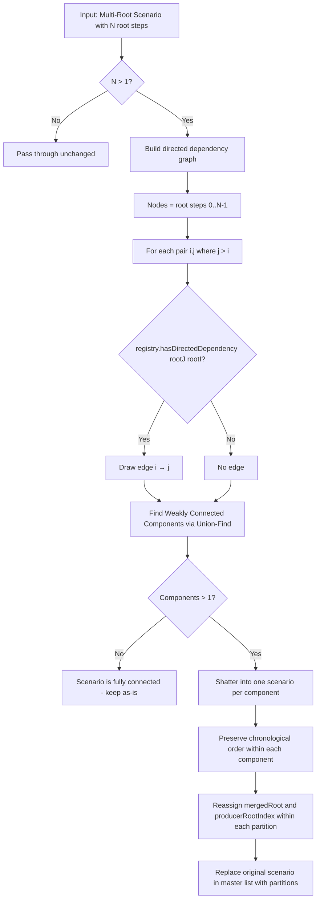

**Algorithm detail (Union-Find for Weakly Connected Components):**
1. **Graph Construction**: For each pair of root steps `(i, j)` where `j > i`, call `SemanticDependencyRegistry.hasDirectedDependency(rootStep[j], rootStep[i])`. If true, draw a directed edge from `i → j` (producer → consumer).
2. **Union-Find**: Initialise each node as its own component. For every edge, union the two endpoints. Path compression ensures near-constant-time operations.
3. **Component Extraction**: Group root step indices by their component representative. Each group becomes a new `WorkflowScenario`.
4. **Metadata Reassignment**: Within each partition, the first root step is unmarked (`mergedRoot=false`, `producerRootIndex=-1`). For every subsequent root, `producerRootIndex` is the **1-based local position of the earliest preceding root inside the same component that has an incoming directed edge from the predecessor** (i.e., the earliest member of the component that produces data consumed by this root, looked up via the reverse-adjacency set built in step 1). This correctly handles fan-out topologies (A produces for both B and C, no edge B→C) where a naive "previous list position" heuristic would wrongly record C's producer as B. If no directed predecessor is found in the component (unexpected inside a connected component), the code falls back to the chain position to stay robust.

**`hasDirectedDependency(consumerStep, producerStep)`** logic:
1. Build normalised API keys from both steps (`method + path` from span attributes)
2. Look up all consumer parameter bindings for the consumer's API key
3. Return `true` if ANY binding's `producerApiKey` matches the producer step's API key

**Example:**
```
Before shattering (1 fat scenario, 5 roots):
  Root 0: POST /api/v1/travelservice/trips/left     (search)
  Root 1: GET  /api/v1/stationservice/stations       (isolated - no deps)
  Root 2: POST /api/v1/orderservice/order            (depends on Root 0 via tripId)
  Root 3: GET  /api/v1/routeservice/routes           (isolated - no deps)
  Root 4: POST /api/v1/inside_pay_service/inside_payment (depends on Root 2 via orderId)

Dependency graph edges: 0→2 (tripId), 2→4 (orderId)

Connected components:
  Component A: {0, 2, 4} — coherent order flow
  Component B: {1}       — isolated station lookup
  Component C: {3}       — isolated route lookup

After shattering (3 scenarios):
  Scenario A: Root 0 → Root 1 → Root 2 (search → order → pay)
  Scenario B: Root 0 (station lookup — independent 1-root test)
  Scenario C: Root 0 (route lookup — independent 1-root test)
```

**Configuration:**

| Property | Default | Description |
|----------|---------|-------------|
| `scenario.shattering.enabled` | `true` | Master switch; set to `false` to skip partitioning and keep fat merged scenarios |

**Classes involved:**

| Class | Responsibility |
|-------|----------------|
| `ScenarioOptimizer` | Orchestrates the shattering: iterates scenarios, builds graph, runs Union-Find, produces partitions |
| `SemanticDependencyRegistry` | Provides `hasDirectedDependency()` for edge determination |
| `MultiServiceTestCaseGenerator` | Calls `ScenarioOptimizer.optimizeScenarios()` after shared pool generation, before variant loop |

---

### MST Test Case and Input Generation (MultiServiceTestCaseGenerator)

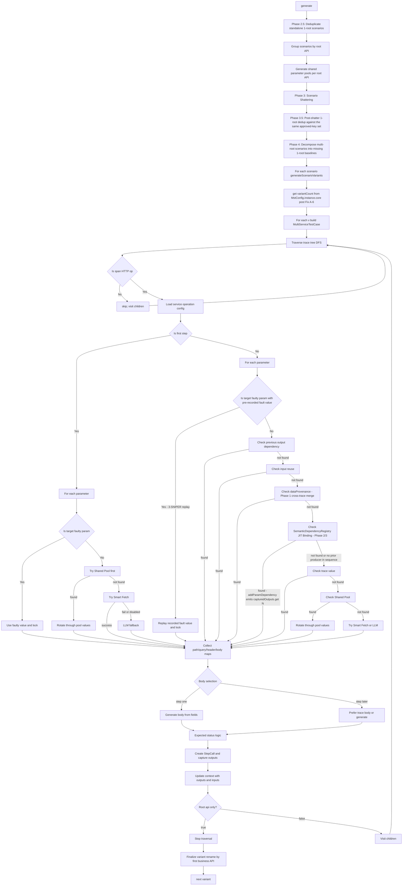

### Semantic Dependency Registry (`SemanticDependencyRegistry`)

**Purpose**: Pre-compute a schema-driven dictionary that maps every consumer parameter (any param whose name ends with `id`, `Id`, `uuid`) to its likely producer API and JSON path, using only the loaded `TestConfigurationObject` OpenAPI specs.

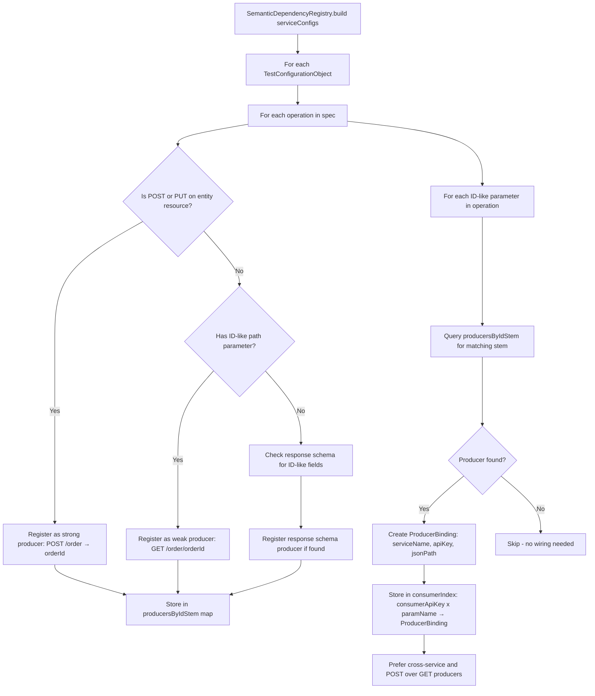

**`findProducer(consumerApiKey, paramName)`** — called during JIT binding in `traverse()`:
1. Normalise `paramName` by stripping trailing `Id`/`ID`/`uuid` to get the "noun stem" (e.g., `orderId` → `order`)
2. Look up `consumerIndex[consumerApiKey][paramName]`
3. If not found, try `consumerIndex["*"][paramName]` (global lookup ignoring consumer API)
4. Returns `ProducerBinding(serviceName, apiKey, jsonPath)` or `null`

**JIT Binding in `traverse()` (Just-In-Time Dependency Wiring):**

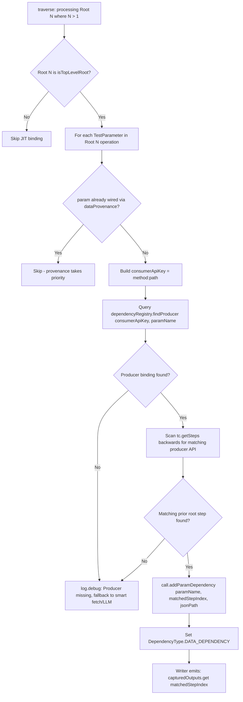

> **Graceful Fallback (C→B edge case):** If `SemanticDependencyRegistry` says Root B needs data from Root A, but the current merged scenario is `Root C → Root B` (A is absent), then `scanBackwards` returns no match and **no** `ParamDependency` is added. RESTest's existing smart fetch / LLM generation handles the parameter automatically. A `log.debug` message is emitted: `"Producer missing for parameter X in sequence, falling back to smart fetch."`

**Classes involved:**

| Class | Responsibility |
|-------|----------------|
| `SemanticDependencyRegistry` | Builds producer/consumer map from TestConfigurationObject; `findProducer()` API |
| `SemanticDependencyRegistry.ProducerBinding` | Holds `serviceName`, `apiKey`, `jsonPath` for a matched producer |
| `MultiServiceTestCaseGenerator` | Calls `dependencyRegistry.findProducer()` in `traverse()` for Root N > 1 |
| `MultiServiceRESTAssuredWriter` | Emits `capturedOutputs.get(N)` code for steps with JIT-wired `ParamDependency` |

---

### Shared Parameter Pool Generation (per root API)

**Purpose**: Pre-generate diverse parameter values once per root API, size each pool dynamically from API complexity, and remove the old semantic-expansion bottleneck.

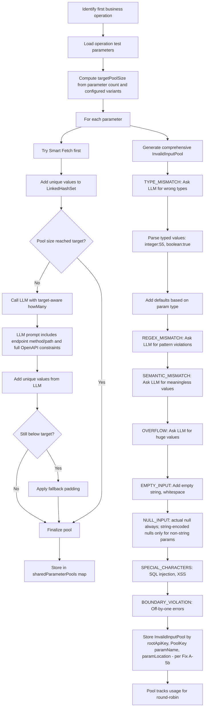

**Post-Path-B note**: the fault-type axis inside each `InvalidInputPool` is
keyed on `FaultType.id` strings drawn from `FaultTypeRegistry` (default YAML
ids match the deleted `InvalidInputType` enum names byte-for-byte), and the
pool's outer shape is `Map<String, Map<PoolKey, InvalidInputPool>>` —
outer key is `rootApiKey`, inner key is `PoolKey(paramName, paramLocation)`
from Fix A-5b so same-name parameters at different locations
(path / query / header / cookie / body) never collide.

### Shared Parameter Pool Usage (during variant generation)

**Strategy**: Positive tests use the pre-generated shared pool as the primary source for the first business API, but values are selected randomly rather than by modulo rotation.

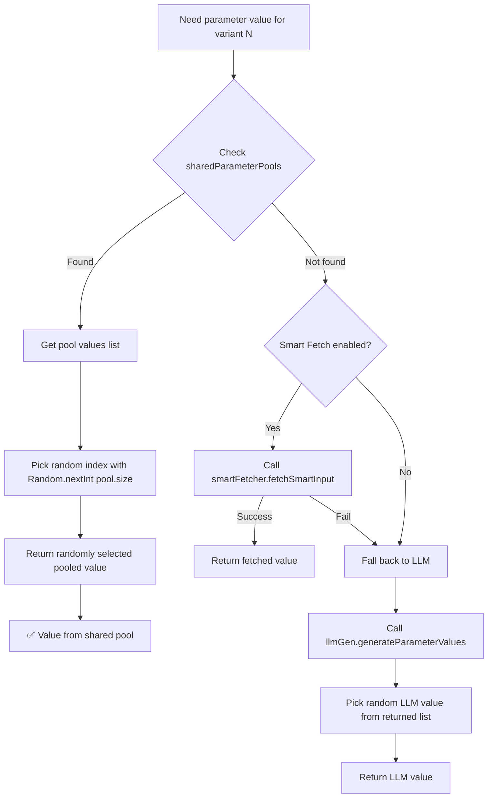

**Key Benefits**:
1. **Performance**: Pre-generated pools eliminate redundant Smart Fetch/LLM calls during variant generation
2. **Consistency**: All variants use values from the same pre-generated pool
3. **Diversity**: Dynamic pool sizing plus random selection greatly reduces duplicate payloads
4. **Correctness**: The LLM now sees endpoint context plus OpenAPI constraints before generating values
5. **Fallback**: Direct Smart Fetch/LLM calls only when a pool is unavailable or under-filled

**Example Execution**:
- Root API: `POST /api/v1/adminroute`
- Parameter: `startStation`
- Computed `targetPoolSize`: e.g. `25` for a 2-parameter API with `V=100`
- Shared Pool: `["Beijing", "Shanghai", "Guangzhou", "Shenzhen", "Chengdu", ...]`
- Variant 1: random draw may pick `"Shanghai"`
- Variant 2: random draw may pick `"Chengdu"`
- Variant 3: random draw may pick `"Beijing"`
- Full payload uniqueness is enforced later by fingerprint-based deduplication with retries

### Positive-Value LLM Prompt Construction (`ZeroShotLLMGenerator`)

**Purpose**: Ensure the LLM generates values that are realistic **and** schema-valid by giving it the complete parameter context extracted from OpenAPI.

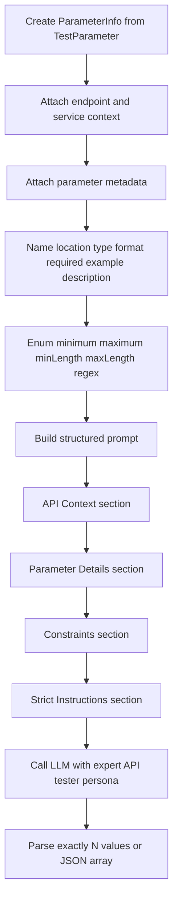

**Prompt Rules**:
1. Include `Endpoint: METHOD /path` so values are business-aware.
2. Include `Parameter Name`, `Location`, `Type`, and `Format`.
3. Print explicit constraints: enum values, numeric range, string length, and regex.
4. Repeat strict output rules: exactly `N` values, no markdown, no numbering, no explanations.
5. For enum parameters, instruct the LLM to use **only** the allowed values.

### Negative Test Selection with 8 Fault Types (Configurable Strategy)

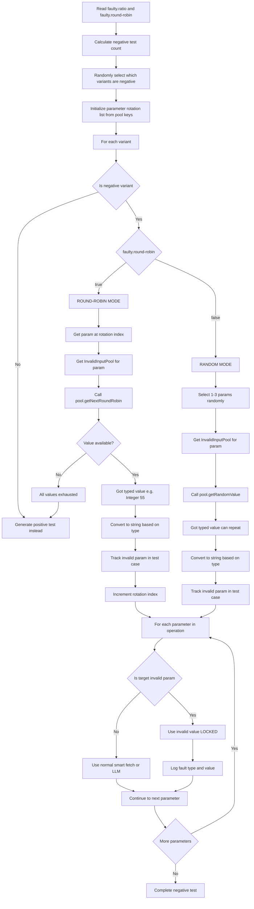

**Strategies**:
- **Round-Robin** (faulty.round-robin=true, default): 
  - ONE invalid param per test, cycling through all params
  - For each param, cycles through all 8 fault types and their values
  - NO REPETITION until all invalid values exhausted
  - **Pre-recorded values**: Each `FaultTarget` captures the actual invalid value at queue-build time and stores it on the `MultiServiceTestCase` (`targetFaultValue`). At fire time the generator reads the pre-recorded value instead of re-rotating the pool, so the rendered value can never drift from the recorded `faultTypeCategory` label even if pool state mutates between phases.
  - **All 8 Fault Types (with examples)**:
    1. **TYPE_MISMATCH**: Wrong data type
       - Example: String param gets `Integer(55)` or `Boolean(true)`
       - Example: Number param gets `"not_a_number"` or `Boolean(false)`
    2. **REGEX_MISMATCH**: Pattern violation
       - Example: Email param gets `"invalid@format"` (missing domain)
       - Example: Phone param gets `"123"` (wrong format)
       - Example: Date param gets `"not-a-date"` (invalid format)
    3. **SEMANTIC_MISMATCH**: Meaningless/impossible value
       - Example: Age param gets `-5` (negative age)
       - Example: Birthdate param gets `"2050-01-01"` (future date)
       - Example: Status param gets `"INVALID_STATUS"` (not in enum)
    4. **OVERFLOW**: Exceeds limits
       - Example: String param gets `"AAAA..."` (1000+ characters)
       - Example: Number param gets `9999999999` (beyond max)
       - Example: Path param gets `tripId_1234567890_1234567890_...` (very long)
    5. **EMPTY_INPUT**: Empty values ( !ONLY for REQUIRED params)
       - Example: Required string gets `""` (empty string)
       - Example: Required string gets `"   "` (whitespace only)
       - Example: Required array gets `[]` (empty array)
    6. **NULL_INPUT**: Null values ( !ONLY for REQUIRED params)
       - Example: Required param gets `null` (actual null)
       - Example: Required non-string param gets `"null"` / `"nil"` / `"undefined"` / `"None"` (string-encoded null — fails type binding)
       - Note: string params get ONLY the actual null. `"null"`/`"NULL"` are valid non-empty strings for a string field (secretly-valid negatives) and are no longer emitted
    7. **SPECIAL_CHARACTERS**: Injection attempts
       - Example: SQL injection: `"' OR '1'='1"`
       - Example: XSS attack: `"<script>alert('XSS')</script>"`
       - Example: Path traversal: `"../../../etc/passwd"`
       - Example: Command injection: `"; rm -rf /"`
    8. **BOUNDARY_VIOLATION**: Off-by-one errors
       - Example: Min=1 param gets `0` (min-1)
       - Example: Max=100 param gets `101` (max+1)
       - Example: MinLength=5 param gets `"abcd"` (length 4)
       - Example: MaxLength=10 param gets `"12345678901"` (length 11)
  - **Example Round-Robin Sequence**:
    - Test 1: paramA=TYPE_MISMATCH(Integer(55))
    - Test 2: paramB=REGEX_MISMATCH("invalid@format")
    - Test 3: paramA=SEMANTIC_MISMATCH(-5)
    - Test 4: paramC=OVERFLOW("AAAA..." (1000 chars))
    - Test 5: paramA=EMPTY_INPUT("")  (if paramA is required)
    - Test 6: paramB=NULL_INPUT(null)  (if paramB is required)
    - Test 7: paramA=SPECIAL_CHARACTERS("' OR '1'='1")
    - Test 8: paramC=BOUNDARY_VIOLATION(0)  (if min=1)
    - Test 9: paramA=TYPE_MISMATCH(Boolean(true))  (next value for paramA)
    - ... continues until all invalid values exhausted
  - When exhausted: generates positive tests
  
- **Random** (faulty.round-robin=false):
  - 1-3 randomly selected invalid params per test
  - Random fault type and value selection
  - CAN REPEAT values across tests
  - Test 1: [paramA=TYPE_MISMATCH(55), paramC=NULL_INPUT(null)]
  - Test 2: [paramB=SPECIAL_CHARACTERS("' OR '1'='1")]
  - Test 3: [paramA=TYPE_MISMATCH(55), paramB=EMPTY_INPUT(""), paramC=OVERFLOW("AAAA...")]

### Negative Test Reporting (Allure Integration)

```mermaid
flowchart LR
    A[Test case marked as negative] --> B[Track invalid parameters during generation]
    B --> C[Writer checks if test is negative]
    C --> D[Add Allure parameter Test Type NEGATIVE]
    D --> E[Add Allure parameter Invalid Parameters list]
    E --> F[Add Allure description with invalid values and fault types]
    F --> G[Report displays in Allure with warning icon]
    G --> H[Test expects 4XX/5XX error response]
    H --> I[If 2XX received test FAILS]
```

### 8 Default Fault Types (Comprehensive Coverage)

These are the eight `FaultType.id` strings shipped in
`mist-core/src/main/resources/mist/fault-types.default.yaml`. They reproduce
the deleted `InvalidInputType` enum byte-for-byte in semantics; the
`FaultTypeRegistry` may add SUT-specific entries on top of them (source =
`MINED`) without changing this default rotation.

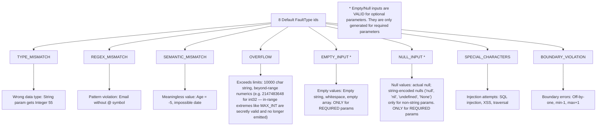

**Important: Optional Parameter Handling**
- **EMPTY_INPUT** and **NULL_INPUT** are only generated for **required parameters** (`required: true`)
- For **optional parameters** (`required: false` or not specified), null/empty values are **valid** and should NOT be used for negative testing
- This ensures negative tests only target true violations, not legitimate optional parameter behavior
- The required-only gate is now enforced in **both** generators: `HardcodedInvalidInputGenerator` (always) AND `ZeroShotLLMGenerator` (`generateEmptyInputs` / `generateNullInputs` early-return for `!required`). Pure-LLM mode previously skipped this guard and silently produced false-fail negative tests for optional parameters.

**TYPE_MISMATCH category hygiene**
- `parseTypedValue` no longer coerces every non-`true` boolean string to `Boolean.FALSE`. Only the literal tokens `true` / `false` (case-insensitive) are converted; any other string is preserved verbatim, which is the actual TYPE_MISMATCH semantics for boolean parameters.
- `addDefaultTypeMismatches` no longer seeds `null` into the TYPE_MISMATCH list. Null values belong to the (required-only-gated) NULL_INPUT category; mixing them into TYPE_MISMATCH made optional-parameter negative tests indistinguishable from positive ones.

**Schema-aware fault applicability (added 2026-05-05)**

A negative variant labelled with a fault type the parameter's schema cannot meaningfully express is **not generated**. This stops the round-robin from emitting nonsense like a 5000-character string labelled `OVERFLOW` for a `boolean` parameter, where the value is really a `TYPE_MISMATCH` wearing the wrong label.

`ApplicabilityMatrix.applies(faultType, oasType, location)` is the single source of truth (Path B Phase 3), consulted at pool-build time by both `HardcodedInvalidInputGenerator.generateInvalidInputPool` and `ZeroShotLLMGenerator` (smart and all-LLM modes). The predicate reads the `applicableTo` / `applicableLocations` axes off each `FaultType` in the registry, which is loaded from `mist-core/src/main/resources/mist/fault-types.default.yaml`. The default-only matrix (eight bundled `FaultType` ids, reproducing the deleted `InvalidInputType` enum byte-for-byte in semantics):

| Fault (FaultType.id) | string | integer / number | boolean | array | object |
|---|---|---|---|---|---|
| TYPE_MISMATCH | ✅ | ✅ | ✅ | ✅ | ✅ |
| NULL_INPUT | ✅ | ✅ | ✅ | ✅ | ✅ |
| EMPTY_INPUT | ✅ | ❌ | ❌ | ✅ | ✅ |
| OVERFLOW | ✅ | ✅ | ❌ | ✅ | ❌ |
| BOUNDARY_VIOLATION | ✅ | ✅ | ❌ | ✅ | ❌ |
| SPECIAL_CHARACTERS | ✅ | ❌ | ❌ | ✅ | ❌ |
| REGEX_MISMATCH | ✅ | ❌ | ❌ | ❌ | ❌ |
| SEMANTIC_MISMATCH | ✅ | ✅ | ❌ | ✅ | ✅ |

Mined `FaultType` entries (source = `MINED`, loaded from a per-SUT overlay or from `.mist/mined-fault-types.yaml`) carry their own applicability rows alongside these defaults, so a domain-specific category like `INVALID_STATION_NAME` participates in the same matrix without code changes.

Effects:
- A `boolean` parameter now produces only `TYPE_MISMATCH` and `NULL_INPUT` (when required) variants. Previously it received six additional fault types whose payloads (long strings, big integers, OWASP injection strings) were really TYPE_MISMATCHes.
- A numeric parameter no longer receives `SPECIAL_CHARACTERS` or `REGEX_MISMATCH` payloads.
- Locked in by the applicability tests under `mist-core/src/test/java/io/mist/core/fault/` (the legacy `InvalidInputTypeApplicabilityTest` was retired along with the enum it covered).

**BOUNDARY_VIOLATION skipped when schema is unbounded**

`generateBoundaryViolationInputs` returns early when the parameter's schema declares no `minimum` / `maximum` / `minLength` / `maxLength`. Previously it emitted "canonical fallbacks" (`-1`, `0`, `""`, length-256 strings) labelled `BOUNDARY_VIOLATION` even when no boundary was declared — those values are really opportunistic edge probes, not boundary violations. The D10 NIFP metric surfaced 248/248 such cases as schema-unbounded; the new behaviour stops generating them at the source rather than mis-labelling.

When the OAS spec is sparse (TrainTicket's case), the round-robin will simply exercise fewer fault types per parameter — which is the correct behaviour. A test for "violates a constraint the schema does not declare" is meaningless.

### Smart Input Fetching Flow (SmartInputFetcher)

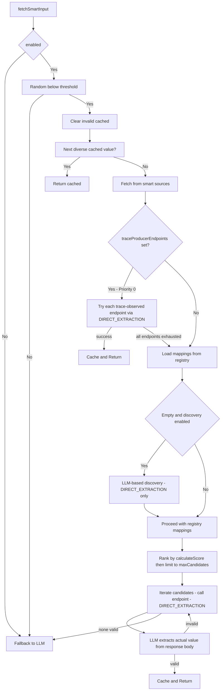

**Priority Chain inside `fetchFromSmartSource`:**

| Priority | Source | Mechanism |
|----------|--------|-----------|
| 0 | Trace-observed producer endpoints (`traceProducerEndpoints`) | Direct GET to baked-in URL, LLM extracts value |
| 1 | YAML registry mappings (persisted between runs) | GET to registered endpoint, LLM extracts value |
| 2 | LLM-discovered mappings (new this session, then saved) | LLM selects service → infers endpoint → GET → LLM extracts |
| — | Fallback | `fallbackToLLM()` (pure generation, no HTTP call) |

> **Per-SUT, not built-in.** `InputFetchRegistry.initializeDefaults()` ships only
> generic prompt templates — it no longer hardcodes train-ticket `ts-*` service
> patterns (those leaked into LLM discovery for unrelated SUTs, so the model once
> "discovered" `ts-travel-service` for non-TT params). Each SUT supplies its own
> service patterns via its `input-fetch-registry.yaml`, loaded by
> `InputFetchRegistry.toRegistry()`. Service-name grounding
> (`OpenAPIEndpointDiscovery.deriveServiceName`) resolves `x-service-name` →
> OpenAPI `tags` (a tag ending in "service" preferred), so off-the-shelf specs
> that group by tags (Bookinfo, Sock Shop) register correctly. The TrainTicket
> framing in this section is illustrative.

**Key Design Decisions:**
- **Cold-start name-affinity ranking**: when no mapping for a parameter carries a positive `successRate`, the candidate ranking adds a token-overlap prior between the parameter name and the endpoint/service tokens (`endStation` → `stationservice` beats the higher-priority `trains`). `successRate` rises only on real SUT feedback (the legacy format-check bump was removed as self-poisoning), and the shipped per-SUT registries carry `successRate: 0.0` everywhere so the prior actually engages on a fresh run.
- **JSONPath is fully retired**: `fetchFromApiMapping` always calls `extractValueDirectlyFromResponse` regardless of `ApiMapping.extractPath`. The legacy `extractValueFromResponse` (JSONPath) method has zero call sites and is dead code.
- **Trace endpoints are session-scoped**: Trace-observed `ApiMapping` objects are never added to `registry.addMapping()` and are never persisted to YAML. Only LLM-discovered mappings are saved.
- **Cache key parity with the LLM generator**: `buildCacheKey` now hashes `name + type + location + format + enum + minimum/maximum + minLength/maxLength + regex`. Two parameters that share a name but differ on any of those constraints get distinct cache entries — the previous coarse `name+type+location` key was leaking values across services and across operations with different constraints.
- **Per-scenario rotation reset**: `SmartInputFetcher.resetValueRotation()` is invoked at the start of every scenario from `MultiServiceTestCaseGenerator.generateScenarioVariants`. The diverse-value rotation cursor therefore starts at 0 in every scenario instead of inheriting wherever the previous one left off — reproducibility no longer depends on scenario ordering.
- **`isValidApiResponse` uses structured detection**: instead of a substring scan for the word "error" anywhere in the body, the validator now parses JSON and inspects only the top-level envelope (`status`, `success`, `error`, `hasError`). Responses whose `data` payload contains words like `errorCode` or `errors` are no longer falsely rejected.

### LLM Communication Path (LLMService)

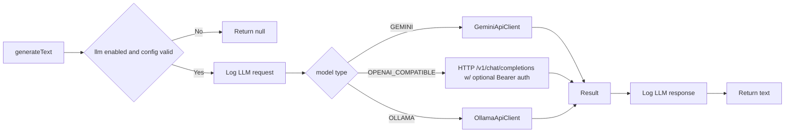

**Backends** (the **code default is `OPENAI_COMPATIBLE`** — `LLMConfig`; `trainticket-demo.properties` itself sets no `llm.model.type`, so even TT-demo inherits `openai_compatible`, and the SP1/DeepSeek runs use it):
- **OLLAMA** — local Ollama daemon (its own default model is `gemma3:4b` at `http://localhost:11434`); used only when `llm.model.type=ollama` is set explicitly.
- **GEMINI** — Google Gemini REST API.
- **OPENAI_COMPATIBLE** — any provider speaking OpenAI's `/v1/chat/completions` shape. Covers hosted APIs (DeepSeek — the default test target — plus OpenAI, OpenRouter, Together, Groq, Mistral, ...) and self-hosted OpenAI shims (`gpt4all`, `llama.cpp --api`). When `llm.openai_compatible.api.key` is non-empty, `LLMService.generateWithOpenAICompatible` adds an `Authorization: Bearer <key>` header; when empty it sends an unauthenticated request. The deprecated `llm.local.*` property keys are still accepted as aliases — the new name reflects that this backend is not "local" in the typical case.

**`llm.openai_compatible.api.key` resolution**: the property accepts `${ENV_VAR}` or `${ENV_VAR:default}` syntax; `LLMConfig.resolveEnvPlaceholder` reads from `System.getenv` first, then `System.getProperty` (so IntelliJ run configs can pass `-DDEEPSEEK_API_KEY=…`). A missing variable resolves to `""` so the auth header is simply omitted — the literal `${…}` placeholder never reaches the wire. Locked in by `mist-llm/src/test/java/io/mist/llm/LLMConfigEnvResolverTest.java`.

**DeepSeek example** (no edits to the existing `trainticket-demo.properties` needed; copy `deepseek-config.properties` or set these four lines):

```properties
llm.model.type=openai_compatible
llm.openai_compatible.url=https://api.deepseek.com/v1/chat/completions
llm.openai_compatible.model=deepseek-chat
llm.openai_compatible.api.key=${DEEPSEEK_API_KEY}
```

Local copies of properties files that carry a literal API key should be named `*-local.properties` or `*-secret.properties` (gitignored).

### LLM Response Validation System (ZeroShotLLMGenerator.validateResponse)

**Purpose**: Detect "soft errors" - APIs that return 200 OK but include error information in the response body.

**Validation Prompt Structure:**

```
System Prompt (Instructions):
- Analysis criteria for failure detection
- 4 categories of failure indicators
- Output format requirements
- Emphasis on precision (avoid false positives)

User Prompt (Task):
- API details (service, endpoint, status code)
- Response body JSON
- Examples of soft errors vs valid success
- Request for analysis
```

**LLM Analysis Criteria:**

1. **Explicit Failure Indicators**:
   - `status: 0` or `status: false` or `status: "error"`
   - `success: false`
   - `error: true` or `hasError: true`

2. **Error Messages**:
   - Fields named: `error`, `errorMessage`, `msg`, `message`, `errorMsg`
   - Exception information or stack traces

3. **Data Validation**:
   - `data` field is `null` or empty when data is expected
   - Empty result arrays when results are expected

4. **Business Logic Errors**:
   - Validation error messages ("invalid parameters", "not found")
   - Constraint violation messages

**LLM Output Format:**
```
FAILED: true|false
RCA: <detailed root cause analysis>
```

**Integration with Test Validation:**

```
Positive Test + LLM says FAILED  → Test FAILS (expected success, got soft error)
Positive Test + LLM says SUCCESS → Test PASSES (as expected)
Negative Test + LLM says FAILED  → Test PASSES (expected error, got soft error)
Negative Test + LLM says SUCCESS → Test FAILS (expected error, got success)
```

**Performance Optimization:**
- Only validates 2XX responses by default (`llm.response.validation.only.2xx=true`)
- Uses focused prompts with higher token limit (500) and lower temperature (0.3)
- Gracefully handles LLM failures (logs warning, doesn't break test execution)

### Writer and Execution Flow (MultiServiceRESTAssuredWriter + IntelliJ runner)

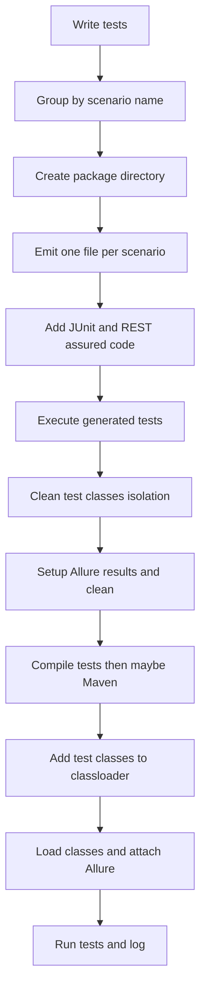

### Test Execution and Validation Flow (Configuration-Based Status Code Validation)

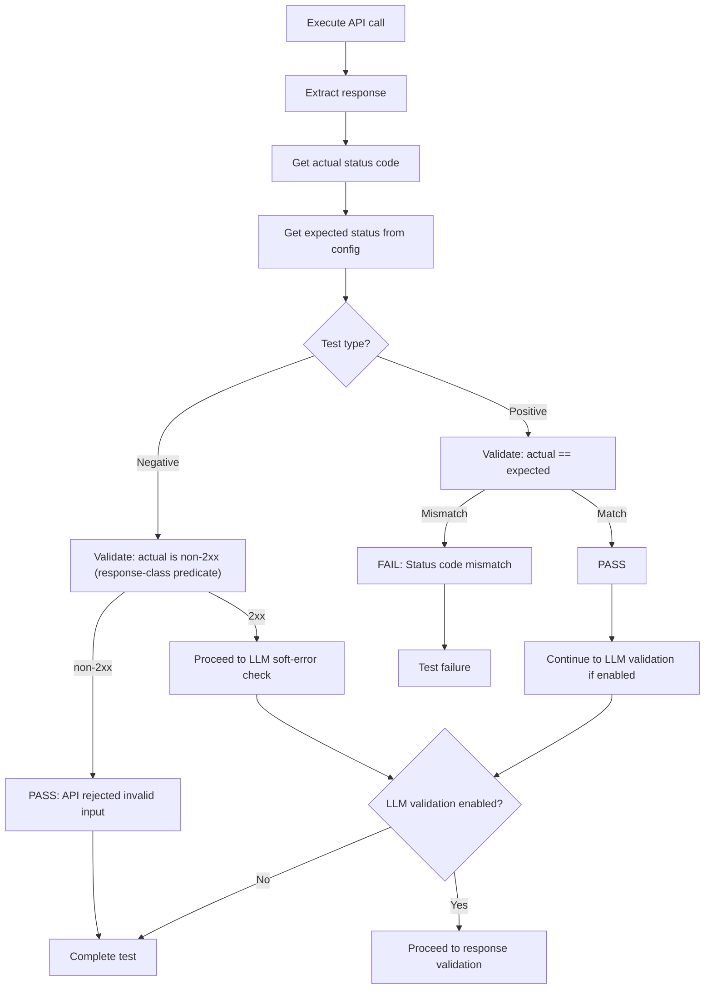

**Key Changes from Previous Implementation:**
- **Before**: Hardcoded thresholds (< 400 for success)
- **Intermediate**: Used `expectedStatus` from `real-system-conf.yaml` for both positive and negative predicates (but broke when `expectedStatus` itself was non-2xx)
- **Current**: **Response-class predicate** for negatives
- **Positive Tests**: PASS only if `actualStatus == expectedStatus`
- **Negative Tests**: PASS if the response is non-2xx (i.e., `actualStatus < 200 || actualStatus >= 300`) — the API clearly rejected the invalid input. A 2xx response proceeds to the LLM soft-error check. This predicate is response-class based (not `actual != expected`) so it works correctly when `expectedStatus` itself is non-2xx, and it naturally enforces the `llm.response.validation.only.2xx` contract: the LLM only fires when the response is in `[200,300)`.

### LLM Response Validation Flow (Soft Error Detection)

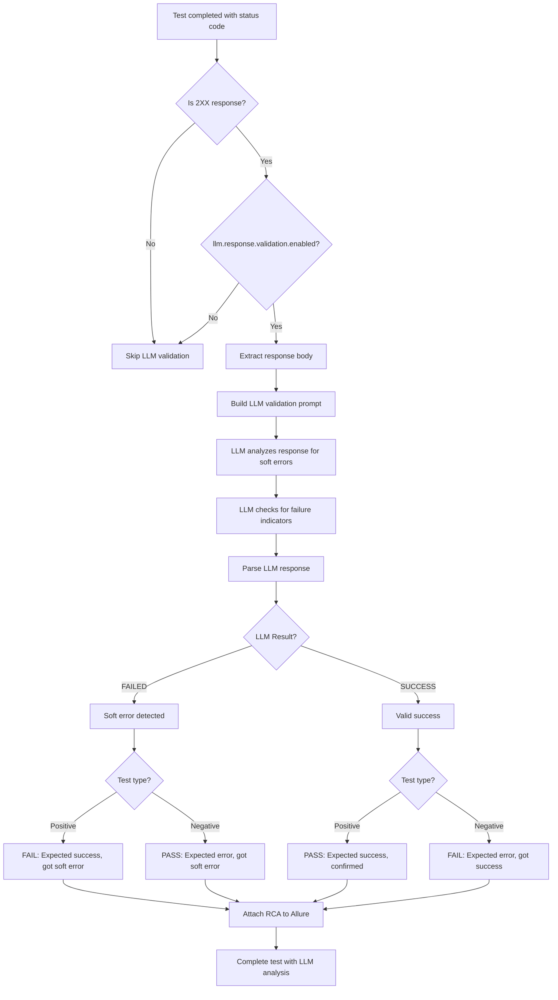

**Soft Error Indicators Detected by LLM:**
1. **Explicit failure flags**: `status: 0`, `success: false`, `error: true`
2. **Error messages**: Non-empty `error`, `errorMessage`, `msg` fields
3. **Null/empty data**: `data: null` when data is expected
4. **Business logic errors**: Validation messages, constraint violations

**Example Soft Error:**
```json
{
  "status": 0,
  "msg": "start or end station not include in stationList.",
  "data": null
}
```
- HTTP Status: 200 OK
- LLM Detection: ❌ SOFT ERROR (status=0, error message present, data is null)
- Positive Test: FAIL (expected success, got soft error)
- Negative Test: PASS (expected error, got soft error)

### Conditions, Flags, and Inputs (key branches)

> **Path B / Fix A-6 routing.** All `mst.*` and `smart.input.fetch.*`
> properties below are read **once** at startup into
> `MstConfig.fromSystemProperties()` and exposed through immutable
> sub-records (`MstConfig.instance().core()`,
> `MstConfig.instance().smartFetch()`, `MstConfig.instance().llm()`,
> `MstConfig.instance().faulty()`, `MstConfig.instance().oracle()`,
> `MstConfig.instance().scheduler()`, etc.). Code outside `MstConfig`
> must not call `System.getProperty("mst.*")` directly. With
> `mst.config.strict=true` the validator fails the run on unknown keys
> or conflicting values.

#### H2 ablation toggles (added 2026-05-21 for ICSE/FSE/ASE/ISSTA
main-track ablation matrix; defaults preserve current behaviour
except where noted):

| Key | Default | Effect when `false` |
|---|---|---|
| `mst.oracle.shape.enabled` | `true` | `TraceShapeOracle.evaluate(...)` short-circuits to an empty verdict (`passed=true`, `violations=[]`); no invariant code runs |
| `mst.oracle.shape.invariants.span_tree.enabled` | `true` | `SpanTreeShapeInvariant` skipped |
| `mst.oracle.shape.invariants.status_propagation.enabled` | `true` | `StatusPropagationInvariant` skipped |
| `mst.oracle.shape.invariants.response_envelope.enabled` | `true` | `ResponseEnvelopeInvariant` skipped |
| `mst.oracle.shape.invariants.timing.enabled` | **`false`** | `TimingEnvelopeInvariant` skipped. Default-off because the paper revision dropped `Timing` from the 3-invariant contribution; the code path stays as an experimental hook |
| `mst.scheduler.bandit.enabled` | `true` | `MistGenerator.applyBanditGate` returns insertion-order queue; no Thompson re-ranking |
| `mst.fault.mining.enabled` (pre-existing) | `false` | `FaultMiner` does not extend the registry with SUT-specific categories at run time |

`MistRunner` logs the resulting `AblationProfile` summary line
immediately after config load, e.g.:

```
[MIST] ablation profile: [oracle:on bandit:on faultmining:off]
```

The published ablation rows (`PATH_B_POSITIONING.md` § 4.2) are
realised as toggle combinations:

| Row | `mst.oracle.shape.enabled` | `mst.fault.mining.enabled` |
|---|---|---|
| R1 MIST-full | `true` | `true` (override) |
| R2 −trace-shape-oracle | `false` | `true` |
| R3 bundled-default | `true` | `false` |
| R4 −trace-shape −adaptive | `false` | `false` |

Under `-Drandom.seed=42` each row reproduces byte-for-byte across
runs (verified: 123 / 123 `Flow_Scenario_*.java` files identical per
row). The bandit's RNG goes through
`io.mist.core.util.SeededRandom.create("bandit")` so its Thompson
samples respect the configured seed.

**Core MST Configuration:**
- generator == MST: the only generator mode after the B1 sever (`mist.jar` is always MST; the legacy classic-mode dispatcher was retired)
- testsperoperation / test.variants.per.scenario: number of variants per scenario
- mst.generate.only.first.step: **default `true` (Root API Mode — primary)**. When `true`, keeps all top-level root APIs in a scenario but prunes internal step-API / service-to-service spans. When `false` (Multi-Step Replay), every internal HTTP span in the trace also becomes its own step in the generated test. Despite its legacy name, this flag does NOT restrict a scenario to a single step — a scenario with 3 root APIs still produces a 3-step test in Root API Mode.
- faulty.ratio: percentage of test variants that should be intentionally faulty (e.g., 0.1 = 10%)
- faulty.round-robin: true (default) = one param per test cycling, false = 1-3 random params per test

**Trace Shape Oracle (Path B Phase 2):**
- `mst.oracle.shape.enabled`: master switch (default `true`); when off, `TraceShapeOracle.evaluate(...)` short-circuits to an empty (passing) verdict — no invariant runs
- per-invariant gates (`mst.oracle.shape.invariants.<name>.enabled`): `span_tree`=`true`, `status_propagation`=`true`, `response_envelope`=`true`, `timing`=**`false`**, `target_attribution`=`true`, `hidden_downstream_failure`=**`false`** (opt-in)
- `mist.tso.store.path`: persistent invariant store path (default `.mist/trace-shape-invariants.json`)

**Adaptive Fault Taxonomy (Path B Phase 3):**
- `mist.fault.types.path`: optional per-SUT YAML overlay on top of the default eight categories (unset by default)
- `mist.fault.mining.enabled`: opt-in switch for `FaultMiner` (default `false`); on `true`, the miner persists proposals to `.mist/mined-fault-types.yaml`

**Smart Input Fetching:**
- smart.input.fetch.enabled: enables Smart Fetch system
- smart.input.fetch.percentage: probability Smart Fetch vs LLM
- smart.input.fetch.registry.path: registry used for mappings and learning
- smart.input.fetch.llm.discovery.enabled: allows LLM-based mapping discovery
- smart.input.fetch.max.candidates: max endpoints tried per parameter
- smart.input.fetch.dependency.resolution.enabled: resolve parameter dependencies
- smart.input.fetch.discovery.timeout.ms: discovery request timeout
- smart.input.fetch.cache.enabled / ttl: cache values and TTL

**LLM Configuration:**
- llm.enabled: enables LLM; llm.model.type: gemini / openai_compatible / ollama (legacy `local` accepted as deprecated alias for openai_compatible). **Code default: `openai_compatible`** (`LLMConfig`)
- llm.gemini.*, llm.openai_compatible.* (legacy llm.local.*), llm.ollama.*: backend-specific
- llm.rate.limit.retry.enabled / max.retries: retry policy

**Authentication (`MstAuthHandler`):**
- `auth.mode`: default **`none`** — no login is attempted and every generated request skips auth (the SUT-agnostic default; unknown values fail-open to `none`). Modes: `none` (default) / `static_token` / `per_test` / `per_jvm`. TrainTicket opts in explicitly with `auth.mode=per_jvm`; Bookinfo / Sock Shop leave it unset (→ `none`)
- `auth.login.url` / `auth.login.username` / `auth.login.password` / `auth.token.header` / `auth.token.prefix` / `auth.login.body.template`: only consulted when `auth.mode != none`

**LLM Response Validation (Soft Error Detection):**
- llm.response.validation.enabled: enables LLM-powered validation of 2XX responses (default: true)
- llm.response.validation.only.2xx: only validate 2XX responses for performance (default: true)
- llm.response.validation.include.rca: include detailed RCA in Allure reports (default: true)

**Jaeger Trace Fetching:**
- jaeger.enabled: enables Jaeger trace fetching for error analysis
- jaeger.base.url: Jaeger API endpoint for fetching traces (default `http://localhost:16686`)
- jaeger.lookback: lookback period for trace queries (e.g., "10m", "1h")

**Root API Registry & Fault Detection:**
- root.api.registry.path: enables Root API registry population from scenarios for architectural observation and JSON export; it does **not** itself filter redundant scenarios during generation
- fault.detection.enabled: enables fault detection tracking
- fault.detection.injected.faults.path: path to injected faults JSON registry. **When unset**, `FaultDetectionTracker.initializeWithNoFaults()` runs (`MistRunner` ~296) and the report still generates (executed-test list + ORACLE ANOMALIES) with 0 named faults — required so non-TrainTicket SUTs (Bookinfo / Sock Shop) produce a report
- fault.detection.report.dir: directory where fault detection reports are saved

**Session-Based Heuristic Trace Merging (Phase 2):**
- trace.merge.max.session.gap.micros: maximum microsecond gap between end of one trace and start of next to still be considered the same user session (default: `60000000` = 60 seconds)
- trace.merge.max.roots.per.scenario: maximum number of root APIs allowed in a single merged scenario (prevents unbounded merging, default: `10`)

**Negative Input Generation:**
- negative.input.generation.mode: `llm` or `hardcode` (default: hardcode)
  - `llm`: LLM generates context-aware invalid inputs (slower, varied)
  - `hardcode`: Deterministic hardcoded invalid inputs (faster, predictable)
- Note: For array parameters, BOTH modes generate:
  - Invalid array structures (null, empty, wrong type)
  - Arrays with invalid elements (null elements, wrong-type elements)

**Status Code Exploration (Smart Coverage):**
- status.code.exploration.enabled: enable LLM-driven status code discovery and exploration tests (default: false)
- status.code.exploration.max.per.test: max exploration tests to create per original test per round (default: 3)
- status.code.exploration.max.per.round: max exploration tests total per round (default: 20)
- status.code.auth.invalid.token: invalid token string for 401 Unauthorized exploration
- status.code.auth.expired.token: expired JWT token for auth testing
- status.code.auth.guest.user/password: guest credentials for 403 Forbidden testing
- status.code.auth.restricted.user/password: restricted user credentials for 403 testing

**Execution & Reporting:**
- allure.report: generate Allure report after execution
- experiment.execute: execute tests vs only generate
- deletepreviousresults: clean allure/data outputs before run

**Reproducibility:**
- `random.seed`: optional system property (long). When set, every `Random` instance produced by `SeededRandom.create(scope)` is deterministically seeded (XOR of base seed and scope hash), so the smart-fetch percentage decision, shared-pool draws, random-mode invalid-param selection, and array-size choice are reproducible across runs. When unset, generators fall back to a per-instance time-derived seed (previous behaviour) and `Math.random()` is no longer used.

**Body Generation Notes:**
- `generateRequestBody` emits a top-level JSON array whenever the operation has exactly one body parameter whose schema type is `array`, regardless of whether the parameter is named `body` or something domain-specific (`routes`, `stationsToAdd`, `seatPlan`). Previously the array form only fired when the literal name was `"body"`, causing array-bodied endpoints to receive an object wrapper and unconditionally fail with HTTP 400.
- `serializeJsonValue` is RFC 8259 §7-conforming: every code point in U+0000..U+001F is escaped as a six-char `\uXXXX` sequence (in addition to `\b`, `\f`, `\n`, `\r`, `\t`, `\\`, `\"`). SPECIAL_CHARACTERS payloads containing raw control bytes are no longer emitted as raw bytes that some JSON parsers truncate at NUL.
- NULL_INPUT body values now serialise as JSON `null`. The generator tracks `typedValSet` separately from `typedVal != null`, so an intentional null assignment for a body parameter is preserved instead of falling back to the string `"null"`.

**ID-stem Normalisation:**
- `SemanticDependencyRegistry.normaliseIdStem` no longer matches plain English words like `paid`, `aid`, `valid`, `void`, `humid`. The `ID_SUFFIX` regex requires a camelCase or snake-case boundary (`Id`, `ID`, `_id`, `_ID`, `UUID`, `Uuid`, `_uuid`, `_UUID`); pure-lowercase `id` at the end of a word is no longer treated as an ID indicator.
- `pluralSafeStem` protects a curated list of common non-plurals (`news`, `bus`, `gas`, `address`, `atlas`, `chaos`, `lens`, `series`, ...) in addition to suffix classes (`ss`, `us`, `is`, `os`, `as`).

**Numeric Cleaning:**
- `SmartInputFetcher.cleanIntegerValue` now uses `Long.parseLong` with a `BigInteger` fallback for int64 / overflow-sized values, truncates fractional digits toward zero (`"12.5"` → `"12"` rather than `"125"`), and treats embedded dashes as separators (`"order-id-12345"` extracts `"12345"`). The previous `Integer.parseInt` path silently coerced almost every realistic ID to `"1"`.
- `cleanLLMGeneratedValue` strips unit suffixes for any numeric-typed parameter (driven by the schema's `type`), not just parameters whose name happens to contain `distance`, `price`, or `rate`.

### Allure Report Attachments (Enhanced Intelligent Analysis)

**Attachment Structure:**

```
📎 Test Attachments:
├── 🤖 INTELLIGENT ANALYSIS (Based on Trace)    [if Jaeger trace available]
│   ├── For technical errors: LLM-generated RCA from trace error analysis
│   └── For business logic failures: Detailed recommendations and analysis
├── 🤖 INTELLIGENT ANALYSIS (Based on Response) [if LLM validation enabled and 2XX response]
│   ├── Analysis Result: ❌ SOFT ERROR DETECTED or ✅ VALID SUCCESS
│   └── Root Cause Analysis: Detailed explanation from LLM
├── 🔗 API Call Trace                          [Jaeger distributed trace visualization]
│   ├── Hierarchical service call tree
│   ├── Pass/Fail indicators for each span
│   └── Duration and status information
├── 📊 Trace Summary                           [Statistical trace summary]
│   ├── Total API calls, success/failure counts
│   ├── Services involved
│   └── Error statistics if present
├── 📥 Response (status_code)                  [Raw HTTP response]
│   └── Response body in JSON format
└── 📈 Raw Trace Data                          [Complete Jaeger trace JSON]
    └── Full trace data for debugging
```

**Intelligent Analysis Types:**

1. **Based on Trace** (Jaeger):
   - Analyzes distributed traces from Jaeger
   - Identifies technical errors (exceptions, timeouts, 5XX errors)
   - Provides service-level failure analysis
   - Includes parameter error tracking

2. **Based on Response** (LLM):
   - Analyzes 2XX response bodies for soft errors
   - Detects `status: 0`, `success: false`, error messages
   - Validates data presence and consistency
   - Provides business logic failure analysis

**Key Features:**
- Clean, consistent naming without status suffixes
- Comprehensive RCA without raw LLM output clutter
- Both trace-based and response-based analysis available
- Automatic attachment based on test outcome and configuration

### Complete Test Validation Matrix (Status Code + LLM Validation)

**Layer 1: Status Code Validation (Configuration-Based)**

| Test Type | Expected (Config) | Actual | Status Code Result |
|-----------|-------------------|--------|-------------------|
| Positive  | 200               | 200    | ✅ PASS (proceed to LLM validation if enabled) |
| Positive  | 200               | 400    | ❌ FAIL (status mismatch) |
| Positive  | 200               | 500    | ❌ FAIL (status mismatch) |
| Negative  | 200               | 200    | ⚠️ PROCEED (might be soft error, check LLM) |
| Negative  | 200               | 400    | ✅ PASS (got expected error) |
| Negative  | 200               | 500    | ✅ PASS (got expected error) |

**Layer 2: LLM Response Validation (For 2XX Responses Only)**

| Test Type | Status | LLM Analysis | Final Result | Reason |
|-----------|--------|--------------|--------------|--------|
| Positive  | 200    | SUCCESS ✅   | ✅ PASS      | Expected success, confirmed by LLM |
| Positive  | 200    | FAILED ❌    | ❌ FAIL      | Expected success, but soft error detected |
| Negative  | 200    | SUCCESS ✅   | ❌ FAIL      | Expected error, but got valid success |
| Negative  | 200    | FAILED ❌    | ✅ PASS      | Expected error, soft error detected |

**Example Scenarios:**

1. **Positive Test with Soft Error**:
   ```
   Expected: 200, Actual: 200 → Status Code: PASS
   Response: {"status":0,"msg":"error","data":null}
   LLM Analysis: FAILED (soft error)
   Final Result: ❌ FAIL (with RCA in Allure report)
   ```

2. **Negative Test with Soft Error (Correct)**:
   ```
   Expected: 200, Actual: 200 → Status Code: PROCEED
   Response: {"status":0,"msg":"error","data":null}
   LLM Analysis: FAILED (soft error)
   Final Result: ✅ PASS (negative test correctly triggered error)
   ```

3. **Negative Test with Valid Success (Incorrect)**:
   ```
   Expected: 200, Actual: 200 → Status Code: PROCEED
   Response: {"status":1,"msg":"Success","data":{...}}
   LLM Analysis: SUCCESS (valid data)
   Final Result: ❌ FAIL (negative test didn't trigger error)
   ```

### Notes on Data/Status Selection

> **Sniper exception (3-SNIPER, subsequent steps).** For a negative variant whose
> FaultTarget root sits at step ≥ 2, the target parameter replays the fault value
> pre-recorded at queue-build time (`tc.getTargetFaultValue()`) before this chain
> runs, and is locked. Without this replay the first-business-step-only injection
> never fired for such targets and the variant silently degraded to a positive.
> All other (non-target) parameters follow the chain below.

**Full parameter resolution priority (subsequent steps, non-negative):**

| Priority | Source | Method |
|----------|--------|--------|
| 1 | Previous step output → current input dependency | `context` map lookup (flat key=value) |
| 2 | Input reuse from previous step | `context` map lookup |
| **3-PROV** | **dataProvenance (Phase 1 cross-trace merge)** | **`span.getDataProvenance().get(paramName)` — exact value from proven producer** |
| **3-JIT** | **SemanticDependencyRegistry JIT Binding (Phase 2/3 merged roots)** | **`dependencyRegistry.findProducer()` → `call.addParamDependency()` → `capturedOutputs.get(N)` at runtime** |
| 4 | Trace replay value | `getTraceParameterValue(span, paramName)` from `inputFields`/`outputFields` |
| 5 | Shared Parameter Pool | random draw from `sharedParameterPools.get(rootApiKey)` |
| 6 | Smart Fetch (INDEPENDENT path) | `smartFetcher.fetchSmartInput(info)` with `traceProducerEndpoints` enriched |
| 7 | LLM generation | `llmGen.generateParameterValues(...)` using full OpenAPI-aware prompt |

**Priority 3-PROV explanation**: When Phase 1 `mergeScenariosByDataDependency` links two traces by matching `accountId=AAA`, it records `rootB.dataProvenance = {"accountId" → "AAA"}`. The Generator checks this map *before* the flat context map so the cross-trace consumer step always uses the exact same UUID that caused the merge.

**Priority 3-JIT explanation**: For scenarios merged by Phase 2 (session heuristic), no `dataProvenance` values exist because the merge was based on time proximity, not value matching. Instead, `SemanticDependencyRegistry` infers *at generation time* that Root N's `orderId` parameter should come from a prior root API that produces orders. The Generator adds a `ParamDependency` on `StepCall`, and the Writer emits `capturedOutputs.get(matchedStepIndex)` code that resolves the ID at **test runtime** from the actual response of the prior root. This is a Just-In-Time binding: the value is unknown at generation time but wired dynamically during execution.

**traceProducerEndpoints enrichment**: For every INDEPENDENT parameter (priority 6), the Generator calls `collectProducerEndpoints(span)` to walk the span's ancestor chain and collect HTTP paths of sibling/ancestor steps. These are passed to `SmartInputFetcher` as `Priority 0` candidate URLs, ensuring the fetcher queries endpoints actually observed in this workflow before falling back to the generic registry.

- First business step: positive parameters prefer `sharedParameterPools` first, then Smart Fetch, then LLM; body from generated fields
- Subsequent steps: follow the full priority chain above
- Expected status: Uses `expectedStatus` from configuration file (not hardcoded thresholds)
  - Positive tests: PASS if actual == expected
  - Negative tests: PASS if actual ∉ [200,300) (response is non-2xx → API rejected invalid input). 2xx responses proceed to the LLM soft-error check.
- LLM response validation: Additional layer for 2XX responses to detect soft errors
  - Only runs when `llm.response.validation.enabled=true`
  - Provides detailed RCA in Allure reports
  - Gracefully handles LLM failures (doesn't break test execution)

---

## Test Case Enhancer

### Overview

The Test Case Enhancer is a post-execution feature that analyzes failed test cases and uses LLM to suggest improved parameter values based on API error responses.

### Flow Diagram

```mermaid
flowchart TD
    A[Test Generation Complete] --> B{Enhancer Enabled?}
    B -->|No| C[Standard Single Execution]
    B -->|Yes| D[Round 0: Initial Execution]
    D --> E[Collect Failed Tests]
    E --> F{Any Enhanceable Failures?}
    F -->|No| G[Done - All Tests Passed]
    F -->|Yes| H{Skip 5xx Errors?}
    H -->|Yes| I[Filter out 5xx errors]
    H -->|No| J[Include all failures]
    I --> K[Send to LLM for Enhancement]
    J --> K
    K --> L[Parse LLM Response]
    L --> M[Regenerate Test Files]
    M --> N[Recompile Tests]
    N --> O{More Rounds?}
    O -->|Yes| P[Round N: Execute Enhanced Tests]
    P --> E
    O -->|No| Q[Final Round: Execute with Allure]
    Q --> R[Generate Final Report]
    C --> R
```

### Configuration Properties

```properties
# Test Case Enhancer Settings
test.enhancer.enabled=true         # Enable/disable the enhancer
test.enhancer.rounds=1             # Number of enhancement rounds (1-5 recommended)
test.enhancer.skip.5xx=true        # Skip 5xx errors (server bugs, not input issues)
```

### Enhancement Process

1. **Test Execution (Round 0)**
   - Execute all generated tests
   - Collect failures via `FailedTestCollector`
   - Store test context: parameters, response, status code

2. **Failure Analysis**
   - Filter out non-enhanceable failures (5xx if configured)
   - Prepare context for LLM (JSON format with all parameter details)

3. **LLM Enhancement**
   - Send failed test context to LLM
   - LLM analyzes error response and suggests improved parameter values
   - Parse structured response with new values and reasoning

4. **Test Regeneration**
   - Locate original test file
   - Replace parameter values with LLM suggestions
   - Add Allure enhancement markers

5. **Re-Execution**
   - Recompile modified tests
   - Execute enhanced tests
   - Repeat for configured number of rounds

6. **Final Reporting**
   - Final round saves results to Allure
   - Enhanced tests marked with "ENHANCED" label
   - Original failure info attached

### LLM Prompt Format

```json
{
  "testName": "test_POST_1_5",
  "endpoint": "/api/v1/travelservice/trips",
  "method": "POST",
  "isNegativeTest": false,
  "actualStatus": 400,
  "responseMessage": "{\"status\":0,\"msg\":\"Invalid station name\"}",
  "parameters": [
    {"name": "startPlace", "value": "InvalidCity", "type": "string", "location": "body", "description": "..."},
    {"name": "endPlace", "value": "Beijing", "type": "string", "location": "body", "description": "..."}
  ]
}
```

### LLM Response Format

```json
{
  "enhancedParameters": [
    {"name": "startPlace", "value": "Shanghai"},
    {"name": "endPlace", "value": "Beijing"}
  ],
  "reasoning": "Changed startPlace to a valid Chinese city name based on error message"
}
```

### Classes Involved

| Class | Responsibility |
|-------|---------------|
| `TestCaseEnhancer` | Main enhancement logic, LLM interaction |
| `FailedTestCollector` | JUnit RunListener, collects failures |
| `FailedTestResult` | Data model for failed test context |
| `ParameterSnapshot` | Data model for parameter state |
| `TestFileRegenerator` | Modifies test files with new values |
| `TestResultCapture` | ThreadLocal for runtime response capture |

### Allure Report Integration

Enhanced tests appear in Allure with:
- Label: `enhancement = ENHANCED`
- Attachment: "Original Failure" with status, response, and enhanced parameters

### Output Files

Enhancement data saved to:
```
target/enhancer/{testId}/
  round-0/
    failed-tests.json
    enhancement-results.json
  round-1/
    failed-tests.json
    enhancement-results.json
  ...
```

---

## Smart Status Code Exploration

### Overview

Smart Status Code Exploration improves coverage by discovering all possible HTTP status codes per API (via LLM and OpenAPI), tracking which codes were actually triggered during execution, and generating dedicated **exploration tests** to trigger previously untriggered codes (e.g. 401, 403, 404, 409).

**Main components:**
- **LLMStatusCodeDiscovery**: After the first test run, uses LLM to infer possible status codes per operation (success, client errors, auth, not-found, conflict, etc.).
- **StatusCodeCoverageTracker**: Records which status codes were observed per operation and which remain untriggered.
- **StatusCodeTarget**: Holds a target code, targeting strategy (e.g. invalid auth, wrong ID), and optional LLM-suggested inputs.
- **AuthManipulationStrategy**: Produces auth-related scenarios (token invalidation, multi-user) for 401/403.
- **StatusCodeExplorationEnhancer**: Integrates with the Test Case Enhancer; asks LLM whether a test is a good candidate for a target code, and creates new test cases for untriggered codes.

### Flow Diagram

```mermaid
flowchart TD
    A[Round 0: Execute Generated Tests] --> B[Capture actual status per operation]
    B --> C{status.code.exploration.enabled?}
    C -->|No| Z[Continue standard enhancer]
    C -->|Yes| D[LLMStatusCodeDiscovery: discover possible codes per API]
    D --> E[StatusCodeCoverageTracker: mark triggered vs untriggered]
    E --> F[For each untriggered code create StatusCodeTarget]
    F --> G[Auth codes? Apply AuthManipulationStrategy]
    G --> H[StatusCodeExplorationEnhancer: generate new tests]
    H --> I[LLM: is existing test good candidate for target code?]
    I -->|Yes| J[Reuse and set target status on test]
    I -->|No| K[LLM: suggest inputs to trigger target code]
    K --> L[Create new MultiServiceTestCase with targetStatusCode]
    L --> M[Mark test as exploration test]
    M --> N[Regenerate test files and recompile]
    N --> O[Next round: run tests; tracker updates]
    O --> P[Repeat until rounds exhausted or coverage satisfied]
    P --> Z
```

### StatusCodeTarget and Discovery

- **StatusCodeTarget**: Combines `statusCode` (e.g. 401, 404), `strategy` (e.g. `INVALID_AUTH`, `NOT_FOUND`), and optional `suggestedInputs` from the LLM.
- **LLMStatusCodeDiscovery**: Runs once after the first execution. For each operation, calls the LLM with OpenAPI operation info and domain (e.g. “train ticket”) to list possible status codes and brief reasons. Results are stored and used to build targets for untriggered codes.

### StatusCodeCoverageTracker

- **Role**: Tracks, per operation (e.g. by method + path), which status codes have been triggered in any run and which are still missing.
- **Input**: Actual status codes from test execution (via writer/collector).
- **Output**: Sets of “triggered” vs “untriggered” codes per operation, driving which StatusCodeTargets the enhancer creates.

### AuthManipulationStrategy

Used when the target code is auth-related (e.g. 401, 403):

- **token_invalidation**: Generate or reuse a scenario where the token is expired/invalid so the API returns 401/403.
- **multi_user**: Use a different user (e.g. different credentials or role) so the API returns 403 Forbidden.
- Configurable via `status.code.exploration.auth.strategy` (`token_invalidation`, `multi_user`, or `both`).

### StatusCodeExplorationEnhancer Workflow

1. **After first run**: Tracker knows triggered vs untriggered codes; discovery has suggested possible codes per API.
2. **For each untriggered code**: Build a StatusCodeTarget (with strategy and optional suggested inputs). For auth codes, apply AuthManipulationStrategy.
3. **Candidate check**: For existing tests (e.g. from enhancer), optionally ask LLM whether the test is a good candidate to trigger a given target code. If yes, set that test’s target status and mark as exploration test.
4. **New tests**: If no suitable existing test, ask LLM for inputs that would trigger the target code; create new MultiServiceTestCase with `targetStatusCode` and mark as exploration test.
5. **Cap**: Respect `status.code.exploration.max.new.tests.per.operation` and `status.code.exploration.skip.5xx` when creating exploration tests.
6. **Regeneration**: New/updated exploration tests are written by the same writer, recompiled, and run in the next round; tracker is updated from new results.

### MultiServiceTestCase and Writer

- **MultiServiceTestCase**: Can carry `targetStatusCode` and an “exploration test” flag so the writer and reporting know the test is meant to trigger a specific code.
- **MultiServiceRESTAssuredWriter**: For exploration tests, validates response against `targetStatusCode` (test passes if actual status equals target). Exploration tests are reported in Allure (e.g. label or parameter indicating “Status Code Exploration” and the target code).

### Configuration Summary

| Property | Purpose |
|----------|---------|
| status.code.exploration.enabled | Master switch for status code discovery and exploration tests |
| status.code.exploration.max.per.test | Max exploration tests to create per original test per round (default: 3) |
| status.code.exploration.max.per.round | Max exploration tests total per round (prevents test explosion, default: 20) |
| status.code.auth.invalid.token | Invalid token to use for 401 Unauthorized exploration |
| status.code.auth.expired.token | Expired JWT token for auth testing |
| status.code.auth.guest.user/password | Guest credentials for 403 Forbidden testing |
| status.code.auth.restricted.user/password | Restricted user credentials for 403 testing |

### Classes Involved

| Class | Responsibility |
|-------|----------------|
| LLMStatusCodeDiscovery | Discovers possible status codes per API via LLM (and OpenAPI) after first run |
| StatusCodeCoverageTracker | Tracks triggered vs untriggered status codes per operation |
| StatusCodeTarget | Holds target code, strategy, and optional suggested inputs |
| AuthManipulationStrategy | Produces token invalidation and multi-user scenarios for auth codes |
| StatusCodeExplorationEnhancer | Creates/reuses tests for untriggered codes; uses LLM for candidate check and input suggestions |
| ZeroShotLLMGenerator | Extended with status code discovery and exploration candidate evaluation prompts |
| MultiServiceTestCase | Carries targetStatusCode and exploration-test flag |
| MultiServiceRESTAssuredWriter | Validates exploration tests against target code; reports in Allure |

---

## Trace Shape Oracle (Path B Phase 2 — Headline Contribution)

### Overview

Before Path B the Jaeger trace was a *diagnostic side-channel*: traces fed the
intelligent-analysis LLM call and the soft-error cache, but no part of the
generated test code asserted that the trace *itself* matched an expected shape.
The Trace Shape Oracle promotes the trace to a **first-class oracle**: per
root API it learns invariants from a labelled seed corpus, persists them, and
at test time evaluates every freshly-pulled trace against the learned
invariants. Violations become named oracle failures attached to the Allure
step.

The oracle lives entirely in `mist-core`:

```
mist-core/src/main/java/io/mist/core/oracle/shape/
  TraceShapeLearner.java
  TraceShapeOracle.java
  TraceShapeVerdict.java
  ShapeInvariantStore.java
  TraceModel.java
  ShapeInvariant.java
  invariant/
    SpanTreeShapeInvariant.java
    StatusPropagationInvariant.java
    TimingEnvelopeInvariant.java
    ResponseEnvelopeInvariant.java
    TargetAttributionInvariant.java          # intent-conditioned, no learned state
    HiddenDownstreamFailureInvariant.java    # label-free, no learned state
```

The TSO lives entirely in `io.mist.core.oracle.shape.*`; the
`mist-cli` writer is the only bridge from test-execution code into
the oracle (it emits a `TraceShapeOracle` field + `@BeforeClass`
bootstrap into each generated `Flow_Scenario_*.java`).

### Data Flow

```mermaid
flowchart LR
    SEED[Seed traces<br/>labelled known-good]
    LABELS[seed-trace-labels.json<br/>in mist-core resources]
    LEARN[TraceShapeLearner]
    STORE[ShapeInvariantStore<br/>.mist/trace-shape-invariants.json]
    NEW[Live Jaeger trace<br/>per generated test step]
    ORACLE[TraceShapeOracle]
    VERDICT[TraceShapeVerdict<br/>passed + per-invariant outcomes]
    REPORT[Allure step attachment<br/>Trace Shape Oracle Verdict]

    SEED --> LEARN
    LABELS --> LEARN
    LEARN -- persist --> STORE
    STORE -- load --> ORACLE
    NEW --> ORACLE
    ORACLE --> VERDICT
    VERDICT --> REPORT
```

### Learner Inputs

| File | Purpose |
|------|---------|
| `mist-cli/src/main/resources/My-Example/trainticket/test-trace/*.json` | TrainTicket seed-trace corpus (the same JSON/JSONL files the workflow extractor consumes) |
| `mist-core/src/main/resources/mist/seed-trace-labels.json` | Maps each trace file basename to either `"known-good"` (default) or `"known-bad"`; unknown files default to `known-good`. Edit this file to exclude a trace cluster from invariant learning. |
| `MstConfig.instance().oracle().*()` | Wires `mst.oracle.shape.enabled` (+ the per-invariant gates) and `mist.tso.store.path` into the runner |

The learner reads labels, walks the seed corpus, groups traces by their root
API key (HTTP method + path of the outermost span), and for each `known-good`
trace cluster runs the **four learned (structural) invariants'** `learn(traces)`
step. The result is persisted via `ShapeInvariantStore.persist(...)` into a
single JSON file. The two label-free / intent-conditioned invariants
(`TargetAttribution`, `HiddenDownstreamFailure`) carry **no learned state** — they
are constructed fresh and evaluated per trace at test time, so they need no seed
corpus.

### Invariant Taxonomy

```mermaid
flowchart TB
    INV[ShapeInvariant - interface]
    INV --> ST[SpanTreeShapeInvariant<br/>per root API:<br/>expected child services,<br/>expected fan-out distribution]
    INV --> SP[StatusPropagationInvariant<br/>per root API:<br/>http.status_code at each level,<br/>otel.status_code distribution]
    INV --> TE[TimingEnvelopeInvariant<br/>per root API:<br/>p50/p95/p99 total duration,<br/>per-span p50/p95]
    INV --> RE[ResponseEnvelopeInvariant<br/>per root API:<br/>confirmed-success + confirmed-failure<br/>primary-field values<br/>SUBSUMES the deleted SoftErrorRuleCache]
    INV --> TA[TargetAttributionInvariant<br/>intent-conditioned, label-free:<br/>did the trace's leaf rejection land on<br/>the attacked targetService/targetParam?]
    INV --> HD[HiddenDownstreamFailureInvariant<br/>label-free:<br/>2xx at entry but a downstream span<br/>http&gt;=500 / otel=ERROR was swallowed]
```

| Kind | What it learns | What it flags | Default severity |
|------|----------------|---------------|------------------|
| `SpanTreeShapeInvariant` | Set of `(parent.service, child.service)` edges that appear in ≥ K% of known-good traces, plus per-level fan-out distribution | Unexpected service edges; missing edges that the learned set required; fan-out outliers | `ERROR` |
| `StatusPropagationInvariant` | Per-level distribution of `http.status_code` and `otel.status_code` across known-good traces | Spans whose status code falls outside the learned distribution at their position in the tree | `ERROR` |
| `TimingEnvelopeInvariant` | Per-root-API total-duration percentiles (p50, p95, p99) and per-span percentiles | Traces whose total duration exceeds the learned p99, or any individual span exceeding its p99 by ≥ 2× | `WARN` (noisy by nature; default-off) |
| `ResponseEnvelopeInvariant` | Per-root-API confirmed-success and confirmed-failure value sets for the primary response-envelope field (e.g. `status`) | 2xx responses whose primary-field value is in the failure set (soft errors); unknown values trigger an LLM classification call that grows the set | `ERROR` |
| `TargetAttributionInvariant` *(no learned state; intent-conditioned)* | Nothing — reads the negative test's intent (`targetService`, `targetParam`) | Trace's leaf rejection landed on the **wrong** param (`WRONG_PARAM_REJECTION`) or an **upstream** service (`UPSTREAM_REJECTION`); `TARGET_REJECTION` / `NO_ATTRIBUTION` pass | `INFO` (advisory) |
| `HiddenDownstreamFailureInvariant` *(no learned state; label-free)* | Nothing — pure structural check | Entry span is `2xx` but some downstream span server-errored (`http>=500` ⇒ swallowed `ERROR`; `otel=ERROR`-only ⇒ `WARN`) | `ERROR` / `WARN` |

The Trace Shape Oracle's overall verdict is `passed = AND of all ERROR-severity
invariant outcomes`; each outcome carries its own `severity` (`ERROR` / `WARN` /
`INFO`) so the runner treats `WARN`/`INFO`-only violations as non-blocking.

### Hidden Downstream Failure Invariant (the item-#1 novel contribution)

`HiddenDownstreamFailureInvariant` (`ShapeInvariant<Void>` — no learned state)
detects a **swallowed** downstream failure: the client receives a clean `2xx`,
so the only evidence of the failure is a span *off* the response path. This is
invisible to a status-code oracle, to a schema oracle, **and** to MIST's own LLM
soft-error check (the response body looks fine).

**Algorithm** (`HiddenDownstreamFailureInvariant.evaluate`):
1. Identify the client-facing **entry** span by `rootApiKey` (fallback: all
   parentless spans — precision degrades on partial Jaeger views).
2. If the entry span itself server-errored, the failure is **LOUD** → pass (a
   status oracle already catches it).
3. If the entry is `2xx` **and any other span** server-errored, that failure was
   **swallowed** → flag it.

**Server error** is defined as `http.status_code >= 500` **OR**
`otel.status_code = ERROR` — deliberately *not* `>= 400`, because a downstream
`4xx` is usually benign control-flow, not a fault.

**Severity (confidence split).** A swallowed span with `http >= 500` is a real
failure → `ERROR` (fails the verdict, and fails a positive variant). A span with
only `otel = ERROR` and no HTTP 5xx is lower-confidence → `WARN` (surfaced,
non-blocking).

**Default OFF — opt-in.** `mst.oracle.shape.invariants.hidden_downstream_failure.enabled`
defaults to `false`; it is enabled in `evaluation/suts/bookinfo/bookinfo-mst.properties`,
`evaluation/suts/sockshop/sockshop-mst.properties`, and
`mist-cli/src/main/resources/My-Example/hidden-downstream-mst.properties`.

**Allure surfacing.** When it fires, the writer emits a dedicated attachment
`🕳️ HIDDEN DOWNSTREAM FAILURE — swallowed 5xx behind a 2xx` and tags the test with
`Allure.label("mist.anomaly", "HIDDEN_DOWNSTREAM_FAILURE")`, so the anomaly is
filterable in the report rather than buried in the verdict JSON.

### Verdict Shape

```mermaid
flowchart LR
    A[TraceShapeOracle.evaluate(model, rootApiKey)] --> B[For each invariant kind]
    B --> C[Load invariant data from ShapeInvariantStore]
    C --> D[Run invariant.evaluate(trace)]
    D --> E[Collect InvariantOutcome<br/>kind + passed + severity + detail]
    E --> F[Compose TraceShapeVerdict<br/>passed = AND of outcomes]
```

The verdict POJO `TraceShapeVerdict` carries:
- `rootApiKey: String` — the `METHOD path` key the oracle was asked about.
- `passed: boolean` — overall AND across all `ERROR`-severity outcomes.
- `outcomes: List<InvariantOutcome>` — one entry per active invariant kind, each
  with `kind` (`SPAN_TREE_SHAPE`, `STATUS_PROPAGATION`, `TIMING_ENVELOPE`,
  `RESPONSE_ENVELOPE`, `TARGET_ATTRIBUTION`, `HIDDEN_DOWNSTREAM_FAILURE`),
  `passed`, `severity` (`ERROR` / `WARN` / `INFO`), and `detail` (human-readable
  explanation of the violation).

### Persistent State

| File | Layer | Purpose |
|------|-------|---------|
| `.mist/trace-shape-invariants.json` | `ShapeInvariantStore` | Single JSON document holding all learned invariant data keyed by `(invariantKind, rootApiKey)`; written atomically via a `.tmp` sidecar rename so concurrent readers cannot observe a partial state |

The file lives under `.mist/` per Fix A-7 so it survives `mvn clean`; the store
also handles a one-shot migration from the deleted soft-error cache's legacy
`target/` location when present.

### Writer Integration

The Trace Shape Oracle is invoked from the generated test code (emitted by
`MultiServiceRESTAssuredWriter`) immediately after each step's Jaeger trace
fetch. The `evaluate(...)` call is **intent-conditioned** — it passes the
attacked `targetService` / `targetParam` so `TargetAttributionInvariant` can
judge *where* a rejection landed. The writer emits roughly:

```java
TraceShapeVerdict verdict = oracle.evaluate(model, rootApiKey, targetService, targetParam);
LAST_VERDICT.set(verdict);
Allure.addAttachment("Trace Shape Oracle Verdict", "application/json", verdictJson);
for (InvariantOutcome o : verdict.getOutcomes()) {
    if (!o.passed && o.severity == Severity.ERROR) {
        Allure.step("❌ shape violation: " + o.kind + " " + o.detail);
    }
    if ("HIDDEN_DOWNSTREAM_FAILURE".equals(o.kind) && !o.passed) {
        Allure.addAttachment("🕳️ HIDDEN DOWNSTREAM FAILURE — swallowed 5xx behind a 2xx", "text/plain", hd);
        Allure.label("mist.anomaly", "HIDDEN_DOWNSTREAM_FAILURE");
    }
}
```

Two pass/fail flips ride on the stored `LAST_VERDICT`:
- **Positive variant fails on violation.** A positive (non-faulty) variant throws
  `AssertionError("Positive variant failed — Trace Shape Oracle verdict has
  violation(s)…")` when any `ERROR`-severity outcome failed
  (`MultiServiceRESTAssuredWriter` ~2295). This is what makes the Bookinfo
  hidden-downstream case turn red.
- **Negative variant passes on soft-error.** A negative variant flips its
  expected-failure check to **PASS** when `ResponseEnvelopeInvariant` reports a
  `RESPONSE_ENVELOPE` violation (~2462) — the modern replacement for the deleted
  `SoftErrorRuleCache`.

The actual emission lives in
`mist-cli/src/main/java/io/mist/cli/writer/MultiServiceRESTAssuredWriter.java`:
the per-step `oracle.evaluate(...)` at ~688 and the
`Allure.addAttachment("Trace Shape Oracle Verdict", ...)` at ~706.

### Relationship to the Legacy Soft-Error Cache

The deleted `SoftErrorRuleCache` is *exactly* the `ResponseEnvelopeInvariant`
specialised to a single field. The learn-only-from-observation discipline that
made the cache safe is preserved — see Section 8 below for the full write-up
of that invariant, including its concrete learning example and prompt.

The legacy `TraceErrorAnalyzer` flag for `otel.status_code=ERROR` is now a
trivial special case of `StatusPropagationInvariant`: it amounts to declaring
that `otel.status_code=ERROR` is never in the known-good distribution.

### Classes Involved

| Class | Responsibility |
|-------|----------------|
| `io.mist.core.oracle.shape.TraceShapeLearner` | Static `learn(seedCorpusDir, labelsFile, store)`: walks the corpus, groups traces by root API, runs each invariant's `learn(...)` and persists the result. |
| `io.mist.core.oracle.shape.TraceShapeOracle` | Evaluator: `evaluate(traceModel, rootApiKey, targetService, targetParam) → TraceShapeVerdict`. Composes outcomes from all **six** invariant kinds (four learned + two evaluation-only). |
| `io.mist.core.oracle.shape.ShapeInvariantStore` | File-backed JSON store at `.mist/trace-shape-invariants.json`; atomic-rename writes. |
| `io.mist.core.oracle.shape.TraceShapeVerdict` | Verdict POJO with `outcomes`, `passed`, `rootApiKey`. |
| `io.mist.core.oracle.shape.TraceModel` | Normalised in-memory representation of a Jaeger/OTel trace consumed by all six invariants — keeps the invariants decoupled from the wire format. |
| `io.mist.core.oracle.shape.invariant.SpanTreeShapeInvariant` | Service-edge set + per-level fan-out distribution. |
| `io.mist.core.oracle.shape.invariant.StatusPropagationInvariant` | Per-level HTTP / OTel status distribution. |
| `io.mist.core.oracle.shape.invariant.TimingEnvelopeInvariant` | Per-span and total-duration percentile envelope. |
| `io.mist.core.oracle.shape.invariant.ResponseEnvelopeInvariant` | 2xx soft-error detection (subsumes the deleted cache). |
| `io.mist.core.oracle.shape.invariant.TargetAttributionInvariant` | Intent-conditioned (no learned state): classifies the trace's leaf rejection as TARGET / WRONG_PARAM / UPSTREAM / NO_ATTRIBUTION vs the attacked `targetService`/`targetParam`; severity `INFO`. |
| `io.mist.core.oracle.shape.invariant.HiddenDownstreamFailureInvariant` | Label-free (no learned state): flags a downstream `http>=500`/`otel=ERROR` span swallowed behind a `2xx` entry; severity `ERROR` (5xx) or `WARN` (otel-only). |
| `MultiServiceRESTAssuredWriter` | Emits the per-step `oracle.evaluate(...)` call, the `Trace Shape Oracle Verdict` Allure attachment, the `🕳️` hidden-downstream attachment, and the positive-fail / negative-flip wiring. |

---

## 8. Response Envelope Invariant (Subsumes the Old Soft-Error Rule Cache)

> **Path B note.** This section used to describe a standalone `SoftErrorRuleCache`
> bolted onto the writer. Path B Phase 2 **deleted** that class and folded its
> contract into one of the six invariants of the Trace Shape Oracle — the
> `ResponseEnvelopeInvariant` — which now lives in
> `mist-core/src/main/java/io/mist/core/oracle/shape/invariant/ResponseEnvelopeInvariant.java`.
> The "learn only from observation" pattern is preserved verbatim; only the
> housing changed. The other five invariants (span tree shape, status
> propagation, timing envelope, target attribution, hidden-downstream failure)
> are described in the **Trace Shape Oracle**
> section above. This section keeps a focused write-up of the response-envelope
> behaviour because it is the only invariant family that was visible to users
> before Path B.

### Problem

Every test that receives a 2XX response can still hide a business-logic failure
in the body (a "soft error" — HTTP 200 plus `{"status":0,"msg":"...","data":null}`).
Asking an LLM about every 2XX response — ~2400 tests across ~20 APIs in a typical
TrainTicket run — is wasteful: most APIs use the same response envelope shape,
so the LLM answers the same question repeatedly.

### Design Principle: Learn Only From Observation

The invariant **never speculates**. It only records value→meaning mappings that
the LLM has actually confirmed by examining a real response. For example:

- If the LLM sees `status=1` and says "success", the invariant records:
  `1 → success`.
- It does **not** guess that `0` means failure — it has never seen `0`.
- When `status=0` is encountered later, the invariant finds the value in
  **neither** the confirmed-success nor confirmed-failure list → **invariant
  miss** → LLM is called.
- The LLM confirms `0` is failure → the invariant adds `0 → failure` to its
  rule.
- All future `status=0` responses are resolved instantly from the invariant.

This ensures the invariant is always correct — it never makes an assumption
about a value it hasn't observed. The same pattern carries over from the
deleted `SoftErrorRuleCache`.

### Flow

```mermaid
flowchart TD
    A[Test receives 2XX response] --> B{Invariant has rule<br/>for this root API?}
    B -- No --> C["Call LLM:<br/>evaluate + identify<br/>primary field +<br/>observed value meaning"]
    C --> D["LLM returns:<br/>FAILED/RCA +<br/>RULE_FIELD +<br/>OBSERVED_VALUE → meaning"]
    D --> E["Create rule with<br/>ONE confirmed value"]
    E --> F[Return verdict to oracle]

    B -- Yes --> G{Primary field value<br/>in confirmed lists?}
    G -- "Known success<br/>or known failure" --> H["Return cached<br/>verdict instantly<br/>(no LLM call)"]
    G -- "Unknown value<br/>(neither list)" --> I["Call LLM to<br/>classify new value"]
    I --> J["Add value to<br/>success or failure list"]
    J --> F
```

### Concrete Example: `GET /api/v1/adminbasicservice/adminbasic/stations`

**Test 1** — First call, no rule exists → LLM is called.

Response:
```json
{"status":1, "msg":"Find all content", "data":[{"name":"denton"}, ...]}
```

LLM output:
```
FAILED: false
RCA: status=1 indicates success, data contains station list
RULE_FIELD: status
RULE_OBSERVED_VALUE: 1
RULE_OBSERVED_MEANING: success
RULE_MESSAGE_FIELDS: msg
```

Invariant state after Test 1:
```
Rule for "GET /api/v1/adminbasicservice/adminbasic/stations":
  field: status
  confirmed success values: [1]
  confirmed failure values: []        ← empty, we haven't seen a failure yet
  known patterns: ["status=1" → success]
```

**Tests 2–12** — Same `status=1` → invariant hit → instant success.
**No LLM calls.**

**Test 13** — New value `status=0` appears:
```json
{"status":0, "msg":"start station not in list", "data":null}
```

Invariant checks: is `0` in confirmed success? No. In confirmed failure? No.
→ **Unknown value** → invariant miss → LLM is called.

LLM output:
```
FAILED: true
RCA: status=0, error message "start station not in list", data is null
RULE_FIELD: status
RULE_OBSERVED_VALUE: 0
RULE_OBSERVED_MEANING: failure
RULE_MESSAGE_FIELDS: msg
```

Invariant state after Test 13:
```
Rule for "GET /api/v1/adminbasicservice/adminbasic/stations":
  field: status
  confirmed success values: [1]
  confirmed failure values: [0]       ← just learned from LLM
  known patterns: ["status=1" → success, "status=0" → failure]
```

**Tests 14+** — `status=0` → invariant hit → instant failure. `status=1` →
invariant hit → instant success. **No more LLM calls** for this API.

### Hypothetical: Unexpected Value

If Test 20 returns `status=-1` (never seen before):
- Not in success list `[1]`, not in failure list `[0]` → invariant miss → LLM call
- LLM says: failure → rule updated: `confirmed failure values: [0, -1]`
- All future `status=-1` → invariant hit

If Test 25 returns `status=2`:
- Not in either list → invariant miss → LLM call
- LLM says: success (e.g. "2 means partial success") → rule updated:
  `confirmed success values: [1, 2]`

The invariant **grows incrementally** as new values are encountered. It never
guesses.

### Enhanced LLM Prompt

Each call asks the LLM to report **only what it observes** in the current response:

```
FAILED: true|false
RCA: <root cause analysis of THIS specific response>
RULE_FIELD: <the primary JSON field indicating outcome, e.g. status>
RULE_OBSERVED_VALUE: <the actual value in THIS response, e.g. 1>
RULE_OBSERVED_MEANING: success|failure
RULE_MESSAGE_FIELDS: <comma-separated fields carrying messages, e.g. msg,message>
```

The prompt explicitly instructs the LLM:
> "Do NOT guess or speculate about values you have not seen.
> Only report what you can confirm from THIS response."

### Rule Structure

Each `ResponseEnvelopeInvariant.Data` entry for a root API contains:

| Field | Description |
|-------|-------------|
| `fieldChecks` | The primary indicator field with two growing lists: **confirmed success values** and **confirmed failure values** — only values the LLM has actually classified |
| `failureMessageFields` | Field names that carry descriptive messages (for RCA enrichment only — never used for pass/fail decisions) |
| `knownPatterns` | Exact response signatures already seen, mapped to their cached verdict and RCA for instant replay |

### Persistent State

Per Fix A-7 the invariant store lives under `.mist/`, which survives
`mvn clean` (unlike the old `target/` location). The full Trace Shape Oracle
state — including this invariant family alongside span-tree, status-propagation,
and timing data — persists to:

```
.mist/trace-shape-invariants.json
```

A one-shot migration in `ShapeInvariantStore` will move a legacy
`target/soft-error-rule-cache.json` into the new file on first start when the
legacy path still exists; after the migration runs the legacy file is removed.

### Configuration

The invariant inherits the oracle's switches; legacy
`soft.error.cache.enabled` / `soft.error.cache.path` are accepted as deprecated
aliases and routed through `MstConfig.instance().softErrorCache()` for one
release.

| Property | Default | Purpose |
|----------|---------|---------|
| `mst.oracle.shape.enabled` | `true` | Master switch for the Trace Shape Oracle; gates all six invariants including this one |
| `mist.tso.store.path` | `.mist/trace-shape-invariants.json` | File path for persisted invariant state |
| `soft.error.cache.enabled` *(deprecated)* | `true` | Legacy alias; still honoured for one release |

### Verdict Wiring

The writer attaches the oracle's verdict to every Allure step after fetching
the live Jaeger trace, via:

```
Allure.addAttachment("Trace Shape Oracle Verdict", "application/json", verdictJson);
```

(See ~706 of `mist-cli/src/main/java/io/mist/cli/writer/MultiServiceRESTAssuredWriter.java`.)
The `ResponseEnvelopeInvariant` outcome shows up as one entry inside that
verdict's `outcomes[]` array, alongside the other five invariant kinds.

### Classes Involved

| Class | Responsibility |
|-------|----------------|
| `io.mist.core.oracle.shape.invariant.ResponseEnvelopeInvariant` | The invariant itself: stores per-root-API confirmed-success / confirmed-failure value lists; `learn(traces)` seeds from the labelled corpus and `evaluate(trace)` returns the per-step verdict outcome |
| `io.mist.core.oracle.shape.invariant.ResponseEnvelopeInvariant.Data` | The persisted record (replaces the deleted `SoftErrorRuleCache.FieldCheck`) — primary field name, confirmed-success values, confirmed-failure values, known patterns |
| `io.mist.core.oracle.shape.ShapeInvariantStore` | File-backed JSON store under `.mist/trace-shape-invariants.json`; atomic rename via a `.tmp` sidecar so concurrent readers never see a partially-written state |
| `io.mist.core.oracle.shape.TraceShapeOracle` | Orchestrator: composes this invariant with the other five kinds and produces a single `TraceShapeVerdict` per evaluated trace |
| `ZeroShotLLMGenerator` | `validateResponseAndGenerateRule()` — enhanced prompt that reports only observed values; consumed by the invariant on miss |
| `MultiServiceRESTAssuredWriter` | Generates test code that invokes `TraceShapeOracle.evaluate(...)` after the per-step trace fetch and attaches the verdict to Allure |

### Expected Impact

- LLM calls reduced from ~N per API to ~D per API, where D = number of
  **distinct** primary-field values (typically 2–3: e.g. `1` and `0`).
- For a run with ~2400 tests across ~20 APIs → typically ~20–40 LLM calls
  instead of ~2400.
- Invariant grows incrementally and is always correct — no speculation,
  no false positives.
- Shared across all test classes in the same JVM through the singleton
  `ShapeInvariantStore`; persisted under `.mist/trace-shape-invariants.json`
  so re-runs on the same SUT inherit the previously confirmed mappings.

---

## 9. Parameter Error Analysis Cache + Trace Pre-Extractor

### Problem

Every failed test (non-2XX response with technical errors) calls `ParameterErrorAnalyzer`
(PEA), which sends the failure trace to the LLM to identify which input parameter caused
the failure. On a representative run this produced ~2,351 PEA LLM calls (~38 min of
LLM time). Analysis of those calls revealed two large redundancies:

- Only **10 unique** `(service, operation, status, exception)` signatures appeared
  across 1,815 prompts → **99.4% of LLM calls** were asking the same question.
- **17.5%** of error messages already name the failing parameter in plain text via
  Jackson's `(through reference chain: ... ["paramName"])` annotation — the LLM was
  being asked a question the trace already answered.

This section adds two complementary optimizations on PEA's hot path — mirroring the
soft-error cache (§ 8), but on the **failure branch** rather than the 2XX branch:

1. **Verdict cache** keyed by failure signature.
2. **Trace pre-extractor** that resolves the verdict deterministically from the trace
   error message when possible, bypassing the LLM entirely.

### Decision Order

When a failed span enters PEA, it tries each step in turn and falls through on miss:

```mermaid
flowchart TD
    A[Failed span enters PEA] --> B{Cache has verdict<br/>for this signature?}
    B -- Yes --> C["Return cached verdict<br/>(0 LLM calls)"]
    B -- No --> D{"Trace contains<br/>'reference chain'?"}
    D -- Yes --> E["Extract param from<br/>['paramName'] in chain<br/>+ categorize from text"]
    E --> F["Cache verdict<br/>(future hits free)"]
    F --> C
    D -- No --> G[Build LLM prompt with<br/>trace + test parameters]
    G --> H[Call LLM]
    H --> I[Parse YES/NO/param/type]
    I --> J["Cache verdict<br/>(YES or explicit NO)"]
    J --> K[Return verdict]
```

### Cache: `ParameterErrorAnalysisCache`

Stores verdicts (from either the pre-extractor or the LLM) keyed by the dimensions the
LLM actually sees in the prompt.

**Key**: `service | operation | status | exceptionType`

Empirically chosen: this tuple yielded 99.4% hit rate over a 1,815-call sample. Adding
the exception type costs nothing and acts as a safety discriminator if a single
endpoint can fail for distinct reasons.

**Value (`CachedVerdict`)**:

| Field | Meaning |
|-------|---------|
| `isParameterError` | `true` if the failure IS a parameter error; `false` if not |
| `parameterName` | The failing parameter (set only when `isParameterError == true`) |
| `errorType` | One of `TYPE_MISMATCH`, `FORMAT_ERROR`, `VALIDATION_ERROR`, `NULL_ERROR`, `CONSTRAINT_ERROR` (set only when `isParameterError == true`) |

**Caching policy**:

- Positive verdicts (`PARAMETER_ERROR: YES` with param + type) → cached.
- Explicit negative verdicts (`PARAMETER_ERROR: NO`) → cached. Negative verdicts are
  about half of LLM answers on observed runs, so caching them matters.
- Malformed / empty LLM responses → **not** cached. This leaves the next attempt free
  to produce a clean answer.
- Trace pre-extractor matches → cached (same shape as a positive LLM verdict).

### Pre-Extractor: `extractParameterErrorFromTrace`

Runs after a cache miss, before any LLM call. Pure regex against the joined error
messages.

**Pattern**:
```
\["([^"]+)"\]    (only inside the (through reference chain: ...) parenthesized block)
```

**Logic**:

1. Locate `reference chain` in the error text. If absent, return `null` → caller
   falls through to LLM.
2. Bound the search to the next `)` after `reference chain` (Jackson wraps the chain
   in parens). Any bracketed strings outside the chain cannot pollute the match.
3. Find every `["param"]` in the bounded substring. The deepest (last-matched) name is
   the actual failing field — Jackson nests outer→inner, and deserialization fails at
   the innermost reachable field.
4. Categorize: text contains `out of range` → `CONSTRAINT_ERROR`; everything else with
   a reference chain → `TYPE_MISMATCH` (Jackson's most common failure mode).
5. Return a `ParameterError` immediately; the caller also writes the verdict to the
   cache so future identical signatures are an even cheaper cache hit.

**Precision over recall**: the extractor only fires when the parameter name is explicit
in the trace. The ~306 PEA calls per run that have `Cannot deserialize` errors
**without** a reference chain (e.g. `Cannot deserialize instance of int out of START_ARRAY token`)
still go to the LLM — pre-extracting them would require guessing against
`testParameters`, which `performFallbackAnalysis` already does as a separate fallback
when the LLM itself is unavailable.

### Concrete Example

A failed `POST /api/v1/orderOtherService/orderOther/refresh` call yields the error:

```
JSON parse error: Cannot deserialize value of type `boolean` from String "no":
only "true" or "false" recognized; nested exception is
com.fasterxml.jackson.databind.exc.InvalidFormatException ...
at [Source: (PushbackInputStream); line: 1, column: 110]
(through reference chain: other.entity.QueryInfo["enableStateQuery"])
```

**First time this signature is seen**:

- Cache key: `ts-order-other-service | OrderOtherController.queryOrdersForRefresh | 0 | org.springframework.http.converter.HttpMessageNotReadableException`
- Cache miss → pre-extractor runs → finds `enableStateQuery` in the reference chain
- `out of range` absent → `TYPE_MISMATCH`
- Returns `ParameterError(TYPE_MISMATCH, …, apiEndpoint, "enableStateQuery")` immediately
- Verdict cached: `{ isParameterError: true, parameterName: "enableStateQuery", errorType: "TYPE_MISMATCH" }`
- **No LLM call.**

**All subsequent failures** with the same signature → cache hit → same verdict instantly.

### Configuration

| Property | Default | Purpose |
|----------|---------|---------|
| `parameter.error.analysis.cache.path` | `.mist/parameter-error-analysis-cache.json` (Fix A-7) | File path for the persisted PEA cache |

The cache file is auto-created on the first `put()`. Delete it to reset.
Per Fix A-7 the cache lives under `.mist/`, which survives `mvn clean`; a
one-shot migration in `ParameterErrorAnalysisCache.load(...)` moves the
legacy `target/parameter-error-analysis-cache.json` into the new location
on first start.

### Cache JSON Example

After a run, `.mist/parameter-error-analysis-cache.json` looks like:

```json
{
  "ts-order-other-service|OrderOtherController.queryOrdersForRefresh|0|org.springframework.http.converter.HttpMessageNotReadableException": {
    "isParameterError": true,
    "parameterName": "enableStateQuery",
    "errorType": "TYPE_MISMATCH"
  },
  "ts-gateway-service|POST|403|none": {
    "isParameterError": false,
    "parameterName": null,
    "errorType": null
  }
}
```

### Classes Involved

| Class | Responsibility |
|-------|----------------|
| `ParameterErrorAnalyzer` | Top-level analyzer. New decision order: cache → trace pre-extractor → LLM. Existing prompt construction, LLM call, and `performFallbackAnalysis` are unchanged. |
| `ParameterErrorAnalyzer.extractParameterErrorFromTrace` | Deterministic regex extractor for Jackson reference chains. Returns `null` on no-match so the LLM path runs unchanged. |
| `ParameterErrorAnalysisCache` | Singleton per-file cache. Stores `CachedVerdict` entries; persists to JSON under `.mist/`. Predates the Trace Shape Oracle and still survives as a writer-side bolt-on; the soft-error sibling it used to mirror (`SoftErrorRuleCache`) is now folded into `ResponseEnvelopeInvariant`. |
| `ParameterErrorAnalysisCache.CachedVerdict` | Three-field value: `{ isParameterError, parameterName?, errorType? }` |

### Expected Impact

- **First round (cold cache)**: ~17.5% of failures resolved by the pre-extractor with
  zero LLM cost; the remaining ones populate the cache as they go.
- **Subsequent rounds**: ~99.4% of failures resolve from the cache (~10 unique
  signatures observed across thousands of failures).
- **Combined**: PEA LLM calls drop from ~2,350 per run to ~10–20 (cold-start only).
- Cache persists across the three test execution rounds in a JVM run; re-runs of the
  same failing endpoints are free after first classification.
- Shared across all test classes in the same JVM via singleton pattern.

---

## 10. Intelligent Analysis Cache

### Problem

Every failed test with technical errors triggers
`TraceErrorAnalyzer.generateIntelligentAnalysis`, which sends the failure trace to
the LLM to produce a "ROOT CAUSE / FIX" diagnosis attached to the Allure report.
On the canonical benchmark run this hot path produced:

- **9,145 LLM calls** (one per failed test) — *the single biggest LLM consumer in
  the run*.
- **6.0 h of LLM time** (out of 9.5 h total LLM time, 36.5 h wall time).
- Severe rate-limiting pressure on DeepSeek (1,130 HTTP 429 responses, 8.3% of all
  LLM requests throttled).

Yet only **~10 unique failure-mode signatures** appeared across those 9,145 calls —
the same redundancy that motivated the PEA cache in § 9. The output flows only to
`Allure.addAttachment("🤖 INTELLIGENT ANALYSIS (Based on Trace)", ...)` and a
standalone CLI's `System.out.println`; no test logic, fault-detection metric, or
input-generation step reads it. Caching it is therefore a pure speedup with no
effect on test correctness or any paper-reported metric.

### Cache: `IntelligentAnalysisCache`

Stores the final formatted analysis string keyed by the failure-mode signature.

**Key**: the sorted set of root-cause failure signatures, each formatted as
`service | operation | status | exceptionType`, joined by `;;`.

Two traces that fail in exactly the same way (same set of root causes regardless of
order) hit the same cache entry. Empty fields are normalized to `none` (matches the
convention used by `ParameterErrorAnalysisCache` in § 9).

**Value**: the complete formatted output of `formatLLMResponse(llmResponse)` — i.e.,
exactly what `generateIntelligentAnalysis` would have returned on a fresh LLM call.
No decoration, no "cached" marker — the Allure attachment is indistinguishable
between hit and miss.

### Flow

```mermaid
flowchart TD
    A["generateIntelligentAnalysis(analysis, trace)"] --> B{Errors present?}
    B -- No --> C["Return canned success string"]
    B -- Yes --> D["Build key from sorted<br/>root-cause signatures"]
    D --> E{Cache has entry?}
    E -- Yes --> F["Return cached string<br/>(0 LLM calls)"]
    E -- No --> G[Build prompt + call LLM]
    G --> H{LLM succeeded?}
    H -- Yes --> I["formatLLMResponse(...)"]
    I --> J["cache.put(key, formatted)"]
    J --> K[Return formatted]
    H -- No --> L["getFallbackAnalysis(...)<br/>(NOT cached)"]
```

### Configuration

| Property | Default | Purpose |
|----------|---------|---------|
| `intelligent.analysis.cache.path` | `.mist/intelligent-analysis-cache.json` (Fix A-7) | File path for the persisted cache |

The cache file is auto-created on the first `put()`. Delete it to reset.
Per Fix A-7 the cache lives under `.mist/`, which survives `mvn clean`; a
one-shot migration in `IntelligentAnalysisCache.load(...)` moves the legacy
`target/intelligent-analysis-cache.json` into the new location on first
start.

### Cache JSON Example

After a run, `.mist/intelligent-analysis-cache.json` looks like:

```json
{
  "ts-order-other-service|OrderOtherController.queryOrdersForRefresh|0|org.springframework.http.converter.HttpMessageNotReadableException": "🔍 ROOT CAUSE ANALYSIS\n─────────────────────\nROOT CAUSE: `ts-order-other-service` fails JSON deserialization ...",
  "ts-gateway-service|POST|400|none;;ts-route-plan-service|POST|400|none": "🔍 ROOT CAUSE ANALYSIS\n─────────────────────\nROOT CAUSE: The route plan service rejects ..."
}
```

### Classes Involved

| Class | Responsibility |
|-------|----------------|
| `TraceErrorAnalyzer.generateIntelligentAnalysis` | Now consults the cache before building the LLM prompt; writes the formatted result back on miss. Existing prompt construction, fallback, and CLI consumer unchanged. |
| `TraceErrorAnalyzer.buildIntelligentAnalysisCacheKey` | Builds the deterministic key from `ErrorAnalysisResult.getRootCauseFailures()`. |
| `IntelligentAnalysisCache` | Singleton per-file cache. Stores `String` entries; persists to JSON under `.mist/`. Mirrors `ParameterErrorAnalysisCache`. (The soft-error sibling the cache used to mirror is now `ResponseEnvelopeInvariant` inside the Trace Shape Oracle.) |

### Expected Impact

- **First encounter of a given failure-mode signature**: full LLM call, written to
  cache.
- **All subsequent failures with the same signature**: instant byte-identical return,
  zero LLM cost.
- On the canonical benchmark run, expected LLM-call count for this path drops from
  9,145 to roughly the number of distinct root-cause signatures (~10–30).
- Wall-time savings: ~6 of 9.5 LLM hours eliminated; secondary effect: DeepSeek
  rate-limiting drops from ~8% of requests to a small residual since total LLM
  volume falls by ~70%.
- Allure attachments and standalone CLI output unchanged; no paper-reported metric
  (status-code matrices, fault detection rate, trace evidence) is affected.

---

## 11. Adaptive Fault Taxonomy (Path B Phase 3 — Headline Contribution)

### Overview

Before Path B the negative-test catalogue was fixed: an `InvalidInputType`
enum with eight categories (TYPE_MISMATCH, REGEX_MISMATCH,
SEMANTIC_MISMATCH, OVERFLOW, EMPTY_INPUT, NULL_INPUT, SPECIAL_CHARACTERS,
BOUNDARY_VIOLATION) plus a hard-coded applicability matrix that gated which
type applies to which OpenAPI parameter shape. The same enum drove every
SUT, regardless of whether its parameters were station names, payment
identifiers, or thermostat set-points.

Path B Phase 3 deletes the enum and replaces it with a *registry*:

- **`FaultType`** is a final Java 11 data carrier — id, display name,
  applicability set, applicable HTTP locations, and a source tag
  (`DEFAULT` for the eight bundled categories or `MINED` for SUT-specific
  ones).
- **`FaultTypeRegistry`** loads the default YAML at startup and optionally
  overlays a per-SUT YAML. Order is preserved, so the Sniper round-robin
  cursor still fires defaults first.
- **`FaultMiner`** asks an LLM for SUT-specific categories given the
  OpenAPI parameter descriptions and observed 4xx/5xx responses; accepted
  proposals are written to `.mist/mined-fault-types.yaml` for the user
  to promote into a per-SUT overlay.
- **`ApplicabilityMatrix`** is the read side: a single
  `applies(faultType, oasType, location)` predicate, backed by the
  registry's YAML-declared applicability — no more hard-coded matrix.
- **`MistInvalidInputPool`** is the v2 pool keyed on `FaultType.id`
  strings instead of the deleted enum.

The eight default categories in `fault-types.default.yaml` reproduce the
legacy enum byte-for-byte in semantics; their ids match the legacy enum
names verbatim so existing Allure attachments and reports do not change
through the migration. The change is purely *additive* — new SUT-specific
faults can join the registry, while the eight defaults continue to fire.

The taxonomy lives entirely in `mist-core`:

```
mist-core/src/main/java/io/mist/core/fault/
  FaultType.java
  FaultTypeRegistry.java
  FaultMiner.java
  ApplicabilityMatrix.java
  MistInvalidInputPool.java
  ObservedResponse.java
  SpecRef.java

mist-core/src/main/resources/mist/
  fault-types.default.yaml
```

### Registry Loading and Overlay

```mermaid
flowchart TB
    REG[FaultTypeRegistry]
    DEFAULT["fault-types.default.yaml<br/>(classpath:/mist/...)<br/>8 generic categories<br/>source=DEFAULT"]
    OVERLAY["Per-SUT YAML<br/>(mist.fault.types.path)<br/>refinements + mined types<br/>source=MINED"]
    MINED[".mist/mined-fault-types.yaml<br/>(written by FaultMiner)"]
    LLM[LLM<br/>via FaultMiner]
    OAS[OpenAPI parameter<br/>descriptions]
    TRACES[Observed 4xx/5xx<br/>responses<br/>ObservedResponse]

    DEFAULT --> REG
    OVERLAY --> REG
    MINED -. user promotes .-> OVERLAY
    LLM -- proposes --> MINED
    OAS --> LLM
    TRACES --> LLM
```

`FaultTypeRegistry.loadDefault()` reads the bundled YAML; the result is
immutable. `registry.loadOverlay(perSutYaml)` returns a new registry with the
overlay merged (entries that share an id replace the prior entry; new ids
extend the registry while preserving declared order).

### Default YAML Shape

```yaml
faults:
  - id: TYPE_MISMATCH
    displayName: Type Mismatch
    applicableTo: [string, integer, number, boolean, array, object]
    applicableLocations: [path, query, header, cookie, body]
    source: DEFAULT
  - id: REGEX_MISMATCH
    displayName: Regex Mismatch
    applicableTo: [string]
    applicableLocations: [path, query, header, cookie, body]
    source: DEFAULT
  # ... six further entries: SEMANTIC_MISMATCH, OVERFLOW, EMPTY_INPUT,
  #     NULL_INPUT, SPECIAL_CHARACTERS, BOUNDARY_VIOLATION
```

The eight default entries reproduce the legacy enum's applicability matrix
verbatim (string-only for REGEX_MISMATCH, no booleans for OVERFLOW or
BOUNDARY_VIOLATION, etc.) — the same matrix that used to be hard-coded in
`InvalidInputType.appliesTo(...)`. See the "8 Invalid Input Types"
section above for the readable matrix table.

### Mining Flow (FaultMiner)

```mermaid
flowchart TD
    A[FaultMiner.mine spec, observedResponses] --> B{mist.fault.mining.enabled?}
    B -->|false default| Z[Return empty list - registry stays at 8 defaults]
    B -->|true| C[Build system + user prompt from<br/>OpenAPI parameter descriptions + observed 4xx/5xx responses]
    C --> D[LLMClient.call routed through LLMCallCache]
    D --> E[Parse JSON-per-line response into candidate FaultType records]
    E --> F[Validate shape, drop entries that duplicate one of the 8 defaults]
    F --> G[Append survivors to .mist/mined-fault-types.yaml]
    G --> H[Return accepted FaultType list to caller]
    Z --> I[Sniper baseline byte-for-byte identical with legacy behaviour]
```

Key properties:

- **Gated by default.** `mist.fault.mining.enabled=false` is the shipped
  default. With mining off, the registry contains the eight defaults only
  and seeded reruns are byte-for-byte identical with pre-Path-B output.
- **Cached LLM dispatch.** The miner calls
  `io.mist.llm.LLMClient`, which routes through `LLMCallCache` — so
  seeded reruns short-circuit the LLM backend. Reproducibility under
  `-Drandom.seed=42` is preserved.
- **Real, not a stub.** The Phase-3 follow-up replaced the early stub
  with a working LLM-backed implementation; the miner builds prompts
  from the spec descriptions plus observed 4xx/5xx responses, validates
  the response shape, and appends survivors to
  `.mist/mined-fault-types.yaml`.
- **Manual promotion.** Mined types land in `.mist/mined-fault-types.yaml`;
  promoting them into the registry permanently is a deliberate user step
  (move the entry into a per-SUT overlay YAML pointed to by
  `mist.fault.types.path`). The miner never silently extends the live
  rotation order.

### Applicability Matrix (Data-Driven)

The legacy `InvalidInputType.appliesTo(oasType)` is replaced by:

```java
boolean ok = new ApplicabilityMatrix(registry).applies(faultType, oasType, location);
```

`ApplicabilityMatrix` is a thin read-side wrapper over the registry's YAML
data. Behaviour:

- Looks up the canonical `FaultType` in the registry by id so a mined
  overlay always wins over a stale copy a caller might be holding.
- Either `oasType` or `location` may be `null`; an absent axis is unfiltered
  (mirrors the legacy enum's conservative "when in doubt, applicable"
  behaviour, so a parameter with an undeclared schema type still gets
  applicable faults).

### Pool Shape (`MistInvalidInputPool`)

The outer pool shape from Fix A-5b is unchanged:

```java
Map<String, Map<MultiServiceTestCaseGenerator.PoolKey, MistInvalidInputPool>>
//   rootApiKey              ^^^^^^^ (paramName, paramLocation)
```

Phase 3 only touches the **inner** fault dimension: each
`MistInvalidInputPool` now keys its `valuesByType`, `usedIndicesByType`, and
`typeRotation` on `FaultType.id` strings rather than the deleted enum.
Defaults rotate first (in YAML-declared order), then mined types — so the
Sniper baseline keeps the same order it always had.

`MultiServiceTestCase.faultTypeCategory` (the string that ends up in the
Allure label) is unchanged; its value now comes from `FaultType.id` instead
of `InvalidInputType.name()`. Because the default ids match the legacy enum
names byte-for-byte, existing Allure attachments do not regress.

### Persistent State

| File | Purpose | Path |
|------|---------|------|
| Bundled default taxonomy | The eight DEFAULT fault categories | classpath:/mist/fault-types.default.yaml (in `mist-core/src/main/resources/mist/`) |
| Per-SUT overlay | User-curated refinements / promoted mined types | `mist.fault.types.path` (no default; opt-in) |
| Mined types staging area | Where `FaultMiner` writes accepted LLM proposals | `.mist/mined-fault-types.yaml` |

All persistent state lives under `.mist/`, surviving `mvn clean` per Fix A-7.

### Configuration

| Property | Default | Purpose |
|----------|---------|---------|
| `mist.fault.types.path` | *(unset)* | Optional per-SUT overlay YAML, layered on top of the defaults |
| `mist.fault.mining.enabled` | `false` | Opt-in switch for `FaultMiner`; off by default for reproducibility |
| `mst.config.strict` (from Fix A-6) | `false` | When `true`, an unknown id in a per-SUT YAML fails the run rather than silently inheriting defaults |

The properties flow through `MstConfig.instance().faulty()` — direct
`System.getProperty("mist.fault.*")` reads outside `MstConfig` are forbidden
per Fix A-6.

### Migration from the Legacy Enum

| Legacy site | Path B replacement |
|---|---|
| `InvalidInputType.X` enum constant | `FaultTypeRegistry.byId("X")` lookup |
| `InvalidInputType.appliesTo(oasType)` | `new ApplicabilityMatrix(registry).applies(faultType, oasType, location)` |
| `InvalidInputPool` (legacy generator-side pool, keyed on enum) | `MistInvalidInputPool` (mist-core, keyed on `FaultType.id` strings) |
| `MultiServiceTestCase.faultTypeCategory = InvalidInputType.TYPE_MISMATCH.name()` | `MultiServiceTestCase.faultTypeCategory = "TYPE_MISMATCH"` (same string, sourced from `FaultType.id`) |

The legacy enum is **deleted**, not deprecated; any code still referencing
`InvalidInputType` is a Phase-3 regression.

### Classes Involved

| Class | Responsibility |
|-------|----------------|
| `io.mist.core.fault.FaultType` | Final data carrier: `id`, `displayName`, `applicableTo`, `applicableLocations`, `source` (DEFAULT / MINED). `equals`/`hashCode` are id-based. |
| `io.mist.core.fault.FaultTypeRegistry` | Loads `fault-types.default.yaml`; `loadOverlay(path)` returns a merged registry; `byId(...)` lookup; `values()` preserves declared rotation order. |
| `io.mist.core.fault.FaultMiner` | LLM-driven miner. `mine(SpecRef, List<ObservedResponse>)` returns accepted FaultType candidates and appends them to `.mist/mined-fault-types.yaml`. Gated by `mist.fault.mining.enabled`. |
| `io.mist.core.fault.ApplicabilityMatrix` | YAML-driven read side. `applies(ft, oasType, location)`; consults the live registry so mined overlays win over stale copies. |
| `io.mist.core.fault.MistInvalidInputPool` | v2 invalid-input pool keyed on `FaultType.id` strings. The outer `Map<String, Map<PoolKey, MistInvalidInputPool>>` shape from Fix A-5b is unchanged. |
| `io.mist.core.fault.SpecRef` / `io.mist.core.fault.ObservedResponse` | Plain-data carriers for the miner's inputs (parameter descriptions and observed 4xx/5xx responses); keep `mist-core` decoupled from RESTest's `TestParameter` and HTTP-response types. |
| `MultiServiceTestCaseGenerator` (adapter side) | Reads from the registry, consults the applicability matrix, fills the pool, and rotates through `FaultType.id` strings in the Sniper loop. |

### Expected Impact

- Same eight categories, same fault values, same Allure label strings on a
  default-only run — the registry-driven baseline is byte-for-byte
  identical with the pre-Path-B output under `-Drandom.seed=42`.
- With `mist.fault.mining.enabled=true`, the registry can grow to cover
  SUT-specific failure modes (e.g. `INVALID_STATION_NAME` on TrainTicket,
  `EXPIRED_PROMO_CODE` on a payments SUT) without code changes.
- Per-SUT overlays live in user-curated YAML files, so new SUTs onboard
  without recompilation.
- `ApplicabilityMatrix` is a single read-side predicate, replacing the
  hand-coded matrix that used to drift between
  `HardcodedInvalidInputGenerator`, `ZeroShotLLMGenerator`, and the
  applicability test.

